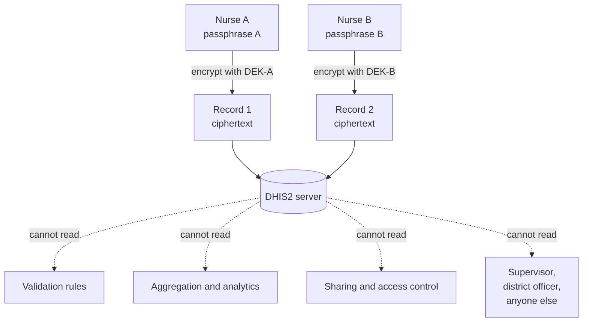
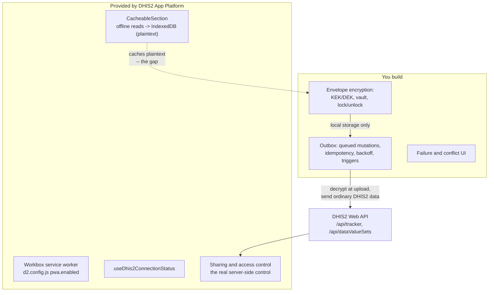

# DHIS2 context

[DHIS2](https://dhis2.org) is the original motivation for this project. It is a health
information platform used by ministries of health in a large number of countries, and one
of its defining constraints is that data is entered in places with no reliable
connectivity — clinics, field visits, remote facilities.

This page is where the project's central architectural decision is argued out in full. It
also maps Lockbox's layers onto what the DHIS2 web app platform actually provides.

!!! note "Scope"
    This is about the **web** app platform (`@dhis2/cli-app-scripts`, `@dhis2/app-runtime`).
    The DHIS2 **Android** app is a separate codebase with a different offline story — see
    [below](#the-android-app-is-different).

## The per-user passphrase problem

This is the argument that reshaped the project, so it is worth working through carefully
rather than asserting.

Start from the obvious-seeming design. A field worker's device holds sensitive health data.
Encrypt it client-side. Encryption is good. Why not keep it encrypted all the way to the
server, so the server never sees plaintext at all?

Because of where the key comes from.

**Every user of the PWA chooses their own passphrase.** There is no organisational key, no
key escrow, no PKI, no key distribution. The DEK is wrapped under a KEK derived from
whatever the person at the keyboard typed. That is the only thing a browser can reliably
offer without infrastructure that does not exist here.

Now follow the consequences of uploading records encrypted under that key:



### 1. Each record becomes readable by exactly one person

Nurse A's records can be opened by Nurse A and no one else — not her supervisor, not the
district officer, not the national data team, not Nurse A herself from a different device
if she forgot the passphrase. Health data is *collected* by individuals and *used* by
organisations. A per-user key severs that link completely.

### 2. Server-side processing stops working

DHIS2 does substantial work on the data it holds:

| DHIS2 capability | Needs to read the values? |
| --- | --- |
| Validation rules (`left side` vs `right side` expressions) | Yes |
| Aggregation across org units and periods | Yes |
| Analytics tables, pivot tables, dashboards, maps | Yes |
| Indicators and program indicators | Yes |
| Predictors, min-max outlier detection | Yes |
| Duplicate detection on tracked entities | Yes |
| Program rules evaluated server-side | Yes |

None of that runs over ciphertext. Uploading opaque blobs turns DHIS2 from a health
information system into a very expensive encrypted file store.

### 3. DHIS2's own access control becomes meaningless

This is the subtlest point and the most important one.

DHIS2 already has a mature model for who may see what: user roles, authorities, sharing
settings on metadata and data, org-unit scoping, data-approval workflows. That model is the
**actual governing mechanism** for this data. It is what a ministry of health reasons about,
audits, and is accountable for.

Per-user client-side encryption does not strengthen that model. It *overrides* it with an
unrelated and much cruder one: "whoever typed the passphrase". Sharing a record with a
colleague, granting a supervisor read access, scoping a dataset to a district — every one of
those operations becomes impossible, because the platform cannot hand out a key it never
had.

!!! danger "Encryption that breaks access control is not a security improvement"
    It is easy to read "the server cannot decrypt it" as strictly better. It is not. It
    replaces an auditable, delegable, revocable authorisation model with an unmanaged
    per-user secret, and it removes the platform's ability to enforce anything at all. For
    data that is *supposed* to be shared among authorised users, that is a downgrade.

### The conclusion

**The data on the server is supposed to be readable by multiple authorised users.** That is
not a flaw to be encrypted away, it is the purpose of the system.

So encryption belongs where it adds something the platform cannot provide, and only there:

!!! success "Local-only encryption is the design"
    - **On the device** → the platform provides nothing, and the risk (a stolen field
      laptop) is real and unmitigated. This is where client-side encryption earns its
      keep, and it is what Lockbox implements.
    - **In transit** → TLS already solves it.
    - **On the server** → DHIS2's access control governs it, backed by whatever
      operational encryption at rest the deployment has.

    This is not a compromise reached reluctantly. It is where the boundary actually is.

### And the cost of that decision

Uploading readable data means decrypting at upload time, which means the vault must be
unlocked to sync. Lockbox implements this honestly rather than hiding it — see
[Offline Sync](../design/offline-sync.md#the-unlocked-vault-requirement) — and ships the
encrypted mode alongside so the trade-off can be seen rather than argued about. The **Sync
Modes** page in the app puts both server stores on screen at once.

## What the App Platform already gives you

### PWA support is built in

The App Platform has first-class PWA support, enabled with a single flag in `d2.config.js`:

```javascript
const config = {
    type: 'app',
    name: 'my-app',
    title: 'My App',
    pwa: {
        enabled: true,
    },
    entryPoints: {
        app: './src/App.jsx',
    },
}

module.exports = config
```

That turns on a **Workbox-based service worker** generated at build time: precached app
shell, revisioned manifest, offline app loading, and an update flow. It is the same
machinery discussed in [Trade-offs: service worker](trade-offs.md#service-worker), done
properly and for free.

Docs: <https://developers.dhis2.org/docs/app-platform/pwa/>

!!! success "Layer 1 (PWA shell): already solved"
    Lockbox's hand-rolled `sw.js` exists for learning. In a DHIS2 app, do not write one —
    set `pwa.enabled` and move on.

### Cacheable sections give you offline reads

`@dhis2/app-runtime` provides an offline caching model built around **cacheable sections**.
The app wraps itself in `OfflineProvider`, and a subtree can be put into "recording mode":
the service worker captures all network traffic that subtree generates into IndexedDB, and
thereafter that section renders offline from the cache.

```jsx
import { useCacheableSection, CacheableSection } from '@dhis2/app-runtime'

const { startRecording, lastUpdated, isCached, remove, recordingState } =
    useCacheableSection('section-id')

<CacheableSection id="section-id" loadingMask={<Loader />}>
    <Dashboard />
</CacheableSection>
```

Also provided:

| API | Purpose |
| --- | --- |
| `OfflineProvider` | Wires up the offline machinery and the cached-section registry |
| `useCacheableSection` / `CacheableSection` | Recording-mode caching of a subtree's network traffic |
| `useDhis2ConnectionStatus` | Whether the **DHIS2 server** is reachable — a real probe, not `navigator.onLine`. Exactly the distinction Lockbox makes with `/api/info` |
| `useOnlineStatus` | Lower-level browser online/offline state |

Docs: <https://developers.dhis2.org/docs/app-runtime/advanced/offline/>

!!! warning "These offline APIs are flagged experimental"
    The DHIS2 documentation marks the offline features as experimental. Check the current
    status against your target DHIS2 version before depending on them.

## The two gaps

### Gap 1: there is no offline mutation queue

`@dhis2/app-runtime` gives you offline **reads**. Cacheable sections cache responses so a
dashboard or a data entry form renders without a network. There is **no** equivalent for
writes — no durable queue, no retry with backoff, no idempotency handling, no
error classification. `useDataMutation` fails when offline, and that is the end of it.

Every DHIS2 app that supports offline data entry hand-rolls this. Which means every one of
them independently re-decides:

- Where do queued mutations live, and do they survive a browser restart?
- Are writes idempotent, or does a retry after a lost response duplicate an event?
- Which HTTP failures are worth retrying, and which are permanent?
- What is the backoff, and is there a ceiling?
- What triggers a flush, given Background Sync is Chromium-only?
- What happens when the server rejects a queued write — where does the user see it?

Those are precisely the questions [Offline Sync](../design/offline-sync.md) works through.
The outbox in `sync.ts` is a direct answer to this gap, and it maps onto DHIS2 cleanly
because it makes no assumptions about the backend beyond "idempotent PUT-like endpoint".

!!! note "DHIS2 endpoints are reasonably outbox-friendly"
    The tracker API (`POST /api/tracker`) accepts client-generated UIDs, which is the key
    property — it means a locally created event has a stable identity before it ever
    syncs, and a replayed import is an update rather than a duplicate. `importStrategy`
    and the async import job model give you a workable acknowledgement path. This is the
    hard prerequisite for an outbox, and DHIS2 satisfies it.

### Gap 2: there is no encryption at rest, anywhere

Searching the DHIS2 web app-platform stack for client-side encryption turns up nothing.
The service worker caches API responses into IndexedDB in **plaintext**. Cacheable
sections store plaintext. There is no key management, no vault, no lock/unlock concept,
and no configuration option to add one.

So: a DHIS2 PWA that has cached patient-level tracker data for offline use has that data
sitting readable in the browser profile of the field device. Take the laptop, copy the
profile, open the IndexedDB — it is all there.

!!! danger "This is the gap Lockbox exists to demonstrate"
    Encryption at rest **on the device** is not a feature you can switch on in the DHIS2
    web app platform. It has to be built into the app, and it has to be built *carefully*,
    because it interacts with everything above it: what can be indexed, what can be
    searched, and what can sync while locked.

    Note precisely what this gap is and is not. It is a **local storage** gap. It is not an
    argument for encrypting uploads, which as shown above would break the platform.

### The Android app is different

The DHIS2 **Android Capture app** supports optional local database encryption (SQLCipher
over its SQLite store). So the capability exists in the DHIS2 ecosystem — it just does not
exist on the web platform, where the OS-level primitives (keystore, biometric unlock,
app sandbox) that make it ergonomic on Android are unavailable.

Worth noting that the Android app draws the same boundary Lockbox now does: the **local**
database is encrypted, and what it syncs to the server is ordinary DHIS2 data. That is the
established answer in this ecosystem, and arriving at it independently from first
principles is a decent sign it is the right one.

The asymmetry is worth stating plainly when someone asks "why can't the web app just do
what the Android app does": no secure keychain, no background execution guarantees, and a
storage layer the browser may evict. See [Threat Model](../design/threat-model.md).

## Mapping the layers

| Layer | DHIS2 App Platform | What you would still build |
| --- | --- | --- |
| **PWA shell** | yes: `pwa: { enabled: true }`, Workbox-based | Nothing |
| **Offline reads** | yes: `CacheableSection`, `useCacheableSection` | Decide which subtrees are cacheable |
| **Connection status** | yes: `useDhis2ConnectionStatus` | Nothing — it already probes the server properly |
| **Server-side access control** | yes: sharing, roles, org-unit scoping | Configure it correctly — it is the real confidentiality control |
| **Offline writes** | none | The whole outbox: queue, idempotency, error classification, backoff, triggers, failure UI |
| **Encryption at rest on the device** | none | The whole envelope: vault, KDF, wrap/unwrap, lock/unlock UX, encrypted record boundary |
| **Conflict resolution** | partial: import summaries only | Domain-specific; DHIS2's import summaries give you the raw material |



## What a real DHIS2 integration would look like

1. **Use the platform for what it provides.** `pwa: { enabled: true }`, `OfflineProvider`,
   `useDhis2ConnectionStatus`. Do not hand-roll a service worker; do not reimplement
   connectivity detection; do not reinvent authorisation.

2. **Encrypt the sensitive payload before it touches IndexedDB.** Envelope encryption as in
   [Encryption](../design/encryption.md): Argon2id-derived KEK wrapping a random DEK,
   AES-256-GCM per record. Encrypt data values and tracked entity attributes; leave UIDs,
   timestamps and sync state in the clear so the note list and queue remain workable.

3. **Add an outbox for mutations.** Queue tracker events and data values as self-contained
   encrypted payloads keyed by client-generated UIDs. Drain FIFO, stop on the first
   transient failure, classify 4xx as permanent, back off with a ceiling.

4. **Decrypt at the moment of upload and send ordinary DHIS2 payloads.**
   `POST /api/tracker` or `/api/dataValueSets` receives exactly what it expects — readable
   data values, over TLS, authenticated as the user, governed by DHIS2's sharing rules.
   Server-side validation, aggregation and analytics all keep working.

5. **Accept that sync then requires an unlocked session, and design the UX around it.**
   This is the honest consequence. Prompt for the passphrase when there is a queue to
   flush and connectivity is available; make the blocked state legible rather than silently
   stalling; keep auto-lock timeouts generous enough that a sync started at the end of a
   shift can complete.

6. **Be careful with cacheable sections.** They cache whatever the network returned,
   plaintext, by design. Any section covering patient-level data is a section that writes
   identifiable data unencrypted to disk. Either keep such data out of cacheable sections
   and manage it through your own encrypted store, or accept the exposure knowingly.

7. **Have a recovery story.** Health workers forget passphrases, and "the unsynced data is
   permanently unreadable" is not an acceptable outcome for a ministry of health. Recovery
   codes, or a second KEK held by a supervisor, wrapping the same DEK. Note that in this
   architecture already-synced data is safe on the server — the exposure is bounded by the
   queue, which is a much better position than end-to-end encryption leaves you in.

8. **Write the threat model down** and share it with whoever signs off on the deployment.
   Two distinctions get lost in every summary and both matter: "protects a stolen device"
   versus "protects against a compromised session", and "the device is encrypted" versus
   "the server is encrypted". Say which one you are claiming.

!!! warning "What this design does not give you"
    It does not protect the data from the server operator, and it does not make DHIS2
    zero-knowledge. If a deployment genuinely requires that the server cannot read the
    data, then a shared analytics platform is the wrong home for that data — and the answer
    is a different architecture, not per-user encryption bolted onto this one.

## References

- DHIS2 App Platform — PWA: <https://developers.dhis2.org/docs/app-platform/pwa/>
- DHIS2 App Runtime — Offline: <https://developers.dhis2.org/docs/app-runtime/advanced/offline/>
