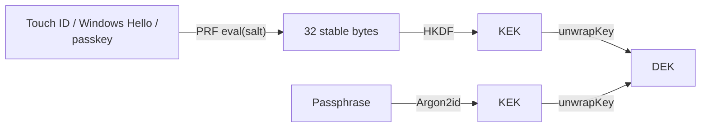

# Trade-offs and alternatives

Almost every choice in Lockbox was made to keep the mechanics visible, which is the right
priority for a learning project and frequently the wrong one for production. This page
lays out what else exists, what each option actually costs, and what to pick if you were
building this for real.

## Plaintext vs encrypted sync

The most consequential decision in the project, and the one that was got wrong first.

Lockbox implements **both**, selectable at runtime, with **plaintext as the default**.

| | **Plaintext sync** (default) | **Encrypted sync** (demonstration) |
| --- | --- | --- |
| What the server receives | Readable `{title, body}` | Opaque ciphertext |
| Server-side validation | ✅ | ❌ |
| Aggregation, analytics, indicators | ✅ | ❌ |
| Readable by other authorised users | ✅ | ❌ — one passphrase, one reader |
| Platform access control still meaningful | ✅ | ❌ — replaced by "who typed the passphrase" |
| Server operator can read the data | ✅ | ❌ |
| Sync while the vault is locked | ❌ | ✅ |
| Background Sync API could ever help | ❌ — a service worker has no DEK | ✅ |
| Client-side integrity check on what the server returns | ❌ | ✅ GCM auth tag |
| Blast radius of a forgotten passphrase | The unsynced queue | Everything |
| Fits DHIS2 | ✅ | ❌ |

**The argument in one paragraph:** every user of the PWA picks their own passphrase. There
is no organisational key and no key distribution. Encrypting uploads under a per-user key
therefore makes each record readable by exactly one person, breaks every server-side
operation DHIS2 exists to perform, and overrides the platform's own sharing rules with a
cruder and unmanageable substitute. The data on the server is *supposed* to be readable by
multiple authorised users. The full working-through is in
[DHIS2 Context](dhis2.md#the-per-user-passphrase-problem).

!!! success "Recommendation: encrypt locally, sync plaintext, and say so"
    Scope the encryption to the device, where the platform provides nothing and the risk
    (a stolen field laptop) is real. Leave transit to TLS and server-side confidentiality
    to the platform's access control. Then **document the boundary explicitly** — the
    failure mode here is not the choice, it is letting people believe "encrypted" means
    something broader than it does.

    Reach for end-to-end encrypted sync only when the requirement genuinely is "the server
    operator must not be able to read this", and accept what it costs: no server-side
    validation, no analytics, no sharing, no server-side merge, and a per-user key you now
    have to manage for real. If that requirement is real, a shared analytics platform is
    probably the wrong home for the data in the first place.

!!! warning "The consequence you cannot design away"
    Plaintext uploads must decrypt, so **sync requires an unlocked vault**. Encrypted mode
    does not, because the outbox holds self-contained ciphertext. That is a genuine
    ergonomic win for the mode that is otherwise unusable, and it is worth knowing about
    rather than discovering. See
    [Offline Sync](../design/offline-sync.md#the-unlocked-vault-requirement).

## Key derivation function

The KEK is derived with **Argon2id** via
[`hash-wasm`](https://github.com/Daninet/hash-wasm), with parameters **calibrated on the
device at vault creation**: a ladder from 128 MiB / `t = 3` down to OWASP's 19 MiB /
`t = 2` floor, picked by a timed probe so one derivation stays inside a 1 s unlock budget
(tunables in `frontend/src/lib/config.ts`). **This is now implemented**, not a
recommendation. PBKDF2-HMAC-SHA256 at 600,000 iterations is retained solely to open vaults
created before the switch, and as the comparison arm in the app's KDF Lab page.

| Option | Memory-hard | Bundle cost | Notes |
| --- | --- | --- | --- |
| **Argon2id** via `hash-wasm` (**current**) | **Yes** | ~40 KB WASM, bundled with the app JS and precached | Winner of the Password Hashing Competition. Memory cost makes GPU/ASIC parallelism expensive rather than nearly free |
| **PBKDF2-HMAC-SHA256** (legacy) | No | 0 — native `crypto.subtle` | Universally available, zero payload. Kept for pre-existing vaults and benchmarking. OWASP 2026 guidance is 600k iterations |
| **scrypt** via WASM | Yes | Similar | Memory-hard, older, fewer well-maintained JS builds. Argon2id is the better target |
| **bcrypt** | Somewhat | Small | Password *hashing*, not key derivation. 72-byte input limit. Wrong tool |

**The problem with PBKDF2:** it is CPU-hard but not memory-hard. A GPU can run enormous
numbers of SHA-256 chains in parallel at trivial per-lane memory cost, so an attacker's
advantage over the defender's single browser thread is very large. Argon2id forces each
guess to allocate real memory — up to 128 MiB, never below 19 MiB — which caps how many
guesses fit on a card and shrinks that advantage by orders of magnitude.

This only matters for **low-entropy passphrases**. Against a diceware-style passphrase,
PBKDF2 at 600k is already unbreakable. Against `summer2026`, Argon2id might buy weeks
where PBKDF2 buys hours. Users pick `summer2026`.

### Measured, not assumed

`benchmarkKdf()` times a real derivation, and the **KDF Lab** page drives it with tunable
parameters. Defaults were chosen from measured candidates on an Apple Silicon laptop:

| KDF | Parameters | Time |
| --- | --- | --- |
| Argon2id | 64 MiB, `t = 3`, `p = 1` | ~121 ms (a ladder tier) |
| Argon2id | **128 MiB, `t = 3`, `p = 1`** | **~263 ms** ← the ceiling tier |
| PBKDF2-HMAC-SHA256 | 600,000 iterations | **~54–67 ms** |

128 MiB sits inside the usual 250–500 ms interactive-unlock target on a laptop while
doubling attacker memory cost per guess.

!!! warning "The laptop numbers only set the ceiling"
    A low-end Android tablet — the device this project is actually about — is easily
    10-25x slower, so no single parameter set fits both. Vault creation therefore runs
    `calibrateKdfParams()`: a timed probe at the floor tier plus a `navigator.deviceMemory`
    cap picks the strongest ladder tier the device can afford, and an allocation failure
    steps down the ladder rather than failing. The KDF Lab remains the manual version of
    the same measurement.

The vault record stores `{kdf, params}`, so old vaults keep working and costs can be raised
later. Migration is cheap because of the envelope: unwrap with the old KEK, re-wrap with
the new one, no note touched. `changePassphrase()` takes a `kdf` argument for exactly this
reason — see [Encryption](../design/encryption.md#passphrase-change-and-kdf-migration-are-the-same-operation).

## Unlock UX

The user types a PIN/passphrase every session by default. **WebAuthn PRF biometric unlock
is implemented** as a second envelope over the same DEK (Security page).

| Option | Security | UX | Support (2026) |
| --- | --- | --- | --- |
| **Typed passphrase** (current) | Only as strong as the passphrase | Poor — every session, on a touch keyboard, in the field | Universal |
| **WebAuthn PRF extension** | High-entropy key material from a hardware authenticator | Excellent — Touch ID / face / PIN | Chrome, Safari, Firefox; macOS/iOS/Android platform authenticators solid. **Windows Hello support still weak** |
| Cache the DEK in `sessionStorage` | **Broken** — defeats the purpose | Good | n/a |
| Long-lived unlock with idle timeout | Reduces prompts, widens the XSS window | Good | Universal |

### WebAuthn PRF

The [PRF extension](https://w3c.github.io/webauthn/#prf-extension) lets a credential
evaluate a pseudo-random function over an input you supply and return the result. For a
given credential and salt, the output is **stable** — the same 32 bytes every time — and
it never leaves the authenticator except as that output. Which makes it exactly what you
need for a KEK:



The envelope makes this almost free to add: wrap the *same* DEK under both KEKs and store
two envelopes. Either unlocks.

!!! warning "PRF must never be the only unlock path"
    Authenticators get lost, wiped, and replaced; a platform authenticator is tied to the
    device. If the credential is the only KEK, losing the device loses the data — even
    though the ciphertext is safely synced. Windows Hello's uneven PRF support alone means
    a fallback is mandatory.

!!! success "Recommendation: WebAuthn PRF as an optional unlock, passphrase as the root"
    The passphrase (or a printed recovery code) stays the recoverable root of trust; PRF
    is the everyday convenience. This is roughly what 1Password and Bitwarden do with
    biometric unlock.

## Local storage layer

Lockbox uses **raw IndexedDB** — about 220 lines including a hand-rolled promise wrapper.

| Option | Size | Encryption support | Verdict |
| --- | --- | --- | --- |
| **Raw IndexedDB** (current) | 0 | You write it | Verbose, event-based API. Fine for three stores; painful past that |
| [`idb`](https://github.com/jakearchibald/idb) | ~1.2 KB | You write it | A thin promise wrapper over IndexedDB, nothing more. Removes the boilerplate and none of the control |
| [Dexie.js](https://dexie.org) | ~25 KB | Via `dexie-encrypted` | Excellent query API, schema versioning/migrations, live queries, React hooks |
| `dexie-encrypted` | + small | Field-level | Actively maintained; **v4 is beta**. **Cannot encrypt indices** — the same field-level trade-off Lockbox has |
| [RxDB](https://rxdb.info) | ~50 KB+ | Plugin | Reactive, pluggable storage, real replication. **The encryption plugin is now a paid/premium feature** — a licensing decision to make deliberately, not discover late |
| SQLite-WASM + SQLCipher / [wa-sqlite](https://github.com/rhashimoto/wa-sqlite) | ~1 MB WASM | **Whole database, indices included** | The only option that encrypts metadata. OPFS-backed. Heavy; real SQL |
| PouchDB + `crypto-pouch` | ~140 KB | Field-level | Aging. Compelling only if you already run CouchDB |

**On `idb`:** the smallest genuinely worthwhile upgrade. Lockbox's `promisify()` and
`withStore()` helpers exist purely because raw IndexedDB is event-based; `idb` deletes
both and changes nothing else.

**On Dexie:** the right answer once the schema grows past a handful of stores, or once
real users make data-preserving migrations mandatory. Pre-release, Lockbox never migrated
data — a schema bump simply dropped and recreated the stores, which is only defensible
while no user data exists. Once it does, the `onupgradeneeded` pattern gets ugly fast at
version 4 or 5, and Dexie's versioning/migration story is exactly what you do not want to
hand-roll.

!!! success "Recommendation"
    - Learning or a tiny schema → raw IndexedDB, or `idb` to remove the ceremony.
    - Real app, field-level encryption acceptable → **Dexie**, with your own encryption at
      the boundary (encrypt before `put`, decrypt after `get`). `dexie-encrypted` does
      this for you but is beta and shares the index limitation, so writing ~50 lines
      yourself is defensible.
    - Metadata confidentiality genuinely required → **SQLite-WASM + SQLCipher**, and budget
      for the ~1 MB WASM and the OPFS complexity.
    - RxDB → only after checking the encryption plugin's licensing against your project.

## Sync engine

Lockbox hand-rolls an outbox in ~250 lines of code (plus a lot of comment), covering both sync modes.

| Option | Size | Model | Fits into an existing app? |
| --- | --- | --- | --- |
| **Hand-rolled outbox** (current) | ~250 LOC | Queue of self-contained mutations | Yes — it is your code |
| [Replicache](https://replicache.dev) | ~35 KB | Mutators + server push/pull, rebased | Yes. **Now maintenance-mode and open-sourced** — no longer actively developed |
| [Zero](https://zero.rocicorp.dev) | Larger | Query-driven sync, Postgres-first | Replicache's successor. **Public alpha** — promising, not yet safe for production |
| RxDB replication | ~50 KB+ | Pull/push handlers over an RxDB collection | Yes, if you adopt RxDB for storage |
| PouchDB / CouchDB | ~140 KB | Full bidirectional replication, MVCC conflicts | Requires CouchDB (or Cloudant) as the backend. Owns your data model |
| [WatermelonDB](https://watermelondb.dev) | Medium | Lazy sync over SQLite | React Native oriented; web support is secondary |
| [TinyBase](https://tinybase.org) | **~5 KB** | Reactive store with persisters/synchronizers | Yes. Remarkably small. Model is a key-value/tabular store you adopt |
| CRDT (Yjs / Automerge) | 30–100 KB | Convergent replicated state | Yes, but changes the data model to an op log |

The critical question is not bundle size, it is **"does this fit inside my app, or does my
app have to fit inside it?"**

- Replicache, Zero and TinyBase are *libraries*: you keep your architecture.
- PouchDB/CouchDB and RxDB are *platforms*: they dictate the backend, the document model
  and the conflict semantics. Excellent if you are greenfield and agree with their
  choices, painful when retrofitting to an existing API like DHIS2's.

!!! warning "The state of the art moved, and not forward"
    Replicache — for years the best-in-class answer here — is in maintenance mode. Its
    successor, Zero, is in public alpha and is Postgres-first, which does not fit a system
    with an existing HTTP API. As of 2026 there is **no mature, actively developed,
    backend-agnostic offline-write sync library for the web**. That is a genuine gap, and
    it is why so many offline-first apps hand-roll an outbox.

!!! success "Recommendation: hand-roll the outbox"
    Not as a fallback — as the deliberate choice. The pattern is ~200 lines, it composes
    with any existing HTTP API, and every hard part (idempotency, error classification,
    backoff, ordering) is a decision you *want* to make explicitly for your domain. Health
    data in particular has conflict semantics no generic library will guess correctly.

    Consider TinyBase if you want a reactive store and synchronizer for ~5 KB and are
    happy to adopt its data model. Watch Zero, but do not bet on it yet.

## Service worker

Lockbox hand-rolls `sw.js` — about 100 lines.

| | Hand-rolled | [Workbox](https://developer.chrome.com/docs/workbox) / [`vite-plugin-pwa`](https://vite-pwa-org.netlify.app) |
| --- | --- | --- |
| Precache manifest | Manual asset list + a whole-bundle content hash | **Generated at build time**, per-asset revisions |
| Caching strategies | Written by hand | Battle-tested `StaleWhileRevalidate`, `NetworkFirst`, `CacheFirst`, expiration plugins |
| Background sync | Not implemented | `workbox-background-sync` provides a durable retry queue |
| Update flow | ~15 lines of `skipWaiting`/`claim` you must get right | Handled, with a prompt-for-update recipe |
| Bundle | 0 | ~10–20 KB in the worker |
| Understanding | Complete | Largely opaque until something breaks |

!!! note "The cache-versioning bug is the argument for Workbox"
    Lockbox's whole-bundle content hash exists because a fixed cache name plus a cache-first
    strategy serves stale code **forever** — found the hard way during development. That
    is precisely the bug Workbox's revisioned precache manifest prevents by construction,
    and it is not the only such bug lying around in that area.

!!! success "Recommendation: `vite-plugin-pwa` for anything real"
    The frontend is already Vite; the plugin generates the manifest and wires Workbox in
    with a few lines of config. Write the worker by hand exactly once, to understand what
    it is doing — then let the tool do it.

    Note that Workbox's `BackgroundSyncPlugin` still depends on the Background Sync API,
    so it remains Chromium-only. It does not remove the need for foreground triggers.

## Field-level vs whole-database encryption

The most consequential architectural choice on this page.

**Field-level (current):** encrypt the sensitive payload, leave keys, timestamps and sync
state in the clear.

**Whole-database:** encrypt the entire store, including indices — SQLCipher over
SQLite-WASM being the practical route on the web.

| | Field-level | Whole-database |
| --- | --- | --- |
| Metadata protected | ❌ ids, timestamps, counts visible | ✅ everything |
| Query/sort while locked | ✅ | ❌ nothing is readable |
| Queue readable while locked | ✅ ciphertext moves as opaque bytes | ❌ cannot even read the queue |
| Search by content | ❌ requires decrypting everything | ✅ normal SQL over the decrypted DB |
| Dependency weight | 0 (Web Crypto) | ~1 MB WASM |
| Partial decryption | ✅ decrypt only what is displayed | ❌ all-or-nothing |

The trade is fundamentally about **indices**. An index is a data structure whose whole job
is to reveal ordering and equality relationships over values. Encrypt a value properly and
you destroy exactly the structure the index needs. So you either:

1. Leave indexed fields in the clear (field-level) — keeps offline sync and list rendering
   working while locked, leaks metadata; or
2. Encrypt the index too (whole-database) — leaks nothing, but nothing works until unlock.

For Lockbox the choice is forced: **the outbox must be readable while locked**. The queue
badge has to be accurate before unlock — that is when the user most wants to know how much
unsynced work is outstanding — and the note list has to render as locked placeholders.
Whole-database encryption makes both impossible. That is a hard functional requirement,
not a preference.

Note that this is now independent of the *sync mode* question. Encrypted-mode sync also
drains while locked, but plaintext-mode sync does not, because it must decrypt. Field-level
encryption is what makes the queue *inspectable* while locked either way.

### The middle ground: blind indexing

You can search encrypted fields without decrypting them by storing a deterministic
**HMAC** of the searchable value under a separate key:

```text
blindIndex = HMAC-SHA256(indexKey, normalize(value))
```

Equality search then becomes a lookup on the HMAC. The costs are real: it supports only
exact matches (no prefix, no range, no fuzzy), and because it is deterministic it leaks
equality — an attacker sees *which* records share a value, and frequency analysis over a
low-cardinality field (a district name, a diagnosis code) can be devastating. Truncating
the index to a few bits creates deliberate collisions and blunts that, at the cost of
false positives you filter after decryption.

Worth it for "find the patient by ID number". Not a general search solution. On the
[Roadmap](roadmap.md).

!!! success "Recommendation"
    Field-level is right for Lockbox and for most offline-first apps, because a queue and a
    list that work before unlock are usually non-negotiable. **Document the metadata leak
    explicitly** — the failure mode
    is not the choice, it is making the choice silently. Reach for whole-database
    encryption only when metadata confidentiality is an actual requirement, and accept
    that the app then does nothing at all until unlock.

## Summary of recommendations

| Area | Current | Recommended for production |
| --- | --- | --- |
| Encryption scope | **Local device only**, plaintext sync by default | Unchanged — correct for a shared-data platform. Document the boundary explicitly |
| KDF | **Argon2id**, device-calibrated (128 MiB ceiling, 19 MiB floor), params in the vault record | Unchanged — calibration replaces manual per-device benchmarking |
| Unlock | PIN/passphrase + optional **WebAuthn PRF** | Add recovery codes as a second root envelope |
| Cipher | AES-256-GCM | Unchanged — correct |
| Envelope | KEK wraps DEK | Unchanged — correct, and enables everything above |
| Storage | Raw IndexedDB | **Dexie** past ~3 stores; `idb` as the minimal step |
| Sync | Hand-rolled outbox | **Hand-rolled outbox** — no mature library fits an existing API in 2026 |
| Service worker | Hand-rolled | **`vite-plugin-pwa`** / Workbox |
| Granularity | Field-level | Field-level + **blind indexing** where search is needed |
