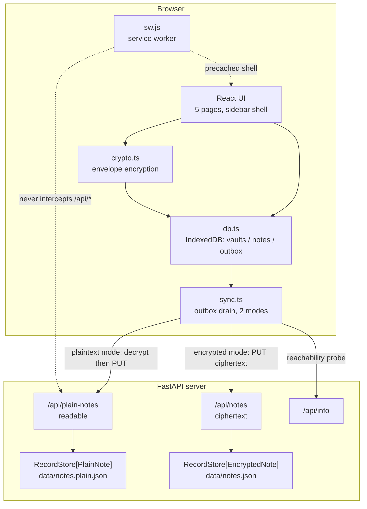
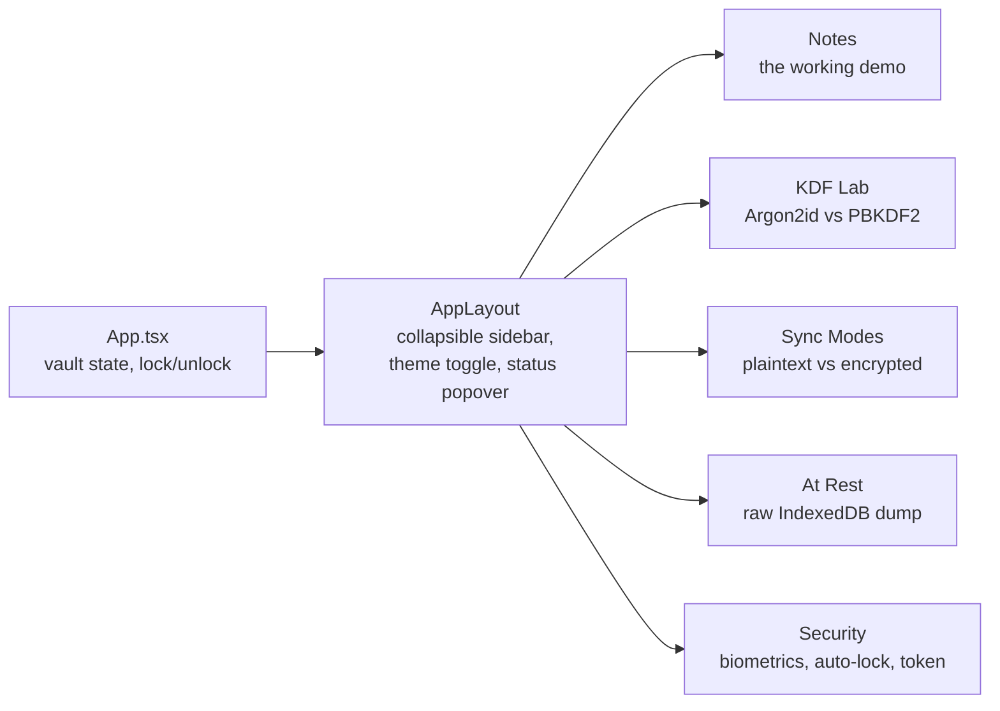
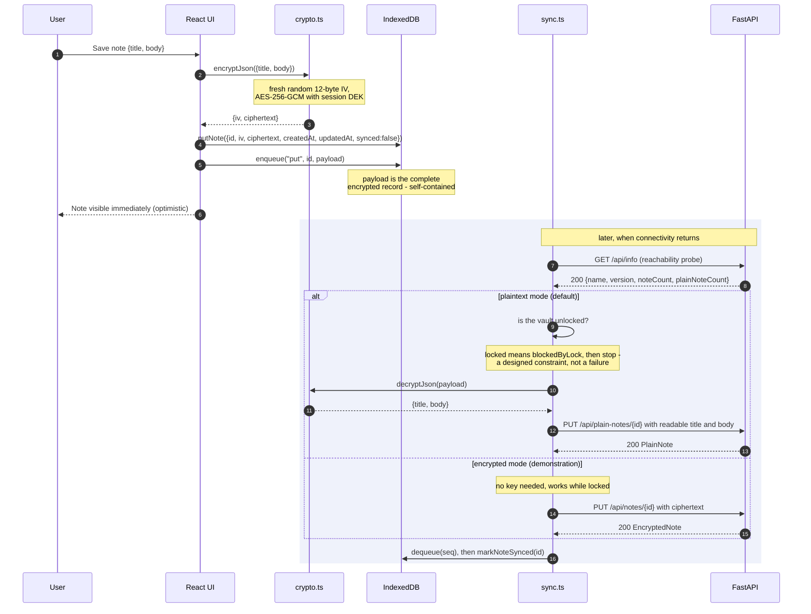
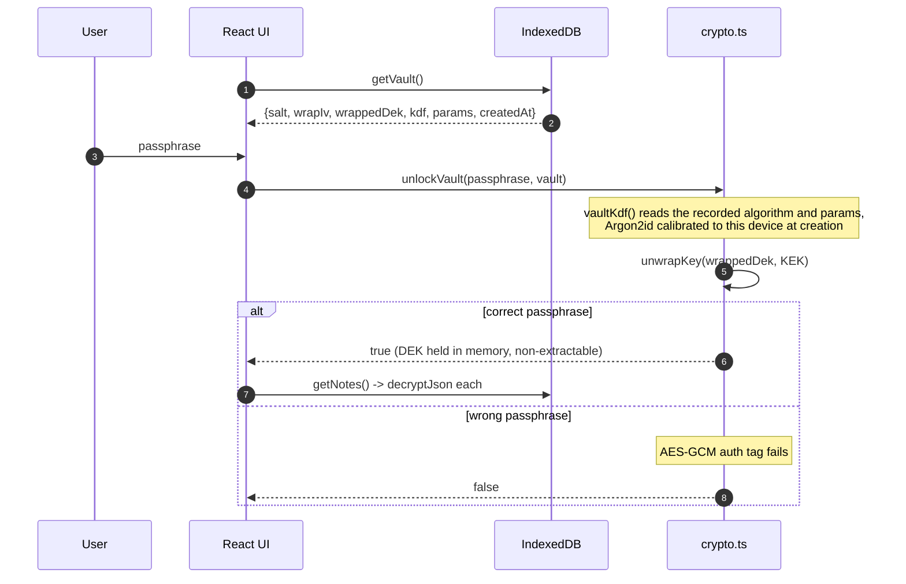

# Architecture

Lockbox is three independent layers stacked on a deliberately dumb server. Each layer
solves one problem and knows as little as possible about the others.



The critical property of that diagram: **ciphertext crosses every boundary inside the
browser**. IndexedDB and the outbox handle opaque blobs, always, in both modes. What
differs is only what happens at the network boundary.

!!! info "Where the plaintext boundary sits"
    | Mode | IndexedDB | Outbox | Wire | Server |
    | --- | --- | --- | --- | --- |
    | **plaintext** (default) | ciphertext | ciphertext | readable (over TLS) | readable |
    | **encrypted** (demo) | ciphertext | ciphertext | ciphertext | ciphertext |

    The default is plaintext because the target is DHIS2, and a shared-data platform
    cannot use records encrypted under a per-user passphrase. See
    [DHIS2 Context](../context/dhis2.md) for the full argument.

## The three layers

### 1. PWA shell — "the app exists without a network"

A hand-rolled service worker precaches the app shell (HTML, CSS, JS, icons, manifest) and
serves it cache-first. Navigations are network-first with a cached-shell fallback, so a
deployed update is picked up when online but the app still boots when it is not.

`/api/*` is never cached and never intercepted. See [Service Worker](service-worker.md).

The Argon2id WASM ships inside the main JS bundle, so it is precached with everything else
and the vault still opens with no network at all.

### 2. Offline sync — "writes survive without a network"

IndexedDB is the source of truth, not the server. Every local write is applied to the
`notes` store and appended to the `outbox` queue in the same logical operation. The sync
engine drains the outbox whenever the server is reachable, in whichever mode is selected.
See [Offline Sync](offline-sync.md).

### 3. Encryption at rest — "the local data is useless without the passphrase"

A random 256-bit AES-GCM data encryption key (DEK) encrypts each note. The DEK is wrapped
by a key encryption key (KEK) derived from the passphrase with Argon2id. Only the wrapped
DEK, its salt, the wrap IV and the KDF parameters are persisted. See
[Encryption](encryption.md).

## The app shell and its pages

Navigation uses `HashRouter`, so every page has a URL (`#/security`, `#/kdf`, …). Reloading
still returns to the unlock screen, because the key cannot survive it — but the app no
longer also forgets which page you were on.

The hash matters for more than tidiness: routes stay client-side, so the server needs no
SPA fallback, and the service worker only ever sees `/` for a navigation. The cached shell
therefore matches any route, and a deep-linked page loads with no network at all. A
path-based router would need a server fallback that is by definition unreachable offline.



| Page | Source | What it demonstrates |
| --- | --- | --- |
| Notes | `pages/NotesPage.tsx` | Offline writes, the outbox, sync badges |
| KDF Lab | `pages/KdfLabPage.tsx` | `benchmarkKdf()` timing both algorithms on this device, with tunable memory and iteration counts |
| Sync Modes | `pages/SyncModesPage.tsx` | `setMode()` plus `fetchServerState()`, printing both server stores raw and side by side |
| At Rest | `pages/StoragePage.tsx` | `vault`, `notes` and `outbox` read straight from IndexedDB with no decryption |
| Security | `pages/SecurityPage.tsx` | WebAuthn PRF enrolment, auto-lock timeout, optional API token |

The shell itself carries a lock button, a light/dark theme toggle, toast notifications
(`sonner`) and a status popover summarising what is held offline and whether persistence
was granted. Several users can share one browser profile: each has their own vault and
DEK; notes and outbox entries are scoped by `ownerId`.

## Data flow for a write

This is the path a single "save note" click takes, offline, then what happens later when
connectivity returns. The upload branch is where the two modes diverge.



Three things in that diagram matter more than they look:

- **The write is acknowledged to the user before any network call.** The UI never waits
  on the server. Offline is the normal case, not the error case.
- **The outbox payload is the full encrypted record**, not a note id to be re-read later.
  The queue is therefore self-contained: replaying it never has to re-read the `notes`
  store, and in encrypted mode it never has to decrypt anything either.
- **Decryption happens at the last possible moment**, inside `sendEntry()`, and only in
  plaintext mode. That single line is what makes plaintext sync require an unlocked vault.

```typescript
if (mode === 'plaintext') {
    // Requires the DEK, hence the unlocked-vault precondition.
    const content = await decryptJson<NoteContent>(payload)
    body = {
        id: payload.id,
        title: content.title,
        body: content.body,
        createdAt: payload.createdAt,
        updatedAt: payload.updatedAt,
    }
}
```

`sync.ts` never imports the vault directly. It is handed a predicate via
`setUnlockedCheck()`, so it can only decrypt when the app has explicitly given it the
ability — which makes the constraint impossible to bypass by accident.

## Data flow for an unlock



There is no stored password hash. The authentication tag on the wrapped DEK *is* the
passphrase check. A vault record with no `kdf` field predates Argon2id and is treated as
PBKDF2, so older vaults still open.

## The object stores

IndexedDB database `lockbox`, version 3, three object stores:

| Store | Key | Contents | Encrypted? |
| --- | --- | --- | --- |
| `vault` | `id` (keyPath) — one record per local user | `{id, salt, wrapIv, wrappedDek, kdf, params, createdAt, owner, prf?}` | Not secret — inert without the passphrase (or PRF envelope) |
| `notes` | `[ownerId, id]` (compound keyPath), index on `ownerId` | `{id, iv, ciphertext, createdAt, updatedAt, synced, ownerId, origin?}` | `ciphertext` only |
| `outbox` | `seq` (autoIncrement), index on `ownerId` | `{seq, op, noteId, payload, status, attempts, lastError, queuedAt, ownerId}` | `payload` carries ciphertext |

```typescript
// One schema, version 3. A fresh install creates it. Pre-release policy:
// any schema bump drops existing stores and recreates the current shape —
// only defensible while no real users keep data. (Array.from matters:
// objectStoreNames is a live list that shrinks as stores are deleted.)
if (oldVersion >= 1) {
    for (const name of Array.from(db.objectStoreNames)) {
        db.deleteObjectStore(name)
    }
}
db.createObjectStore(STORE_VAULT, { keyPath: 'id' })
const notes = db.createObjectStore(STORE_NOTES, { keyPath: ['ownerId', 'id'] })
notes.createIndex('ownerId', 'ownerId')
const outbox = db.createObjectStore(STORE_OUTBOX, {
    keyPath: 'seq',
    autoIncrement: true,
})
outbox.createIndex('ownerId', 'ownerId')
```

The compound note key is load-bearing for multi-user: two users pulling the same server
record share its `id`, so keying on `id` alone let one user's ciphertext overwrite the
other's. The **At Rest** page renders the stores unmodified, so the claim can be checked
rather than taken on trust.

!!! note "What is deliberately left in the clear"
    Note ids, `ownerId`, `createdAt`, `updatedAt`, `synced` and the vault `owner` display
    name are plaintext. The app has to index and order on them without unlocking — the note
    list renders (as locked placeholders) and, in encrypted mode, the outbox drains while
    the vault is closed. The cost is a metadata leak: an attacker with the device learns
    *that* a note existed at time T, and how many, but not what it said. This is the
    fundamental trade of field-level encryption; see
    [Trade-offs](../context/trade-offs.md#field-level-vs-whole-database-encryption).

## The server

The server is intentionally the least interesting component. It is two JSON-file stores
behind two parallel APIs, sharing one generic implementation:

```python
class RecordStore[T: NoteBase]:
    """Thread-safe, last-write-wins store of notes of a single shape.

    Generic over the record type so the same logic serves both the encrypted
    blob store and the plaintext (DHIS2-style) store.
    """

    def __init__(self, path: Path, model: type[T]) -> None:
        ...
```

```python
store = RecordStore(encrypted_file, EncryptedNote)          # data/notes.json
plain_store = RecordStore(plain_file, PlainNote)            # data/notes.plain.json
```

The plaintext file is derived as a sibling of the encrypted one
(`encrypted_file.with_suffix(".plain" + suffix)`), so a single `--data-file` option
configures both.

Upsert is last-write-wins on `updated_at`, identical for both shapes:

```python
def put(self, note: T) -> T:
    with self._lock:
        existing = self._notes.get(note.id)
        if existing is not None and existing.updated_at > note.updated_at:
            return existing
        self._notes[note.id] = note
        self._flush()
        return note
```

The encrypted store genuinely cannot decrypt anything — it never receives key material.
The plaintext store reads everything, which is the whole point of it. Neither has any
authentication; see [API Reference](../reference/api.md).

Writes are flushed atomically (`tmp.write_text(...)` then `tmp.replace(path)`) so a crash
mid-write cannot truncate the file.

## Request and response shapes

The wire models live in `src/lockbox/schemas.py`. `NoteBase` holds what both shapes share,
and the two concrete models add the part that differs:

```python
class NoteBase(BaseModel):
    model_config = ConfigDict(populate_by_name=True)

    id: str = Field(min_length=1, max_length=128)
    created_at: int = Field(alias="createdAt", ge=0)
    updated_at: int = Field(alias="updatedAt", ge=0)


class EncryptedNote(NoteBase):
    iv: str = Field(min_length=1, max_length=64)
    ciphertext: str = Field(min_length=1, max_length=1_000_000)


class PlainNote(NoteBase):
    title: str = Field(min_length=1, max_length=1_000)
    body: str = Field(default="", max_length=100_000)
```

That the id and timestamps sit in the shared base is not an accident of refactoring: they
are exactly the fields that must be readable by the server in *either* mode, so it can
store, order and de-duplicate records.

Python snake_case internally, camelCase on the wire via Pydantic aliases. `iv` and
`ciphertext` are base64url. Timestamps are milliseconds since the epoch, from the *client*
clock — the server never generates one, because the client is the source of truth.

Full endpoint documentation is in the [API Reference](../reference/api.md).

## A blank page is never an acceptable failure

Three separate defects in this project produced the same symptom — a page that
loaded, rendered nothing, and reported no error. They are worth listing
together, because the shared symptom made each one look like the previous one
returning.

| Cause | Why clearing caches did not help |
| --- | --- |
| Service worker stuck in `waiting`, serving a shell whose assets a rebuild renamed | It did help, once the worker was actually replaced |
| No `Cache-Control` on `/`, so the browser served a stale shell heuristically | The HTTP cache is not Cache Storage, and unregistering a worker does not touch it |
| **`onblocked` unhandled when opening IndexedDB** | Not a cache at all. No amount of clearing could fix it. |

The third was the most instructive. An IndexedDB upgrade cannot begin while
another connection is open on the old version, and the open request then fires
`onblocked`. That handler was missing, so the promise never settled, every
caller awaited forever, and the sign-in screen sat on `if (vaults === null)
return null`.

Three things were wrong at once, and all three are worth fixing anywhere:

1. **An unsettled promise is worse than a rejected one.** A rejection can be
   shown and acted on. A hang cannot.
2. **`onversionchange` was missing**, so an open tab never released the database
   and blocked every other tab indefinitely. One stale tab could brick the app
   everywhere.
3. **`return null` was treated as a loading state.** It is not — it is an
   invisible failure. There is now a loading card and an error card, and the
   sign-in screen cannot render nothing.

!!! tip "Working in a private window is a diagnosis, not a workaround"
    A private window has no service worker, no HTTP cache and no existing
    database. If it works there and nowhere else, the cause is client state — and
    which of the three it is depends on what clearing changes. Clearing Cache
    Storage and seeing no difference is itself strong evidence, and it is the
    step most likely to be skipped because the first two causes made it look
    like a caching problem.

### Deadlines, not faith in events

`onblocked` is the documented way to learn that a database upgrade cannot start.
It is also not something to rely on alone: it may fire late, or not at all if a
versionchange transaction stalls partway. Handling it was an improvement over
handling nothing, and still left a spinner that could run forever.

So `openDb` carries a deadline. If nothing settles within it, the promise
rejects with a message naming the likely cause. The general form is worth
keeping:

> Any browser API that can hang deserves a timeout, because a hang has no
> failure path. There is nothing to catch, nothing to display, and nothing for
> the user to do.

The error screen also offers **Reset local data**, which deletes the database
outright. It is destructive — local vaults and unsynced notes go with it — but
the state it recovers from is an app that will not start, and anything already
synced comes back by signing in and pulling. The point is that the escape hatch
is *in the app*: needing DevTools to make a page load is not something a user
can be asked to do.
