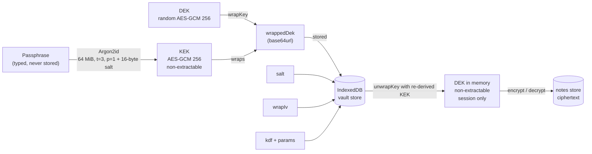
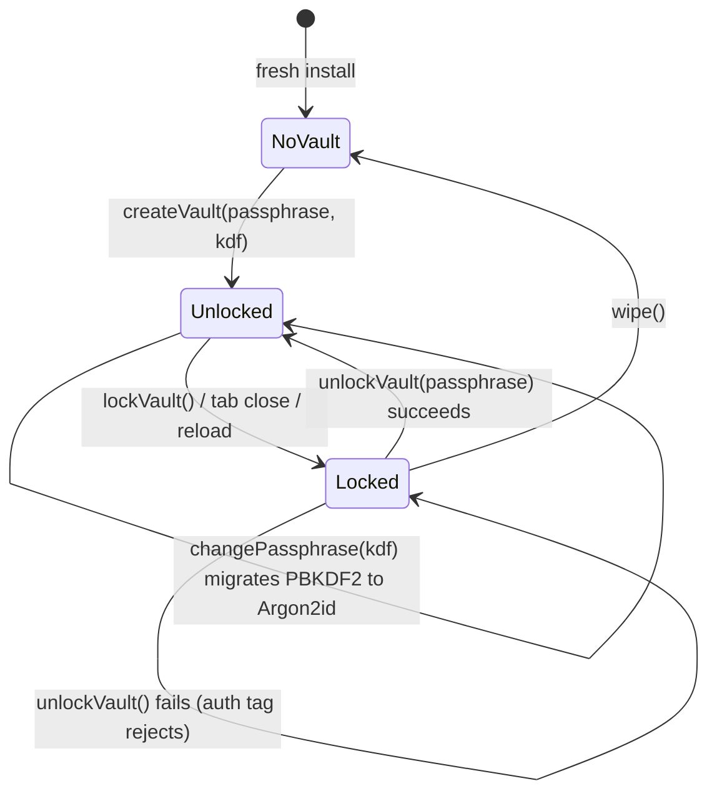

# Encryption design

Everything here runs in the browser. Symmetric encryption uses the native
[Web Crypto API](https://developer.mozilla.org/en-US/docs/Web/API/Web_Crypto_API)
(`crypto.subtle`); key derivation uses Argon2id from
[`hash-wasm`](https://github.com/Daninet/hash-wasm), because Web Crypto has no Argon2. No
key material is ever sent to the server, and none is ever written to disk in usable form.

!!! info "Scope: the local device only"
    This page describes encryption **at rest in IndexedDB**. In the default sync mode the
    data is decrypted at upload time and the server receives it readable — deliberately, because
    the target is a shared-data platform. See [DHIS2 Context](../context/dhis2.md) and
    [Threat Model](threat-model.md).

## Envelope encryption in one paragraph

A random 256-bit AES-GCM **data encryption key (DEK)** encrypts every note. The DEK itself
is never stored in the clear — it is *wrapped* (encrypted) by a **key encryption key
(KEK)** derived from the user's passphrase with Argon2id. Only the wrapped DEK, the salt,
the wrap IV and the KDF parameters live in IndexedDB. On unlock the KEK is re-derived from
the typed passphrase, the DEK is unwrapped, and it is held in memory as a non-extractable
`CryptoKey` for the session.



## Why two keys instead of one

The obvious design is to derive a key from the passphrase and encrypt notes with it
directly. It works, and it is one fewer moving part. It has one fatal ergonomic flaw:

!!! tip "The whole point of the envelope"
    **Changing the passphrase only re-wraps the DEK.** With a single passphrase-derived
    key, changing the passphrase means decrypting and re-encrypting *every record* — an
    operation that is slow, non-atomic, and catastrophic if interrupted halfway on a
    device that is about to lose power. With an envelope, it is one 32-byte
    `wrapKey` call.

    The same O(1) operation also **migrates a vault from PBKDF2 to Argon2id**. See below.

## The vault record

Everything persisted for the vault is safe in the clear — without the passphrase it is
inert bytes.

```typescript
export interface VaultRecord {
    /** Random per-vault salt (base64url). Stops precomputed-table attacks. */
    salt: string
    /** IV used when wrapping the DEK (base64url). */
    wrapIv: string
    /** The DEK, encrypted under the KEK (base64url). The valuable part. */
    wrappedDek: string
    kdf: KdfId          // 'argon2id' | 'pbkdf2'
    params: KdfParams   // { iterations, memorySize?, parallelism? }
    createdAt: number
}
```

Recording **which KDF and which parameters** produced the KEK is what makes the vault a
living format rather than a frozen one. Costs can be raised as devices get faster, or the
algorithm swapped, without stranding vaults that already exist.

Vaults created before the `kdf` field existed have no way to say what they used, and the
only safe interpretation is the algorithm that was in use at the time:

```typescript
/**
 * Read a vault's KDF settings, tolerating records written before `kdf` existed.
 *
 * Any vault without an explicit `kdf` predates Argon2id and must be PBKDF2 -
 * guessing wrong would make a correct passphrase look wrong.
 */
export function vaultKdf(vault: VaultRecord): { kdf: KdfId; params: KdfParams } {
    const kdf: KdfId = vault.kdf ?? 'pbkdf2'
    return { kdf, params: vault.params ?? { iterations: PBKDF2_ITERATIONS } }
}
```

Getting that default wrong would present a user with a correct passphrase being rejected —
the single most alarming possible failure mode for an encrypted store.

## Key derivation

**Argon2id is the default for all new vaults.** PBKDF2 is retained only to open
pre-existing vaults and to serve as the comparison arm in the KDF Lab.

```typescript
export const ARGON2ID_PARAMS = {
    /** KiB of memory per guess. The parameter that actually hurts attackers. */
    memorySize: 65_536, // 64 MiB
    /** Passes over memory. Raises cost linearly for attacker and defender alike. */
    iterations: 3,
    /** Lanes. Kept at 1 - browsers give us no reliable parallelism here. */
    parallelism: 1,
} as const

/** Retained for legacy vaults and as the KDF Lab's comparison arm. */
export const PBKDF2_ITERATIONS = 600_000

export const DEFAULT_KDF: KdfId = 'argon2id'
```

One function derives the KEK either way, so the rest of the module never branches on the
algorithm:

```typescript
async function deriveKek(
    passphrase: string,
    salt: Uint8Array,
    kdf: KdfId,
    params: KdfParams,
): Promise<CryptoKey> {
    const raw =
        kdf === 'argon2id'
            ? await deriveArgon2id(passphrase, salt, params)
            : await derivePbkdf2Bits(passphrase, salt, params)

    return crypto.subtle.importKey('raw', bytesOf(raw), { name: 'AES-GCM', length: 256 }, false, [
        'wrapKey',
        'unwrapKey',
    ])
}
```

The KEK is imported non-extractable and with **only** `wrapKey`/`unwrapKey` usages. It
cannot encrypt a note even by mistake, and its bytes can never be read back out — the
narrowest capability that does the job.

### Parameter choices

| Parameter | Value | Rationale |
| --- | --- | --- |
| KDF (default) | **Argon2id** via `hash-wasm` | Memory-hard. Winner of the Password Hashing Competition. Costs ~40 KB of WASM, bundled with the app JS and precached, so unlock still works fully offline |
| Argon2id memory | 65,536 KiB (64 MiB) | The parameter that actually hurts an attacker. Every guess must allocate 64 MiB, which caps how many fit on a GPU |
| Argon2id iterations | 3 | Passes over memory. Scales cost linearly for attacker and defender alike |
| Argon2id parallelism | 1 | Browsers give no reliable parallelism here, so lanes buy nothing |
| KDF (legacy) | PBKDF2-HMAC-SHA256, 600,000 iterations | Native to every browser. Opens vaults created before Argon2id; not used for new ones |
| Salt | 16 random bytes, per vault | Defeats precomputed rainbow tables; regenerated on every passphrase change |
| Cipher | AES-256-GCM | Authenticated encryption — integrity comes free, and tampering is detected rather than silently decrypted into garbage |
| IV / nonce | 12 random bytes, fresh per encryption | 96 bits is the size GCM is specified for. **Never reused** |
| KEK usages | `wrapKey`, `unwrapKey` only | Principle of least privilege at the API level |
| Extractability | KEK and session DEK both non-extractable | Their raw bytes cannot be read out from JavaScript at all |

### Why memory-hardness is the whole argument

PBKDF2 is CPU-hard but not memory-hard. A GPU can run tens of thousands of SHA-256 chains
in parallel at almost no memory cost per lane, so an attacker's advantage over one browser
thread is enormous. Argon2id forces every guess to allocate 64 MiB, which caps how many
guesses fit on a card and shrinks that advantage by orders of magnitude.

This only matters for **weak passphrases**. Against a diceware-style passphrase, PBKDF2 at
600k is already unbreakable. Against `summer2026`, Argon2id might buy weeks where PBKDF2
buys hours. Users pick `summer2026`.

### Benchmark on the device, not on the guidance

`benchmarkKdf()` derives a throwaway KEK and reports the elapsed milliseconds. The **KDF
Lab** page drives it with tunable memory and iteration counts.

```typescript
export async function benchmarkKdf(
    passphrase: string,
    kdf: KdfId,
    params: KdfParams,
): Promise<number> {
    const salt = randomBytes(SALT_BYTES)
    const started = performance.now()
    await deriveKek(passphrase, salt, kdf, params)
    return performance.now() - started
}
```

!!! warning "Measured results — and what they say about these parameters"
    On the development machine (Apple Silicon laptop, Chromium):

    | KDF | Parameters | Time |
    | --- | --- | --- |
    | Argon2id | 64 MiB, t=3, p=1 | **132–146 ms** |
    | PBKDF2-HMAC-SHA256 | 600,000 iterations | **54–67 ms** |

    The usual target for an interactive unlock is **250–500 ms**. Both configurations come
    in *below* that, which means on this hardware **the parameters should be raised**, not
    left where they are. That is an honest finding, and the reason the numbers are printed
    here rather than quietly rounded up.

    The caveat that matters more: a low-end Android tablet — the device this project is
    actually about — will be several times slower, and it is the device that should set the
    parameters. Do not tune on a developer laptop. Run the KDF Lab on the weakest hardware
    you must support and pick from that.

### IV uniqueness

AES-GCM does not degrade gracefully under nonce reuse — encrypting two different
plaintexts under the same key and IV leaks the XOR of the plaintexts *and* compromises the
authentication key, allowing forgery. It is one of the few "you get one mistake and it's
total" properties in modern crypto.

Lockbox generates a fresh IV from `crypto.getRandomValues()` on every single encryption
call. There is no IV cache, no counter, and no derivation:

```typescript
export async function encryptJson(value: unknown): Promise<EncryptedPayload> {
    if (!sessionKey) throw new Error('Vault is locked')

    const iv = randomBytes(IV_BYTES)
    const ciphertext = await crypto.subtle.encrypt(
        { name: 'AES-GCM', iv: bytesOf(iv) },
        sessionKey,
        encoder.encode(JSON.stringify(value)),
    )

    return { iv: toBase64(iv), ciphertext: toBase64(ciphertext) }
}
```

With 96-bit random IVs, the birthday bound puts collision risk at negligible levels until
somewhere around 2^32 encryptions under one key. A notes app is many orders of magnitude
away from that. An app writing millions of records per key should use a deterministic
counter-based nonce scheme instead.

## Key lifecycle



| Phase | Where the DEK is | Where the KEK is |
| --- | --- | --- |
| Vault creation | Generated extractable, wrapped, immediately re-imported non-extractable | Derived, used, discarded |
| Locked | Only as `wrappedDek` in IndexedDB | Does not exist |
| Unlocked | In memory as a non-extractable `CryptoKey`, in a module-level variable | Discarded after unwrap |
| Lock | Reference dropped (`sessionKey = null`) | — |
| Passphrase change or KDF migration | Briefly extractable, to re-wrap | Both old and new derived, then discarded |

The DEK is **never persisted**. Not in `localStorage`, not in `sessionStorage`, not in a
cookie, not in IndexedDB. A page reload locks the vault. That is a deliberate UX cost
accepted in exchange for the property that a powered-off device holds no usable key.

A consequence worth naming: because plaintext sync must decrypt, **locking also stops
sync**. See [Offline Sync](offline-sync.md#the-unlocked-vault-requirement).

!!! note "No secure keychain exists for web apps"
    A native app can put the DEK in the OS keychain / Keystore / Secure Enclave, protected
    by biometrics, and never prompt again. The web platform has no equivalent, so the
    secret must be re-supplied every session. The closest available substitute is the
    WebAuthn PRF extension — see
    [Trade-offs: unlock UX](../context/trade-offs.md#unlock-ux).

## Passphrase change and KDF migration are the same operation

`changePassphrase()` takes a `kdf` argument. Passing a different one migrates the vault.
Because the notes are encrypted under the DEK and the DEK is untouched, this is O(1) in the
number of notes and cannot half-fail across a large dataset.

```typescript
export async function changePassphrase(
    oldPassphrase: string,
    newPassphrase: string,
    vault: VaultRecord,
    kdf: KdfId = DEFAULT_KDF,
): Promise<VaultRecord | null> {
    const current = vaultKdf(vault)
    const oldKek = await deriveKek(oldPassphrase, fromBase64(vault.salt), current.kdf, current.params)

    let dek: CryptoKey
    try {
        dek = await crypto.subtle.unwrapKey(
            'raw',
            bytesOf(fromBase64(vault.wrappedDek)),
            oldKek,
            { name: 'AES-GCM', iv: bytesOf(fromBase64(vault.wrapIv)) },
            { name: 'AES-GCM', length: 256 },
            true, // extractable, so it can be re-wrapped under the new KEK
            ['encrypt', 'decrypt'],
        )
    } catch {
        return null // old passphrase was wrong
    }

    // Fresh salt and IV: reusing either across a passphrase change would leak
    // information about the relationship between the old and new keys.
    const salt = randomBytes(SALT_BYTES)
    const wrapIv = randomBytes(IV_BYTES)
    const params = defaultParams(kdf)
    const newKek = await deriveKek(newPassphrase, salt, kdf, params)
    const wrappedDek = await crypto.subtle.wrapKey('raw', dek, newKek, {
        name: 'AES-GCM',
        iv: bytesOf(wrapIv),
    })

    return { ...vault, salt: toBase64(salt), wrapIv: toBase64(wrapIv), wrappedDek: toBase64(wrappedDek), kdf, params }
}
```

!!! success "This is the envelope paying for itself, concretely"
    Upgrading a PBKDF2 vault to Argon2id — a change to the *root of the entire security
    story* — touches exactly one 32-byte key. Not one note is read, decrypted or rewritten.
    A design without the envelope would have to re-encrypt the whole dataset on a field
    device that may lose power partway through.

    The same mechanism raises Argon2id's own parameters later, and is what a recovery code
    or a WebAuthn PRF unlock would use: another envelope over the same DEK.

Note that the change also generates a **fresh salt and wrap IV**. Reusing the old salt
would be a smaller change but would weaken the new KEK's independence from the old.

Secondary benefits of the envelope, not currently used but cheaply reachable:

- Multiple KEKs can wrap the same DEK — passphrase *and* a WebAuthn-derived key, or a
  recovery code. Each is an independent envelope over the same data.
- Per-record DEKs become possible later (selective sharing, per-record revocation).

## Wrong-passphrase detection is free

There is **no stored password hash**. A wrong passphrase derives a wrong KEK, which fails
AES-GCM's authentication tag check during `unwrapKey`, which throws:

```typescript
export async function unlockVault(passphrase: string, vault: VaultRecord): Promise<boolean> {
    const { kdf, params } = vaultKdf(vault)
    const kek = await deriveKek(passphrase, fromBase64(vault.salt), kdf, params)

    try {
        sessionKey = await crypto.subtle.unwrapKey(
            'raw',
            bytesOf(fromBase64(vault.wrappedDek)),
            kek,
            { name: 'AES-GCM', iv: bytesOf(fromBase64(vault.wrapIv)) },
            { name: 'AES-GCM', length: 256 },
            false,
            ['encrypt', 'decrypt'],
        )
        return true
    } catch {
        // Wrong passphrase (or tampered vault). Indistinguishable by design.
        sessionKey = null
        return false
    }
}
```

This is a genuinely nice property, and it is easy to accidentally throw away. A naive
implementation stores `sha256(passphrase)` to check the input before attempting decryption
— which hands an offline attacker a much cheaper oracle than the KDF-and-unwrap path, and
provides no security benefit whatsoever. Here, verifying a guess costs a full Argon2id
derivation at 64 MiB. That cost *is* the defence.

## What is encrypted, and what is not

**Encrypted in IndexedDB** — the note payload, as a JSON object serialized then encrypted:

```json
{ "title": "Facility visit", "body": "12 doses administered ..." }
```

**Not encrypted:**

| Field | Why it must be clear |
| --- | --- |
| `id` (UUID) | Primary key in IndexedDB and the server; the idempotency key for retries |
| `createdAt` / `updatedAt` | Sort order for the note list; last-write-wins conflict resolution — both must work while locked |
| `synced` | Sync-state badge, and the outbox drains while locked in encrypted mode |
| `salt`, `wrapIv`, `wrappedDek`, `kdf`, `params` | The unlock inputs — inert without the passphrase, so no reason to hide them |

!!! warning "This is a real, if modest, metadata leak"
    An attacker with the device learns how many notes exist, when each was created and
    last modified, and whether it reached the server. Correlated with other information
    ("a record was created at the clinic at 14:32") this is not always harmless.
    Whole-database encryption (SQLite-WASM + SQLCipher) closes this at the cost of losing
    queryable indices and adding a heavy WASM dependency. See
    [Trade-offs](../context/trade-offs.md#field-level-vs-whole-database-encryption).

!!! danger "And in plaintext sync mode, the note body is not protected on the server"
    Everything above concerns the device. In the default mode the title and body are
    decrypted at upload and stored readable in `data/notes.plain.json`. That is the
    intended behaviour — see [DHIS2 Context](../context/dhis2.md) — but it means the
    server-side confidentiality story is entirely the platform's, not this encryption
    layer's.

## Ciphertext expansion and encoding

AES-GCM appends a 16-byte authentication tag, and base64url expands by ~33%. A 200-byte
note becomes roughly `ceil((200 + 16) / 3) * 4 ≈ 288` base64url characters, plus a
16-character IV. The `EncryptedNote` schema caps `ciphertext` at 1,000,000 characters,
which is about 730 KB of plaintext.

Base64url (`-` and `_` instead of `+` and `/`, no padding) is used rather than plain
base64 so the values are safe in JSON, URLs and filenames without escaping:

```typescript
export function toBase64(bytes: ArrayBuffer | Uint8Array): string {
    const view = new Uint8Array(bytes)
    let binary = ''
    for (let i = 0; i < view.length; i += 1) binary += String.fromCharCode(view[i])
    return btoa(binary).replace(/\+/g, '-').replace(/\//g, '_').replace(/=+$/, '')
}
```

## Integrity, not just confidentiality

Because AES-GCM is authenticated, `decryptJson` throws rather than returning garbage if
the ciphertext has been modified. Within the device's own store, that means a corrupted or
tampered record surfaces as an error rather than as plausible-looking nonsense.

In **encrypted sync mode** this extends to the server: a malicious or buggy server cannot
tamper with note contents undetected — it can withhold a record, or serve an old one, but
it cannot alter one. What it *can* do is reorder or replay, since `updatedAt` is
unauthenticated metadata outside the ciphertext. Binding the metadata into the ciphertext
as AES-GCM *additional authenticated data* would close that gap and is a small, worthwhile
change; it is on the [Roadmap](../context/roadmap.md).

In **plaintext mode** none of this applies to the server, which holds readable records it
is free to modify. Integrity there is the platform's problem, handled by its own audit
trail and access control.

## There is no recovery

!!! danger "A forgotten passphrase means permanently unreadable local data"
    There is no reset link, no admin override, no escrow. The passphrase is the only path
    to the DEK, and the DEK is the only path to the notes in IndexedDB.

    In plaintext sync mode a synced note still exists readable on the server, so the loss
    is bounded by whatever had not yet uploaded — which, for a device that has been offline
    for a day in the field, can still be the entire day's work. In encrypted mode the loss
    is total.

    Any real deployment needs an explicit answer here — a printed recovery code that wraps
    the same DEK under a second high-entropy KEK is the standard solution, and is on the
    [Roadmap](../context/roadmap.md).
