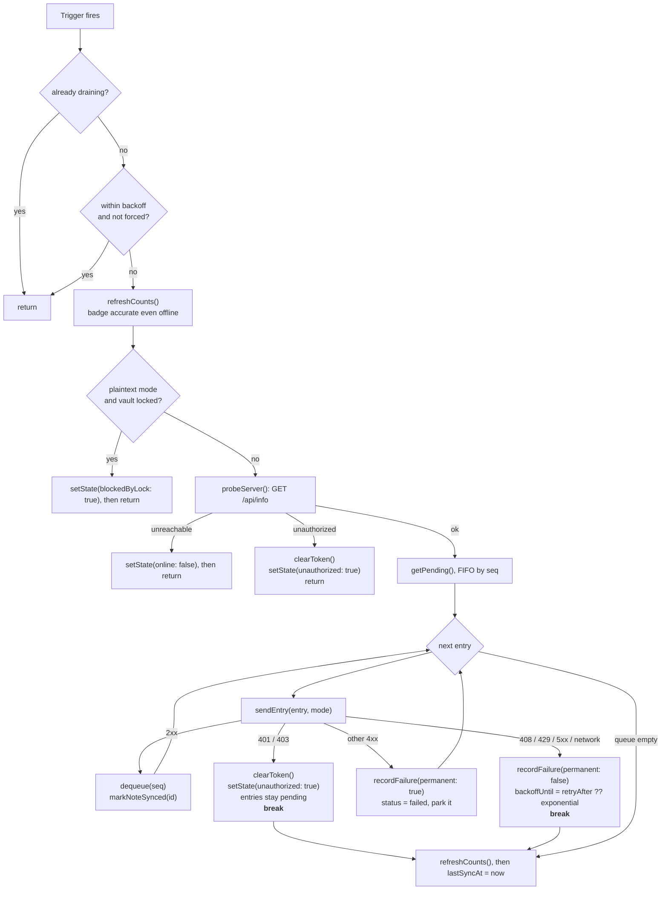
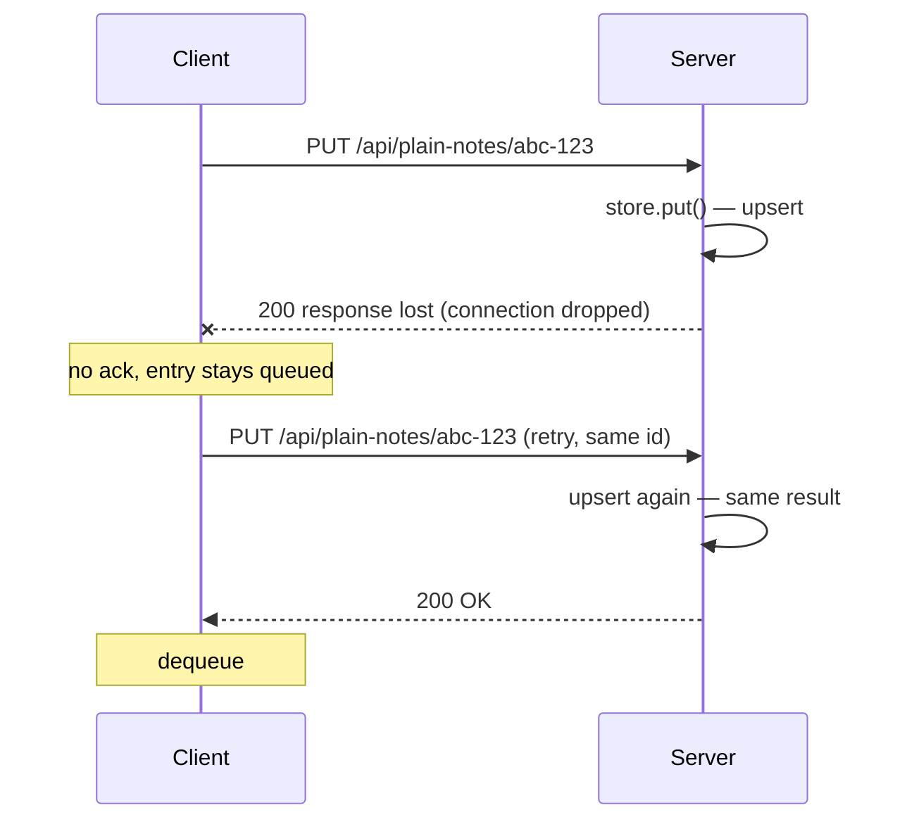

# Offline sync design

The rule the entire sync layer follows: **IndexedDB is the source of truth; the server is
a replica the client pushes to when it can.** Not the other way around. Offline is the
normal operating mode, not an error state to recover from.

## Two sync modes

There are two ways to get a queued write to the server, and choosing between them is the
central architectural decision of this project.

```typescript
export type SyncMode = 'plaintext' | 'encrypted'

/** DHIS2-realistic behaviour is the default. */
export const DEFAULT_SYNC_MODE: SyncMode = 'plaintext'
```

| | **plaintext** (default) | **encrypted** (demonstration) |
| --- | --- | --- |
| What is uploaded | Decrypted `{title, body}` | The stored ciphertext, untouched |
| Endpoint family | `/api/plain-notes` | `/api/notes` |
| Server-side file | `data/notes.plain.json` | `data/notes.json` |
| Server can validate / aggregate / share | ✅ | ❌ |
| Readable by other authorised users | ✅ | ❌ — only the one passphrase opens it |
| **Sync works while locked** | ❌ **requires an unlocked vault** | ✅ |
| Confidentiality on the server | Platform's responsibility (access control, TLS, server-side encryption at rest) | Structural — the server has no key |
| Suits the target (DHIS2) | ✅ | ❌ |

The mode is persisted in `localStorage` under `lockbox.syncMode` and switched with
`setMode()`, which also forces an immediate drain. The **Sync Modes** page exposes this and
fetches both server stores side by side, which is a far more convincing demonstration than
any paragraph.

### Why plaintext is the default

Every user of the PWA sets their own passphrase. Encrypting uploads under a per-user key
would make each record readable by exactly one person, break every server-side operation
DHIS2 exists to perform, and render the platform's own sharing rules meaningless. The data
on the server is *supposed* to be readable by multiple authorised users.

So the encryption is scoped to the device: it protects IndexedDB on a laptop that gets
stolen. TLS protects the data in transit, and the platform governs it server-side. The full
argument is in [DHIS2 Context](../context/dhis2.md).

### The unlocked-vault requirement

Plaintext uploads must decrypt, and decryption needs the DEK, so:

!!! warning "In plaintext mode, a locked vault stops sync"
    This falls directly out of the design and is not worked around. It is surfaced as
    state, not as an error:

    ```typescript
    // Plaintext uploads must decrypt, so a locked vault stops sync dead.
    // Surfaced as state rather than an error - it is a designed constraint,
    // not a failure.
    const needsKey = mode === 'plaintext'
    const locked = needsKey && unlockedDecryptor?.() === false
    setState({ blockedByLock: locked })
    if (locked) return
    ```

    In encrypted mode the outbox holds self-contained ciphertext and nothing needs a key,
    so the queue drains with the vault locked and the laptop lid shut. That is genuinely
    nicer — and the data it delivers is useless to the platform. Both halves of that
    sentence are true at once, which is why the app ships both modes rather than arguing
    about them.

`sync.ts` deliberately does not reach into the vault on its own. It is given a predicate:

```typescript
/** Register a predicate reporting whether the vault is currently unlocked. */
export function setUnlockedCheck(isUnlocked: () => boolean): void {
    unlockedDecryptor = isUnlocked
}
```

Injecting the capability rather than importing it means the engine can only decrypt when
the app has explicitly handed it the ability, which makes the constraint impossible to
bypass by accident.

## The outbox pattern

Every local mutation does two things, and they land in **one IndexedDB transaction** so a
crash can never persist one without the other:

1. Apply the change to the `notes` store, so the UI is correct immediately.
2. Append an entry to the `outbox` store describing the change.

```typescript
export async function putNoteAndEnqueue(
    note: NoteRecord,
    op: OutboxOp,
    payload: NotePayload | null,
): Promise<void> {
    const db = await openDb()
    const tx = db.transaction([STORE_NOTES, STORE_OUTBOX], 'readwrite')

    tx.objectStore(STORE_NOTES).put(note)
    tx.objectStore(STORE_OUTBOX).add({
        op,
        noteId: note.id,
        ownerId: note.ownerId,
        payload,
        status: 'pending',
        attempts: 0,
        lastError: null,
        queuedAt: Date.now(),
    })

    await new Promise<void>((resolve, reject) => {
        tx.oncomplete = () => resolve()
        tx.onerror = () => reject(tx.error)
        tx.onabort = () => reject(tx.error)
    })
}
```

`deleteNoteAndEnqueue()` is the mirror image for removals: it deletes the note and adds a
`delete` entry in the same transaction.

!!! note "Why one transaction and not two"
    These were previously two separate writes — put the note, then enqueue — which left a
    window where a crash, a quota error or a closed tab could persist the note without the
    queue entry. That change would then never sync, silently. IndexedDB gives multi-store
    atomicity for free, so there is no reason not to take it: the note and its outbox entry
    commit together or not at all.

Each entry carries the **`ownerId`** of the user who wrote it. The device can hold several
registered users, each with their own key, and the drain only ever touches the signed-in
user's entries — another user's ciphertext is unreadable here and must wait for them to
sign in.

The outbox is keyed by an auto-incrementing `seq`, which gives a monotonic ordering for
free and doubles as the dequeue handle.

### The payload is self-contained

The outbox entry stores the **full encrypted record**, not a pointer to the note.

The naive design queues `{op: "put", noteId}` and re-reads the note from the `notes` store
at drain time. That couples draining to reading, and it silently collapses three edits into
one final state — losing intermediate history the server might want. Storing the record as
it was at the moment of the edit avoids both problems.

It also means the queue itself never needs the DEK. In encrypted mode the drain path never
touches `crypto.ts` at all. In plaintext mode it does — once, at the last possible moment,
in `sendEntry()` — and that is the only place the *drain* requires the vault. (Reading
records back has a matching requirement on the other side: `pullPlaintext()` re-encrypts on
arrival, so it too needs an unlocked vault. See [Reading the server back](#pull-merging-server-records-back).)

## Draining



Four details in that flow do real work:

- **Counts are refreshed before anything else.** The queue badge has to be accurate while
  offline, or locked — that is exactly when the user needs to see how much unsynced work is
  outstanding. Probing first and bailing early would leave a stale badge.
- **The lock check comes before the network probe.** No point in a round trip that cannot
  be followed by an upload.
- **A transient failure breaks the loop rather than skipping the entry.** Continuing past
  a failed entry would let a later write land on the server before an earlier one,
  reordering the user's edits. Stop-on-first-transient-failure preserves write ordering.
- **An auth failure also stops, but without a backoff.** A 401/403 mid-drain — or a 401
  from the probe itself — is not a property of the payload, so nothing gets parked. The
  token is cleared and `unauthorized` is surfaced so the UI can re-prompt, the entries stay
  `pending`, and once a fresh token arrives the queue resumes with nothing to re-save.

A permanent failure does *not* break the loop — a rejected payload is parked and the queue
continues, because a malformed record should not block every subsequent write forever.

The whole drain is guarded against re-entry with a `draining` flag, since several triggers
routinely fire together (the `online` event and a focus event arrive within milliseconds
of each other when a laptop wakes up).

## Sending one entry

`sendEntry()` is where the mode branch lives, and it is the only place in the engine that
knows the two endpoint families exist:

```typescript
async function sendEntry(entry: OutboxEntry, mode: SyncMode): Promise<SendResult> {
    const base = mode === 'plaintext' ? '/api/plain-notes' : '/api/notes'
    const url = `${base}/${encodeURIComponent(entry.noteId)}`

    try {
        if (entry.op === 'delete') {
            return classify(await apiFetch(url, { method: 'DELETE' }))
        }

        const payload = entry.payload
        if (!payload) return { result: 'permanent', message: 'Queue entry has no payload' }

        let body: unknown = payload

        if (mode === 'plaintext') {
            // Requires the DEK, hence the unlocked-vault precondition.
            const content = await decryptJson<NoteContent>(payload)
            body = {
                id: payload.id,
                title: content.title,
                body: content.body,
                author: content.author,
                createdAt: payload.createdAt,
                updatedAt: payload.updatedAt,
            }
        }

        return classify(
            await apiFetch(url, {
                method: 'PUT',
                headers: { 'Content-Type': 'application/json' },
                body: JSON.stringify(body),
            }),
        )
    } catch (error) {
        const message = error instanceof Error ? error.message : 'Network unreachable'
        return { result: 'transient', message }
    }
}
```

The network calls go through `apiFetch`, not bare `fetch`: it attaches the stored bearer
token, which is what makes a 401 a meaningful signal (see [Error classification](#error-classification)).

In plaintext mode `title`, `body` and `author` come out of the decrypted content — the
`author` travels inside the ciphertext at rest and is unwrapped here so the server record
records who wrote it. By contrast `id`, `createdAt` and `updatedAt` are copied from the
queue entry, not from the decrypted content — they are shared metadata that both wire shapes
carry (`NoteBase` on the server side), and they must be identical whichever mode uploaded
the record.

Response classification is shared: `classify()` does not care which endpoint produced the
response, because the retry semantics are the same either way.

!!! note "The two endpoint families are genuinely parallel"
    `GET` list, `PUT` upsert by id, `DELETE` by id — same verbs, same idempotency, same
    status codes, different body shape. That symmetry is what lets one drain loop serve
    both modes without special cases beyond the one branch above. See
    [API Reference](../reference/api.md).

## Idempotency

Uploads are `PUT /api/{plain-,}notes/{id}` with a **client-generated UUID**, not `POST` to
a collection.



The failure mode this eliminates is the classic one: the request succeeded but the response
was lost, so the client retries, and with `POST` you now have two records. With a
client-generated id and `PUT`, a retry is an overwrite. `DELETE` is idempotent for the
same reason — deleting an unknown id returns 204, not 404:

```python
@app.delete("/api/plain-notes/{note_id}", status_code=204)
async def delete_plain_note(note_id: str) -> Response:
    """Delete one readable note. Idempotent."""
    plain_store.delete(note_id)
    return Response(status_code=204)
```

!!! note "Client-generated ids are what make offline writes possible at all"
    If the server assigned ids, a note created offline would have no identity until it
    synced. Editing it, referencing it, or deleting it before first sync would all need a
    temporary-id remapping layer. `crypto.randomUUID()` avoids that entire class of
    problem — the id exists the moment the note does.

    DHIS2's tracker API accepts client-generated UIDs for exactly this reason, which is
    what makes an outbox viable against it.

## Error classification

Distinguishing "retry this" from "this will never work" — and, now, "this is not about the
payload at all" — is what keeps the queue from either spinning forever or silently dropping
data. `SendResult` is a discriminated union of four outcomes:

```typescript
type SendResult =
    | { result: 'ok' }
    | { result: 'transient'; message?: string; retryAfterMs?: number }
    | { result: 'permanent'; message?: string }
    | { result: 'auth'; message?: string }
```

| Response | Class | Action |
| --- | --- | --- |
| 2xx | **ok** | Dequeue, mark the note synced |
| 401 / 403 | **auth** | Credentials are wrong or gone. Stop the drain, clear the stored token, set `unauthorized`. Leave every entry **pending** — nothing is parked, nothing is re-saved. |
| 408 / 429 | **transient** | The server asked to wait. Back off, honouring `Retry-After` when present. |
| Other 4xx | **permanent** | The server will never accept this payload. Park the entry (`status: "failed"`), surface it to the user, stop retrying it. Continue with the rest of the queue. |
| 5xx | **transient** | Server-side problem, likely temporary. Back off and retry from this entry. |
| Network error / fetch throws | **transient** | Offline, DNS failure, TLS failure, captive portal. Back off and retry. |

```typescript
export function classify(response: Response): SendResult {
    if (response.ok) return { result: 'ok' }

    const status = response.status

    // Credentials are wrong or gone. Not a property of the payload - parking
    // every queue entry as "failed" would make the user re-save notes after
    // fixing the token. Stop, surface unauthorized, leave entries pending.
    if (status === 401 || status === 403) {
        return { result: 'auth', message: `Not authorised (HTTP ${status})` }
    }

    // Temporary client-side conditions: try again later.
    if (status === 408 || status === 429) {
        return {
            result: 'transient',
            message: `Server asked to wait (HTTP ${status})`,
            retryAfterMs: parseRetryAfterMs(response),
        }
    }

    // The server has judged this payload invalid. It will judge every retry the
    // same way, so retrying is pointless - park it for the user instead.
    if (status >= 400 && status < 500) {
        return { result: 'permanent', message: `Server rejected it (HTTP ${status})` }
    }
    return { result: 'transient', message: `Server error (HTTP ${status})` }
}
```

`parseRetryAfterMs` reads the header as a delay in **seconds**, ignoring the HTTP-date form
and any junk value, and caps the result at `BACKOFF_MAX_MS` (60s) so a hostile or buggy
server cannot pin the queue shut for hours:

```typescript
function parseRetryAfterMs(response: Response): number | undefined {
    const raw = response.headers.get('Retry-After')
    if (!raw) return undefined
    const seconds = Number(raw)
    if (!Number.isFinite(seconds) || seconds < 0) return undefined
    return Math.min(seconds * 1_000, BACKOFF_MAX_MS)
}
```

!!! note "The matrix is implemented — and unit-tested"
    An earlier version of this page flagged 408/429/`Retry-After` and 401/403 as *should*,
    pointing at the roadmap. They are all real behaviour now. `classify()` is `export`ed
    precisely so the status-code matrix can be pinned directly: `sync.test.ts` asserts
    2xx→ok, 401/403→auth, 408/429→transient with `Retry-After` honoured, other 4xx→permanent
    and 5xx→transient, without needing an end-to-end run to rediscover an off-by-one.

    Two cases carry the most weight:

    - **401/403 is not permanent.** An auth failure says nothing about the record — the
      token expired, or was never valid. Parking every entry as "failed" would force the
      user to re-save each note after fixing the credential. Instead the drain clears the
      token, flips `unauthorized`, and leaves the queue `pending`, so a fresh sign-in
      resumes it untouched.
    - **`Retry-After` overrides the backoff.** For that one round the server's own hint
      replaces the exponential delay (`delay = retryAfterMs ?? exponential`). It knows when
      it will be ready better than a client-side timer does.

    Plaintext mode adds a new way to earn a 4xx that encrypted mode cannot: the server
    validates the *content* now. A `PlainNote` with an empty title fails schema validation
    with a 422 and is parked. Under ciphertext the server had nothing to object to.

Parked entries need a UI. Lockbox exposes them via `getOutbox()` and offers
`discardEntry(seq)` so a user can acknowledge and drop one, but the queue-inspection UI is
minimal. A proper conflict/failure UI is on the roadmap.

## Backoff

Exponential, computed from the entry's own attempt count, clamped:

```typescript
const BACKOFF_BASE_MS = 1_000
const BACKOFF_MAX_MS = 60_000

// Transient: stop here rather than skipping ahead, so later writes
// cannot overtake this one on the server.
await db.recordFailure(entry.seq, outcome.message ?? 'Unreachable', false)
const exponential = Math.min(BACKOFF_BASE_MS * 2 ** (entry.attempts + 1), BACKOFF_MAX_MS)
const delay = outcome.retryAfterMs ?? exponential
backoffUntil = Date.now() + delay
```

So 2s, 4s, 8s, 16s, 32s, then a 60s ceiling. The ceiling matters: without it, a device
offline overnight would compute a multi-hour delay and fail to sync promptly the next
morning even with perfect connectivity.

The exponential schedule is the *default*, not the last word. When the transient outcome
carried a `retryAfterMs` — a 408 or 429 whose `Retry-After` parsed cleanly — that value
wins for the round (`retryAfterMs ?? exponential`), because a server that says "wait 12s"
knows its own readiness better than a client-side timer. It is still clamped to the same
60s ceiling.

`backoffUntil` is a single module-level gate rather than per-entry, which is a
simplification the FIFO-with-stop-on-failure model makes safe — the head of the queue is
the only entry that will be attempted next anyway.

The `online` event resets the backoff to zero and forces an immediate sync. A fresh
connection is strictly better evidence than a timer, and deserves to override it:

```typescript
window.addEventListener('online', () => {
    backoffUntil = 0 // A fresh connection deserves an immediate attempt.
    setState({ online: true })
    void runSyncCycle({ forceDrain: true, minPullIntervalMs: 0 })
})
```

`runSyncCycle` — drain, then pull — is the shape every automatic trigger now takes; the
next two sections cover why the two halves run in that order and how the pull half
reconciles against the queue.

## The drain-then-pull cycle

Pushing local writes up and fetching remote writes down are two directions, and the order
between them is not arbitrary. Every automatic trigger runs them as a unit:

```typescript
export async function runSyncCycle(opts?: {
    forceDrain?: boolean
    minPullIntervalMs?: number
}): Promise<boolean> {
    await drain({ force: opts?.forceDrain })
    return maybePull(opts?.minPullIntervalMs ?? PULL_INTERVAL_MS)
}
```

**Drain first, pull second.** Draining flushes the user's own unsent work to the server
before any remote copy is read back. That ordering is what lets last-write-wins do the
right thing: the local edits reach the server and become the newest version, so the pull
that follows sees them as current rather than overwriting them with a stale server row. A
pull that ran *first* — or concurrently — could clobber an unsent local note with an older
remote copy and then re-upload it, undoing the user's edit.

To make "concurrently" impossible rather than merely unlikely, `pull()` and `maybePull()`
both wait out any in-flight drain before touching local storage:

```typescript
async function waitWhile(predicate: () => boolean, maxWaitMs = 10_000): Promise<boolean> {
    const deadline = Date.now() + maxWaitMs
    while (predicate()) {
        if (Date.now() >= deadline) return false
        await new Promise((resolve) => setTimeout(resolve, 5))
    }
    return true
}
```

The wait is **bounded at 10s**. A drain wedged on a stalled fetch must not pin every queued
pull trigger forever: when the wait is abandoned, `waitWhile` returns `false` and the caller
bails rather than merging concurrently with whatever is stuck. Correctness first — a skipped
pull converges on the next cycle; a racing one can lose data.

`maybePull` also carries its own timestamp gate (`lastPullAttempt`) so a burst of local
writes cannot trigger a burst of full fetches, and reports whether a pull actually ran so a
manual trigger can tell "nothing new" apart from "skipped, one was already in flight". A
post-write flush that only needs to upload can still call `drain()` on its own — the cycle
is for the triggers that also want fresh remote data.

## Trigger redundancy

There is no single reliable "you are online now" signal on the web. So Lockbox uses four
overlapping ones and accepts that they will sometimes all fire at once (the re-entry guard
makes that harmless). All four now run the **full cycle** through `runSyncCycle`, driven by
a **single** timer rather than one for drain and another for pull — so drain-before-pull
holds even under the poll. Each trigger sets its own pull floor, because the urgency of
fetching remote data differs by situation while draining is always urgent:

| Trigger | Covers | Pull floor |
| --- | --- | --- |
| `window.addEventListener("online")` | The clean case: link comes back while the tab is open and focused | 0 — immediate |
| `document.visibilitychange` → visible | The user returns to a backgrounded tab. **The most reliable trigger on iOS/Safari**, where background execution is heavily restricted | `PULL_ON_FOCUS_MIN_MS` = 3s |
| App boot (`start()` runs `runSyncCycle({ forceDrain: true, minPullIntervalMs: 0 })`) | Reload, cold start, new tab — flushes anything left from the previous session and fetches at once | 0 — immediate |
| 30s poll (single `setInterval`) | The backstop. Catches everything the event-based triggers miss, including the `online` event firing while connected to a captive portal that only becomes usable minutes later | `PULL_INTERVAL_MS` = 60s |

The floors matter because pulling is a *full* fetch of the server's records and only pays
off when someone else has written something, whereas draining is cheap and urgent — the
user's own work. So the 30s poll drains every 30s but only pulls once a minute; returning
to the tab is a strong "show me fresh data" signal and pulls after just 3s; the `online`
event and boot pull immediately. Inside `maybePull` the floor simply no-ops the pull half
until enough time has passed, so the single timer stays cheap.

Unlocking is effectively a fifth trigger: `App.tsx`'s `handleUnlocked` runs a full **forced**
cycle (`runSyncCycle({ forceDrain: true, minPullIntervalMs: 0 })`) because `start()` only
boots the triggers once — a re-unlock, or a second user signing in on the same device, must
ask for fresh remote data itself, and does so immediately. Locking forces the blocked state
to reflect at once.

!!! note "Background Sync API — a bonus, never the mechanism"
    The [Background Sync API](https://developer.mozilla.org/en-US/docs/Web/API/Background_Synchronization_API)
    (`registration.sync.register("outbox")`) lets the *service worker* flush the queue with
    the tab closed. It is the right tool, and it is **Chromium-only** — no Safari, no
    Firefox, as of 2026. On iOS every browser is WebKit, so the entire iPad/iPhone fleet
    is excluded.

    That makes it a progressive enhancement by definition: the foreground triggers above
    must be complete on their own. **It is currently not implemented** — see the
    [Roadmap](../context/roadmap.md).

    Worth noting that it could only ever help the **encrypted** mode. A service worker has
    no access to the page's in-memory DEK, so it cannot decrypt, so it cannot produce a
    plaintext upload. Background flushing and the DHIS2-realistic path are mutually
    exclusive by construction.

## Reachability: not `navigator.onLine`

`navigator.onLine` reports whether the device has *a network interface with a route*. It
does not report whether your server is reachable. It returns `true` on:

- a captive-portal Wi-Fi that intercepts every request until you accept the terms,
- a connection where DNS is broken,
- a VPN that is up but not routing to your host,
- a server that is simply down.

Every one of those is common in exactly the field conditions this app targets. So
`navigator.onLine` is used only as a cheap negative filter — if it says offline, believe
it and skip the request — and the real answer comes from an actual round trip. The probe is
**tri-state**, not a boolean, because a rejected credential is neither "reachable" nor
"offline":

```typescript
type Reachability = 'ok' | 'unauthorized' | 'unreachable'

async function probeServer(): Promise<Reachability> {
    if (!navigator.onLine) return 'unreachable'
    try {
        const response = await apiFetch('/api/info', { cache: 'no-store' })
        if (response.status === 401) return 'unauthorized'
        return response.ok ? 'ok' : 'unreachable'
    } catch {
        return 'unreachable'
    }
}
```

On `'unauthorized'` the drain does not proceed and does not report "offline": it clears the
stored token and sets `unauthorized` so the UI can re-prompt, instead of silently retrying a
dead credential against a server that is plainly up. Collapsing that into `online: false`
would send the user hunting for a network fault that does not exist.

`cache: "no-store"` is load-bearing. Without it an HTTP cache could serve a stale 200 and
report reachability for a server that is not there. (The service worker also refuses to
touch `/api/*` for exactly this reason — see [Service Worker](service-worker.md).)

`/api/info` is a good probe because it is cheap and it confirms the *application* is up,
not just the TCP port. It now reports both stores' counts, which the Sync Modes page uses:

```python
@app.get("/api/info", response_model=ServerInfo)
async def info() -> ServerInfo:
    """Report server identity and note counts. Used as a reachability probe."""
    return ServerInfo(
        name="lockbox",
        version=__version__,
        note_count=store.count(),
        plain_note_count=plain_store.count(),
    )
```

## Reading the server back

Two functions read from the server, and they exist for different reasons.

### `fetchServerState()` — inspection, not storage

Fetches both stores and returns them without writing anything locally. It exists solely to
let the **Sync Modes** page print the two backends side by side.

```typescript
const [plain, encrypted] = await Promise.all([
    fetch('/api/plain-notes', { cache: 'no-store' }).then((r) => r.json()),
    fetch('/api/notes', { cache: 'no-store' }).then((r) => r.json()),
])
```

### `pull()` — merging server records back

`pull()` is the direction that makes the whole architecture make sense, and it does have a
plaintext counterpart — it dispatches on mode:

```typescript
export async function pull(): Promise<number> {
    // Never merge remote state while a drain is mid-flight ...
    if (!(await waitWhile(() => draining))) return 0

    if (!activeOwnerId) return 0
    if ((await probeServer()) !== 'ok') return 0

    return state.mode === 'plaintext' ? pullPlaintext() : pullEncrypted()
}
```

**`pullPlaintext()` — the real one.** It fetches readable records from `/api/plain-notes`
and **re-encrypts each one under this device's DEK** before writing it to IndexedDB:

```typescript
// Encrypted here, on arrival - the local copy is never plaintext at rest.
// Authorship comes across intact, so a pulled note still shows who wrote it.
const { iv, ciphertext } = await encryptJson({
    title: remote.title,
    body: remote.body,
    author: remote.author,
})

await db.putNote({
    id: remote.id,
    iv,
    ciphertext,
    createdAt: remote.createdAt,
    updatedAt: remote.updatedAt,
    synced: true,
    origin: 'pulled',
    ownerId,
})
```

That re-encrypt-on-arrival is the crucial step, and the mirror image of the upload
constraint: it requires the DEK, so `pullPlaintext` needs an unlocked vault just as uploading
does. The server copy is shared and readable, governed by the platform's access rules;
every local copy is encrypted under whatever passphrase *that* device chose. A second user
on the same device pulls the same record and encrypts it under a completely different key —
which is exactly why per-user passphrases and a shared backend can coexist at all.
Authorship (`author`) rides across intact, so a pulled note still shows who wrote it.

**`pullEncrypted()` — the demonstration.** It copies ciphertext across verbatim. It needs no
key, so it works locked — but records written under a *different* device's DEK cannot be
decrypted here and surface in the UI as "unreadable". That failure is the point: it shows
precisely why ciphertext-on-the-server cannot support multiple users, and why plaintext mode
exists.

Both pulls apply **tombstones** the same way: a remote record with `deleted: true` deletes
the local copy rather than writing it.

!!! note "Verified end-to-end"
    `multi-user.spec.ts` pins the plaintext re-encrypt path: a note synced by one user is
    pulled for a second user on the same device, arrives readable, and ends up as two local
    records — one per user, same `id`, different `ownerId`, different `ciphertext`. The
    compound `[ownerId, id]` key is what lets the copies coexist.

This is a full-table pull, which is fine for a demo and wrong for anything larger. A real
implementation needs a cursor (`GET /api/plain-notes?since=<timestamp|opaque cursor>`) so a
client with 50,000 records does not re-download all of them on every sync.

### Outbox reconcile on pull

A pull merging remote rows and a drain flushing local writes can disagree about the same
note. Before applying any remote record, the pull consults the note's **latest pending
outbox entry** (highest `seq` — the local intent that has not yet reached the server) and
decides from that. The decision is a pure function, `export`ed and unit-tested so the matrix
does not need IndexedDB to verify:

```typescript
export function decideRemoteApply(
    latest: OutboxEntry | null,
    remote: { updatedAt: number; deleted?: boolean },
    existingUpdatedAt: number | null,
): 'skip' | 'apply' | 'apply-and-dequeue' {
    if (latest) {
        if (latest.op === 'delete') {
            // Local delete still unsent. A live remote row must not resurrect
            // the note before the delete drains. A remote tombstone is the
            // same outcome - apply clean-up and drop the queue entry.
            return remote.deleted ? 'apply-and-dequeue' : 'skip'
        }

        const localUpdated = latest.payload?.updatedAt ?? 0
        if (localUpdated >= remote.updatedAt) {
            return 'skip'
        }
        // Remote is strictly newer than the unsent put - take remote, drop put.
        return 'apply-and-dequeue'
    }

    if (existingUpdatedAt !== null && existingUpdatedAt >= remote.updatedAt) {
        return 'skip'
    }
    return 'apply'
}
```

Read as a matrix:

| Latest pending entry | Remote | Outcome |
| --- | --- | --- |
| `delete` | live row | **skip** — a pull must not resurrect a note whose delete has not drained yet |
| `delete` | tombstone | **apply and dequeue** — same outcome; the queue entry is superseded, so drop it |
| `put`, `updatedAt` ≥ remote | either | **skip** — local in-flight write wins |
| `put`, older than remote | either | **apply remote, then dequeue** — drop the superseded put so a later drain cannot resurrect it |
| none | either | plain note-level LWW on `updatedAt` |

The `apply-and-dequeue` cases lean on `db.dequeueForNote(ownerId, noteId)`, which drops
*every* outbox entry for that note. Without it, a stale pending put could still drain after
the pull and re-create a note the server had already tombstoned.

!!! note "Verified end-to-end"
    `outbox-reconcile.spec.ts` pins both hard cases: a pending local delete survives a
    remote live copy re-asserted at the same `updatedAt` (the note is not resurrected), and
    a newer remote tombstone drops a superseded pending put for the same id.

!!! warning "The honest limitations"
    This reconcile removes the common races, not all of them. Three are worth stating
    plainly, because they are deliberate or unavoidable rather than bugs:

    - **A pending local delete beats even a strictly newer remote edit.** Deletes carry no
      timestamp, so there is nothing to compare — the local intent to delete wins. That is a
      deliberate *delete-wins* choice, not an oversight.
    - **A write landing mid-pull can still briefly lose.** If a local edit is committed
      after the pull has snapshotted the outbox, it can be overwritten by an older remote row
      for one cycle. The next drain-then-pull converges it.
    - **Parked entries are invisible here.** Only `pending` entries are consulted, so a
      `failed` (parked) entry does not protect its note from a remote apply. It has already
      been surfaced to the user as needing attention.

## Conflict resolution

**Last-write-wins on `updatedAt`**, enforced on both sides. The server:

```python
existing = self._notes.get(note.id)
if existing is not None and existing.updated_at > note.updated_at:
    return existing
```

and symmetrically in the client's `pull()`.

Two scopes are worth keeping apart. **Within one device**, the [outbox reconcile](#outbox-reconcile-on-pull)
above removes the pull-versus-unsent-work races entirely — a pull cannot overwrite a local
write that has not drained yet, and cannot resurrect a note the user has deleted locally.
That reconcile also introduces one deliberate asymmetry: a pending local **delete wins over
even a strictly newer remote edit**, because deletes carry no timestamp to compare. **Between
devices** (or between two users sharing the backend) it is still plain LWW on `updatedAt`,
with all the caveats below.

!!! warning "LWW is only appropriate because this is single-user, single-device"
    With one user on one device there is no concurrent editor whose work can be lost. Add
    a second device and LWW starts silently discarding edits, with the loser determined by
    clock skew between two devices that have been offline for days. Client clocks are not
    trustworthy for ordering.

    Real options, roughly in order of cost:

    | Approach | Notes |
    | --- | --- |
    | Server-assigned monotonic version / HLC | Removes clock-skew dependence; still LWW semantics, but deterministic |
    | Per-field LWW | Two people editing different fields of the same record both keep their edits |
    | Conflict surfaced to the user | Honest, and often the correct answer for health data where silent loss is unacceptable |
    | CRDT (Yjs, Automerge) | Genuinely convergent, no loss. Substantially more complex |

    Note the asymmetry between the modes here. In **plaintext** mode the server *can* merge
    — it can read the records, run validation rules, and apply domain logic, which is
    exactly what DHIS2 does. In **encrypted** mode it cannot, so all resolution must be
    client-side and server-side three-way merges are ruled out entirely. That is a real,
    permanent cost of end-to-end encryption, and one more reason the default is what it is.

## Sync state

The engine publishes a small state object to subscribers:

```typescript
export interface SyncState {
    online: boolean
    syncing: boolean
    pending: number       // outbox entries with status 'pending'
    failed: number        // parked entries needing user attention
    lastSyncAt: number | null
    /** Bumped whenever a pull actually changed local data, so the UI reloads. */
    lastPullAt: number | null
    lastError: string | null
    mode: SyncMode
    /** True when plaintext mode is selected but the vault is locked. */
    blockedByLock: boolean
    /**
     * True when the server answered 401.
     *
     * Kept distinct from `online: false` on purpose. A rejected token and an
     * unreachable server look identical to a naive `response.ok` check, and
     * reporting "offline" for a 401 sends the user hunting for a network fault
     * that does not exist.
     */
    unauthorized: boolean
}
```

`subscribe(listener)` plus `getState()` is exactly the `useSyncExternalStore` contract,
which is how `frontend/src/hooks/use-sync.ts` binds it into React without any extra state
management. `blockedByLock` is what the UI uses to explain a stalled queue as a designed
constraint rather than a fault.

Two fields carry the extensions above. `lastPullAt` is bumped **only** when a pull actually
wrote something — an idle poll leaves it untouched, so the UI reloads its note list when
remote changes arrive and not once a minute for nothing (`App.tsx` subscribes to exactly
this edge). `unauthorized` is kept deliberately separate from `online: false`: a rejected
token and an unreachable server are indistinguishable to a naive `response.ok` check, and
reporting "offline" for a 401 would send the user chasing a network fault that is not there
instead of re-authenticating.
