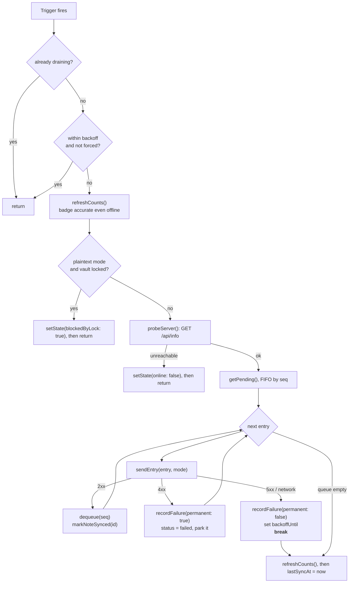
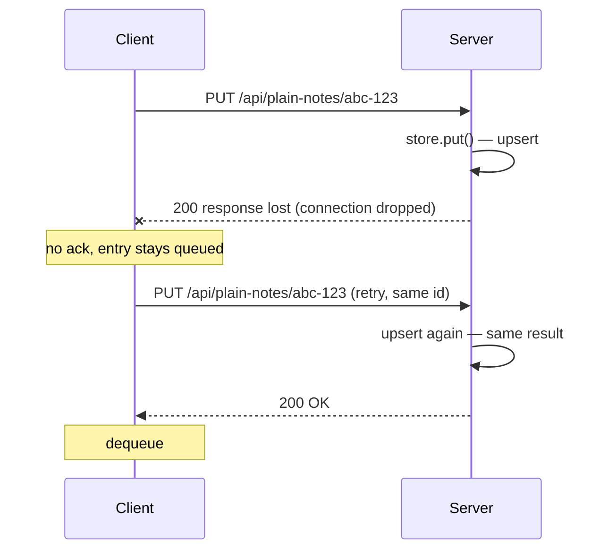

# Offline sync design

The rule the entire sync layer follows: **IndexedDB is the source of truth; the server is
a replica the client pushes to when it can.** Not the other way around. Offline is the
normal operating mode, not an error state to recover from.

## Two sync modes

There are two ways to get a queued write to the server, and choosing between them is the
central architectural decision of this project.

```typescript
export type SyncMode = 'plaintext' | 'encrypted'

/** DHIS2-realistic behaviour is the default. */
export const DEFAULT_SYNC_MODE: SyncMode = 'plaintext'
```

| | **plaintext** (default) | **encrypted** (demonstration) |
| --- | --- | --- |
| What is uploaded | Decrypted `{title, body}` | The stored ciphertext, untouched |
| Endpoint family | `/api/plain-notes` | `/api/notes` |
| Server-side file | `data/notes.plain.json` | `data/notes.json` |
| Server can validate / aggregate / share | ✅ | ❌ |
| Readable by other authorised users | ✅ | ❌ — only the one passphrase opens it |
| **Sync works while locked** | ❌ **requires an unlocked vault** | ✅ |
| Confidentiality on the server | Platform's responsibility (access control, TLS, server-side encryption at rest) | Structural — the server has no key |
| Suits the target (DHIS2) | ✅ | ❌ |

The mode is persisted in `localStorage` under `lockbox.syncMode` and switched with
`setMode()`, which also forces an immediate drain. The **Sync Modes** page exposes this and
fetches both server stores side by side, which is a far more convincing demonstration than
any paragraph.

### Why plaintext is the default

Every user of the PWA sets their own passphrase. Encrypting uploads under a per-user key
would make each record readable by exactly one person, break every server-side operation
DHIS2 exists to perform, and render the platform's own sharing rules meaningless. The data
on the server is *supposed* to be readable by multiple authorised users.

So the encryption is scoped to the device: it protects IndexedDB on a laptop that gets
stolen. TLS protects the data in transit, and the platform governs it server-side. The full
argument is in [DHIS2 Context](../context/dhis2.md).

### The unlocked-vault requirement

Plaintext uploads must decrypt, and decryption needs the DEK, so:

!!! warning "In plaintext mode, a locked vault stops sync"
    This falls directly out of the design and is not worked around. It is surfaced as
    state, not as an error:

    ```typescript
    // Plaintext uploads must decrypt, so a locked vault stops sync dead.
    // Surfaced as state rather than an error - it is a designed constraint,
    // not a failure.
    const needsKey = mode === 'plaintext'
    const locked = needsKey && unlockedDecryptor?.() === false
    setState({ blockedByLock: locked })
    if (locked) return
    ```

    In encrypted mode the outbox holds self-contained ciphertext and nothing needs a key,
    so the queue drains with the vault locked and the laptop lid shut. That is genuinely
    nicer — and the data it delivers is useless to the platform. Both halves of that
    sentence are true at once, which is why the app ships both modes rather than arguing
    about them.

`sync.ts` deliberately does not reach into the vault on its own. It is given a predicate:

```typescript
/** Register a predicate reporting whether the vault is currently unlocked. */
export function setUnlockedCheck(isUnlocked: () => boolean): void {
    unlockedDecryptor = isUnlocked
}
```

Injecting the capability rather than importing it means the engine can only decrypt when
the app has explicitly handed it the ability, which makes the constraint impossible to
bypass by accident.

## The outbox pattern

Every local mutation does two things atomically from the user's point of view:

1. Apply the change to the `notes` store, so the UI is correct immediately.
2. Append an entry to the `outbox` store describing the change.

```typescript
export async function enqueue(
    op: OutboxOp,               // 'put' | 'delete'
    noteId: string,
    payload: NotePayload | null, // the complete encrypted record, for a put
): Promise<void> {
    await withStore(STORE_OUTBOX, 'readwrite', (store) =>
        promisify(
            store.add({
                op,
                noteId,
                payload,
                status: 'pending',
                attempts: 0,
                lastError: null,
                queuedAt: Date.now(),
            }),
        ),
    )
}
```

The outbox is keyed by an auto-incrementing `seq`, which gives a monotonic ordering for
free and doubles as the dequeue handle.

### The payload is self-contained

The outbox entry stores the **full encrypted record**, not a pointer to the note.

The naive design queues `{op: "put", noteId}` and re-reads the note from the `notes` store
at drain time. That couples draining to reading, and it silently collapses three edits into
one final state — losing intermediate history the server might want. Storing the record as
it was at the moment of the edit avoids both problems.

It also means the queue itself never needs the DEK. In encrypted mode the drain path never
touches `crypto.ts` at all. In plaintext mode it does — once, at the last possible moment,
in `sendEntry()` — and that is the *only* place the vault is required.

## Draining



Three details in that flow do real work:

- **Counts are refreshed before anything else.** The queue badge has to be accurate while
  offline, or locked — that is exactly when the user needs to see how much unsynced work is
  outstanding. Probing first and bailing early would leave a stale badge.
- **The lock check comes before the network probe.** No point in a round trip that cannot
  be followed by an upload.
- **A transient failure breaks the loop rather than skipping the entry.** Continuing past
  a failed entry would let a later write land on the server before an earlier one,
  reordering the user's edits. Stop-on-first-transient-failure preserves write ordering.

A permanent failure does *not* break the loop — a rejected payload is parked and the queue
continues, because a malformed record should not block every subsequent write forever.

The whole drain is guarded against re-entry with a `draining` flag, since several triggers
routinely fire together (the `online` event and a focus event arrive within milliseconds
of each other when a laptop wakes up).

## Sending one entry

`sendEntry()` is where the mode branch lives, and it is the only place in the engine that
knows the two endpoint families exist:

```typescript
async function sendEntry(entry: OutboxEntry, mode: SyncMode): Promise<SendResult> {
    const base = mode === 'plaintext' ? '/api/plain-notes' : '/api/notes'
    const url = `${base}/${encodeURIComponent(entry.noteId)}`

    try {
        if (entry.op === 'delete') {
            return classify(await fetch(url, { method: 'DELETE' }))
        }

        const payload = entry.payload
        if (!payload) return { result: 'permanent', message: 'Queue entry has no payload' }

        let body: unknown = payload

        if (mode === 'plaintext') {
            // Requires the DEK, hence the unlocked-vault precondition.
            const content = await decryptJson<NoteContent>(payload)
            body = {
                id: payload.id,
                title: content.title,
                body: content.body,
                createdAt: payload.createdAt,
                updatedAt: payload.updatedAt,
            }
        }

        return classify(
            await fetch(url, {
                method: 'PUT',
                headers: { 'Content-Type': 'application/json' },
                body: JSON.stringify(body),
            }),
        )
    } catch (error) {
        const message = error instanceof Error ? error.message : 'Network unreachable'
        return { result: 'transient', message }
    }
}
```

Note that `id`, `createdAt` and `updatedAt` are copied from the queue entry, not from the
decrypted content — they are shared metadata that both wire shapes carry (`NoteBase` on the
server side), and they must be identical whichever mode uploaded the record.

Response classification is shared: `classify()` does not care which endpoint produced the
response, because the retry semantics are the same either way.

!!! note "The two endpoint families are genuinely parallel"
    `GET` list, `PUT` upsert by id, `DELETE` by id — same verbs, same idempotency, same
    status codes, different body shape. That symmetry is what lets one drain loop serve
    both modes without special cases beyond the one branch above. See
    [API Reference](../reference/api.md).

## Idempotency

Uploads are `PUT /api/{plain-,}notes/{id}` with a **client-generated UUID**, not `POST` to
a collection.



The failure mode this eliminates is the classic one: the request succeeded but the response
was lost, so the client retries, and with `POST` you now have two records. With a
client-generated id and `PUT`, a retry is an overwrite. `DELETE` is idempotent for the
same reason — deleting an unknown id returns 204, not 404:

```python
@app.delete("/api/plain-notes/{note_id}", status_code=204)
async def delete_plain_note(note_id: str) -> Response:
    """Delete one readable note. Idempotent."""
    plain_store.delete(note_id)
    return Response(status_code=204)
```

!!! note "Client-generated ids are what make offline writes possible at all"
    If the server assigned ids, a note created offline would have no identity until it
    synced. Editing it, referencing it, or deleting it before first sync would all need a
    temporary-id remapping layer. `crypto.randomUUID()` avoids that entire class of
    problem — the id exists the moment the note does.

    DHIS2's tracker API accepts client-generated UIDs for exactly this reason, which is
    what makes an outbox viable against it.

## Error classification

Distinguishing "retry this" from "this will never work" is what keeps the queue from
either spinning forever or silently dropping data.

| Response | Class | Action |
| --- | --- | --- |
| 2xx | success | Dequeue, mark the note synced |
| 4xx | **permanent** | The server will never accept this payload. Park the entry (`status: "failed"`), surface it to the user, stop retrying it. Continue with the rest of the queue. |
| 5xx | **transient** | Server-side problem, likely temporary. Back off and retry from this entry. |
| Network error / fetch throws | **transient** | Offline, DNS failure, TLS failure, captive portal. Back off and retry. |

```typescript
if (response.ok) return { result: 'ok' }

// The server has judged this payload invalid. It will judge every retry the
// same way, so retrying is pointless - park it for the user instead.
if (response.status >= 400 && response.status < 500) {
    return { result: 'permanent', message: `Server rejected it (HTTP ${response.status})` }
}
return { result: 'transient', message: `Server error (HTTP ${response.status})` }
```

!!! warning "The classification is right in spirit, imperfect in detail"
    A few 4xx codes are genuinely retryable: **408 Request Timeout**, **429 Too Many
    Requests** (retry after a delay), and in a real system **401/403** may mean "the token
    expired, refresh and retry" rather than "this is invalid forever". A production version
    should special-case at least 408 and 429, and honour `Retry-After`. Lockbox's simple
    range check is on the [Roadmap](../context/roadmap.md) to be refined.

    Plaintext mode adds a new way to earn a 4xx that encrypted mode cannot: the server
    validates the *content* now. A `PlainNote` with an empty title fails schema validation
    with a 422 and is parked. Under ciphertext the server had nothing to object to.

Parked entries need a UI. Lockbox exposes them via `getOutbox()` and offers
`discardEntry(seq)` so a user can acknowledge and drop one, but the queue-inspection UI is
minimal. A proper conflict/failure UI is on the roadmap.

## Backoff

Exponential, computed from the entry's own attempt count, clamped:

```typescript
const BACKOFF_BASE_MS = 1_000
const BACKOFF_MAX_MS = 60_000

// Transient: back off and stop, preserving write ordering.
await db.recordFailure(entry.seq, message ?? 'Unreachable', false)
const delay = Math.min(BACKOFF_BASE_MS * 2 ** (entry.attempts + 1), BACKOFF_MAX_MS)
backoffUntil = Date.now() + delay
```

So 2s, 4s, 8s, 16s, 32s, then a 60s ceiling. The ceiling matters: without it, a device
offline overnight would compute a multi-hour delay and fail to sync promptly the next
morning even with perfect connectivity.

`backoffUntil` is a single module-level gate rather than per-entry, which is a
simplification the FIFO-with-stop-on-failure model makes safe — the head of the queue is
the only entry that will be attempted next anyway.

The `online` event resets the backoff to zero and forces an immediate drain. A fresh
connection is strictly better evidence than a timer, and deserves to override it:

```typescript
window.addEventListener('online', () => {
    backoffUntil = 0 // A fresh connection deserves an immediate attempt.
    setState({ online: true })
    void drain({ force: true })
})
```

## Trigger redundancy

There is no single reliable "you are online now" signal on the web. So Lockbox uses four
overlapping ones and accepts that they will sometimes all fire at once (the re-entry guard
makes that harmless):

| Trigger | Covers |
| --- | --- |
| `window.addEventListener("online")` | The clean case: link comes back while the tab is open and focused |
| `document.visibilitychange` → visible | The user returns to a backgrounded tab. **The most reliable trigger on iOS/Safari**, where background execution is heavily restricted |
| App boot (`start()` calls `drain({force: true})`) | Reload, cold start, new tab — flushes anything left from the previous session |
| 30s poll (`setInterval`) | The backstop. Catches everything the event-based triggers miss, including the `online` event firing while connected to a captive portal that only becomes usable minutes later |

Unlocking is effectively a fifth trigger in plaintext mode: `App.tsx` forces a drain on
unlock, and again on lock so the blocked state is reflected immediately.

!!! note "Background Sync API — a bonus, never the mechanism"
    The [Background Sync API](https://developer.mozilla.org/en-US/docs/Web/API/Background_Synchronization_API)
    (`registration.sync.register("outbox")`) lets the *service worker* flush the queue with
    the tab closed. It is the right tool, and it is **Chromium-only** — no Safari, no
    Firefox, as of 2026. On iOS every browser is WebKit, so the entire iPad/iPhone fleet
    is excluded.

    That makes it a progressive enhancement by definition: the foreground triggers above
    must be complete on their own. **It is currently not implemented** — see the
    [Roadmap](../context/roadmap.md).

    Worth noting that it could only ever help the **encrypted** mode. A service worker has
    no access to the page's in-memory DEK, so it cannot decrypt, so it cannot produce a
    plaintext upload. Background flushing and the DHIS2-realistic path are mutually
    exclusive by construction.

## Reachability: not `navigator.onLine`

`navigator.onLine` reports whether the device has *a network interface with a route*. It
does not report whether your server is reachable. It returns `true` on:

- a captive-portal Wi-Fi that intercepts every request until you accept the terms,
- a connection where DNS is broken,
- a VPN that is up but not routing to your host,
- a server that is simply down.

Every one of those is common in exactly the field conditions this app targets. So
`navigator.onLine` is used only as a cheap negative filter — if it says offline, believe
it and skip the request — and the real answer comes from an actual round trip:

```typescript
async function probeServer(): Promise<boolean> {
    if (!navigator.onLine) return false
    try {
        const response = await fetch('/api/info', { cache: 'no-store' })
        return response.ok
    } catch {
        return false
    }
}
```

`cache: "no-store"` is load-bearing. Without it an HTTP cache could serve a stale 200 and
report reachability for a server that is not there. (The service worker also refuses to
touch `/api/*` for exactly this reason — see [Service Worker](service-worker.md).)

`/api/info` is a good probe because it is cheap and it confirms the *application* is up,
not just the TCP port. It now reports both stores' counts, which the Sync Modes page uses:

```python
@app.get("/api/info", response_model=ServerInfo)
async def info() -> ServerInfo:
    """Report server identity and note counts. Used as a reachability probe."""
    return ServerInfo(
        name="lockbox",
        version=__version__,
        note_count=store.count(),
        plain_note_count=plain_store.count(),
    )
```

## Reading the server back

Two functions read from the server, and they exist for different reasons.

### `fetchServerState()` — inspection, not storage

Fetches both stores and returns them without writing anything locally. It exists solely to
let the **Sync Modes** page print the two backends side by side.

```typescript
const [plain, encrypted] = await Promise.all([
    fetch('/api/plain-notes', { cache: 'no-store' }).then((r) => r.json()),
    fetch('/api/notes', { cache: 'no-store' }).then((r) => r.json()),
])
```

### `pull()` — merging encrypted records back

`pull()` fetches `/api/notes` and merges into the local store on `updatedAt`:

```typescript
for (const remote of notes) {
    const existing = local.get(remote.id)
    if (existing && existing.updatedAt >= remote.updatedAt) continue
    await db.putNote({ ...remote, synced: true })
    changed += 1
}
```

It stores ciphertext exactly as received and decrypts nothing, so pulling works while
locked. It is only meaningful in **encrypted** mode, and only for records this device's DEK
can actually open — a record uploaded by a different user under a different passphrase
would download fine and then fail to decrypt, which is precisely the problem plaintext mode
exists to avoid.

There is no plaintext counterpart. Pulling readable records back into an encrypted local
store would mean re-encrypting them under this device's DEK, which raises real questions
about ownership and merge semantics that this demo does not attempt to answer. In a real
DHIS2 app that download path is what the platform's own offline read caching handles.

This is also a full-table pull, which is fine for a demo and wrong for anything larger. A
real implementation needs a cursor (`GET /api/notes?since=<timestamp|opaque cursor>`) so a
client with 50,000 records does not re-download all of them on every sync.

## Conflict resolution

**Last-write-wins on `updatedAt`**, enforced on both sides. The server:

```python
existing = self._notes.get(note.id)
if existing is not None and existing.updated_at > note.updated_at:
    return existing
```

and symmetrically in the client's `pull()`.

!!! warning "LWW is only appropriate because this is single-user, single-device"
    With one user on one device there is no concurrent editor whose work can be lost. Add
    a second device and LWW starts silently discarding edits, with the loser determined by
    clock skew between two devices that have been offline for days. Client clocks are not
    trustworthy for ordering.

    Real options, roughly in order of cost:

    | Approach | Notes |
    | --- | --- |
    | Server-assigned monotonic version / HLC | Removes clock-skew dependence; still LWW semantics, but deterministic |
    | Per-field LWW | Two people editing different fields of the same record both keep their edits |
    | Conflict surfaced to the user | Honest, and often the correct answer for health data where silent loss is unacceptable |
    | CRDT (Yjs, Automerge) | Genuinely convergent, no loss. Substantially more complex |

    Note the asymmetry between the modes here. In **plaintext** mode the server *can* merge
    — it can read the records, run validation rules, and apply domain logic, which is
    exactly what DHIS2 does. In **encrypted** mode it cannot, so all resolution must be
    client-side and server-side three-way merges are ruled out entirely. That is a real,
    permanent cost of end-to-end encryption, and one more reason the default is what it is.

## Sync state

The engine publishes a small state object to subscribers:

```typescript
export interface SyncState {
    online: boolean
    syncing: boolean
    pending: number       // outbox entries with status 'pending'
    failed: number        // parked entries needing user attention
    lastSyncAt: number | null
    lastError: string | null
    mode: SyncMode
    /** True when plaintext mode is selected but the vault is locked. */
    blockedByLock: boolean
}
```

`subscribe(listener)` plus `getState()` is exactly the `useSyncExternalStore` contract,
which is how `frontend/src/hooks/use-sync.ts` binds it into React without any extra state
management. `blockedByLock` is what the UI uses to explain a stalled queue as a designed
constraint rather than a fault.
