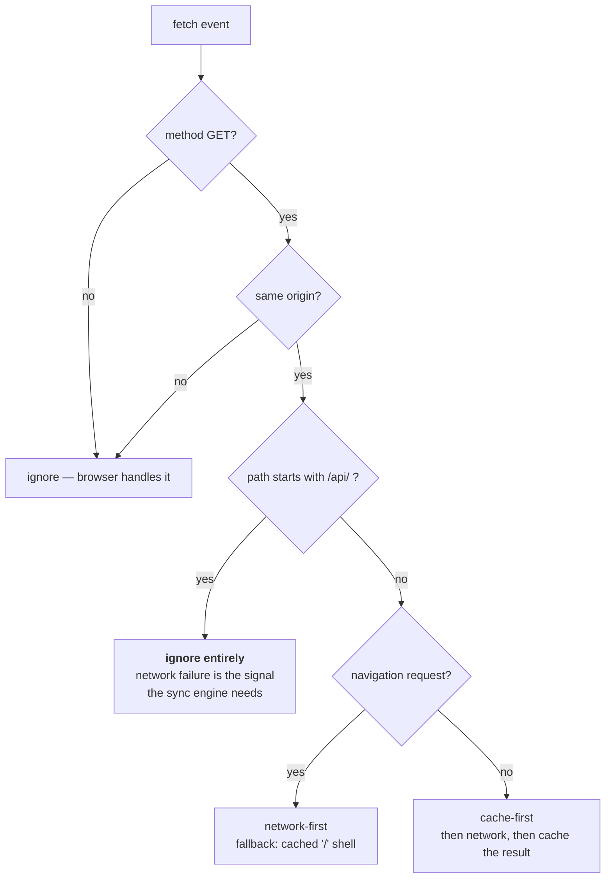
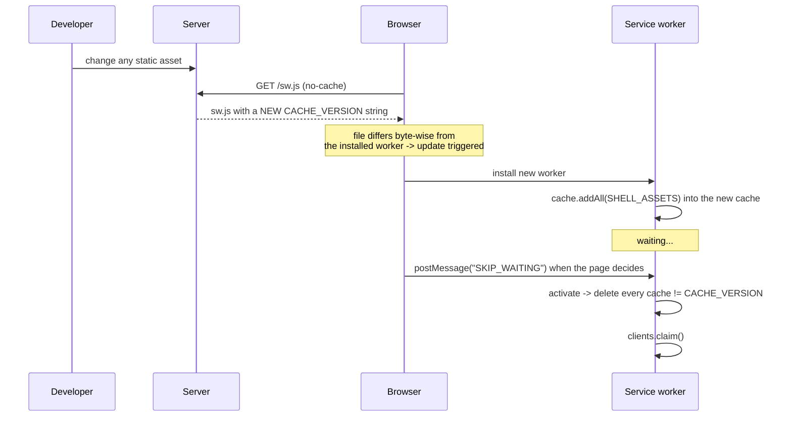

# Service worker and the PWA shell

The service worker lives at `src/lockbox/templates/sw.js`. It is hand-rolled rather than
generated by Workbox, deliberately: the whole point of the project is that the mechanics
are visible. In production code you should probably use Workbox — see
[Trade-offs](../context/trade-offs.md#service-worker).

## Strategy split



### App shell: cache-first

The shell is precached at install time. The asset list is **injected by the server**, not
hard-coded — Vite emits content-hashed filenames (`assets/index-D4f2a91b.js`), so the only
reliable source of truth is what is actually on disk:

```javascript
/* Also injected: the built asset list. Vite emits content-hashed filenames, so
   this cannot be hard-coded - the server enumerates what it actually serves. */
const SHELL_ASSETS = {{ shell_assets }};

self.addEventListener("install", (event) => {
    event.waitUntil(
        caches.open(CACHE_VERSION).then((cache) => cache.addAll(SHELL_ASSETS)),
    );
});
```

```python
def compute_shell_assets() -> list[str]:
    """List the URLs the service worker should precache.

    Vite emits content-hashed filenames, so this is enumerated from what is
    actually on disk rather than hard-coded. "/" is included explicitly because
    the app shell is served there, not at "/index.html".
    """
    urls = ["/"]
    for path in iter_static_files():
        rel = path.relative_to(STATIC_DIR).as_posix()
        if rel != "index.html":  # already covered by "/"
            urls.append(f"/{rel}")
    return urls
```

Rendered into the worker, that becomes something like:

```javascript
const SHELL_ASSETS = [
    "/",
    "/assets/index-D4f2a91b.js",
    "/assets/index-9c3e77af.css",
    "/icon.svg",
    "/manifest.webmanifest"
];
```

`cache.addAll()` is atomic — if any single asset fails to fetch, the whole install fails
and the worker does not activate. That is the behaviour you want: a half-precached shell
would boot into a broken app offline.

Cache-first is safe here *only because* the cache name is content-versioned (see below).

### Navigations: network-first

```javascript
if (request.mode === "navigate") {
    event.respondWith(
        (async () => {
            try {
                return await fetch(request);
            } catch {
                const cached = await caches.match("/");
                return cached ?? Response.error();
            }
        })(),
    );
    return;
}
```

Network-first for the HTML document means a deployed update is picked up on the next
online navigation, while offline still boots from the cached shell.

### `/api/*` is never cached and never intercepted

```javascript
// Let API traffic hit the network untouched - offline failures are the
// signal the sync engine is built around.
if (url.pathname.startsWith("/api/")) return;
```

!!! warning "This is not an optimisation decision, it is a correctness one"
    The sync engine's entire model rests on a failed API request meaning "the server is
    unreachable". If the service worker served a cached 200 for `GET /api/info`, the
    reachability probe would report online while offline, and the drain loop would attempt
    uploads that could never succeed. Worse, a cached `GET /api/notes` would feed stale
    ciphertext into `pull()`, which merges on `updatedAt` — potentially resurrecting
    deleted notes.

    The prefix check covers both endpoint families, `/api/notes` and `/api/plain-notes`,
    which matters more for the latter: a cached plaintext response would be readable note
    content sitting in the Cache Storage API, unencrypted, entirely outside the vault. The
    encrypted store is the only place note content is allowed to rest on this device.

    Data availability offline is IndexedDB's job. The HTTP cache must stay out of it.

## Cache versioning

This is the part that is easy to get wrong and expensive to debug — and it was found the
hard way during development.

A cache-first strategy with a **fixed** cache name serves stale code *forever*. You deploy
a fix, the worker checks its cache, finds `app.js`, and returns the old one. Users are
permanently stuck on whatever version they first installed.

The fix is a cache name that changes whenever an asset changes. Lockbox computes a SHA-256
hash over the contents of every static asset, server-side, and injects it into the service
worker template:

```python
def iter_static_files() -> list[Path]:
    """Return every built asset, sorted for a stable hash."""
    return sorted(p for p in STATIC_DIR.rglob("*") if p.is_file())


def compute_asset_hash() -> str:
    """Hash the contents of every static asset.

    The service worker uses this as its cache name. Because a cache-first
    strategy would otherwise serve stale JS/CSS indefinitely, the cache name has
    to change whenever an asset does - hashing contents makes that automatic
    rather than a constant someone has to remember to bump.
    """
    digest = hashlib.sha256()
    for path in iter_static_files():
        digest.update(path.relative_to(STATIC_DIR).as_posix().encode())
        digest.update(path.read_bytes())
    return digest.hexdigest()[:12]
```

```javascript
const CACHE_VERSION = "lockbox-{{ cache_version }}";
```

Paths are hashed alongside contents, so renaming or adding a file changes the hash even if
no byte of any existing file changed. Iteration is over a `sorted()` list so the hash is
deterministic across filesystems.

The chain that follows is what makes updates work at all:



```javascript
self.addEventListener("activate", (event) => {
    event.waitUntil(
        (async () => {
            const names = await caches.keys();
            await Promise.all(names.filter((n) => n !== CACHE_VERSION).map((n) => caches.delete(n)));
            await self.clients.claim();
        })(),
    );
});
```

!!! note "This replicates Workbox's revisioned precache manifest"
    Workbox generates a manifest of `{url, revision}` pairs at build time and does exactly
    this bookkeeping for you, per-asset rather than per-bundle. Lockbox's whole-bundle
    hash is coarser — one changed byte re-downloads the entire shell — but for a shell of
    a few files that is irrelevant, and it is about fifteen lines instead of a build plugin.

## Update handoff

The page, not the worker, decides when a waiting worker takes over:

```javascript
self.addEventListener("message", (event) => {
    // The page decides when a waiting worker activates, so an update cannot
    // swap code out from under a half-finished write.
    if (event.data === "SKIP_WAITING") self.skipWaiting();
});
```

Calling `skipWaiting()` unconditionally inside `install` is the common shortcut and it is
subtly dangerous in an app like this: the new worker can activate mid-transaction and start
serving new code to a page still running old code, with an outbox drain in flight. Letting
the UI trigger it — typically behind a "Reload to update" prompt — keeps that under control.

`clients.claim()` in `activate` means that once the new worker *does* activate, it controls
already-open tabs immediately rather than waiting for a navigation.

## Serving the worker from `/`

```python
@app.get("/sw.js", include_in_schema=False)
async def service_worker(request: Request) -> Response:
    """Serve the service worker from the root.

    A service worker can only control pages at or below its own path, so
    this must be served from "/" rather than "/static/" to control the whole
    app. It is also served no-cache: the browser has to be able to see a new
    worker, or the app could never update itself.
    """
    return templates.TemplateResponse(
        request,
        "sw.js",
        {
            "cache_version": compute_asset_hash(),
            "shell_assets": json.dumps(compute_shell_assets(), indent=4),
        },
        media_type="text/javascript",
        headers={"Cache-Control": "no-cache", "Service-Worker-Allowed": "/"},
    )
```

Three constraints are satisfied at once here:

| Constraint | Why |
| --- | --- |
| Served from `/sw.js`, not from a subpath | A worker's **scope** is limited to its own path and below. Served from `/assets/`, it could only control `/assets/*` — useless. (`Service-Worker-Allowed: /` is sent too, which would permit a broader scope even from a subpath.) |
| `Cache-Control: no-cache` | If the browser served the worker script from the HTTP cache, it would never see the new one, and the app could never update itself. The one file that must never be cached is the thing that manages caching. |
| `media_type="text/javascript"` | Browsers refuse to register a worker served with the wrong MIME type. |

### Route ordering

The built frontend is mounted as a catch-all at `/`, which means registration order is
load-bearing:

```python
# Mounted last so the routes above win: Starlette matches in registration
# order, and this catch-all would otherwise swallow /api and /sw.js.
# html=True serves index.html at "/" (and as the 404 fallback, which is what
# a single-page app wants).
if STATIC_DIR.is_dir():
    app.mount("/", StaticFiles(directory=str(STATIC_DIR), html=True), name="app")
```

`html=True` gives two behaviours a single-page app needs: `index.html` is served at `/`,
and it is also the 404 fallback, so a deep link like `/notes/abc` reaches the client-side
router instead of erroring.

The `if STATIC_DIR.is_dir()` guard means the API still starts before the frontend has ever
been built — useful during Vite dev, where the dev server proxies `/api` and `/sw.js` to
this process.

!!! tip "Secure context required"
    Service workers only register over HTTPS — with `localhost` explicitly exempted. A
    plain-HTTP LAN address (`http://192.168.1.20:8000`) will silently not register. Test
    on localhost, or put TLS in front.

## Not implemented

- **Background Sync** — Chromium-only, see [Offline Sync](offline-sync.md).
- **Push notifications** — not relevant to this project.
- **Runtime caching of anything beyond the shell** — there is nothing else to cache;
  all data lives in IndexedDB.

## Updating: why the worker must not wait

A service worker that installs but does not activate is not a stale-code
problem, it is a blank-page problem.

The shipped design deferred activation to a `SKIP_WAITING` message from the
page — and nothing ever sent one. So a rebuilt worker sat in `waiting`
indefinitely while its predecessor kept serving the shell it had cached. That
shell references content-hashed asset filenames, and a rebuild renames them, so
the old shell asks for files the server no longer has. The result is a page that
loads, renders nothing, and reports no error.

!!! tip "The tell was that it worked in a private window"
    A fresh profile has no previous worker to get stuck behind, so it always
    looked fine. Any browser that had visited before was broken. That asymmetry
    is worth recognising quickly — it points at the worker rather than the
    server, and the server is where the time usually gets spent.

Two changes fix it:

```javascript
// install: activate immediately rather than queueing behind the old worker
.then(() => self.skipWaiting())
```

```javascript
// the page: a handover means this document is still running the old worker's
// JavaScript, so line them up once
navigator.serviceWorker.addEventListener('controllerchange', () => {
    if (!hadController || reloading) return
    reloading = true
    window.location.reload()
})
```

`hadController` is captured *before* registering, so a first visit does not
trigger a pointless reload — only a genuine handover does.

The alternative, keeping the wait and prompting the user to reload, is a
defensible design and what Workbox recommends. It is simply not what this
project had: it had the wait without the prompt, which is the worst of both.

## A PWA must never need DevTools to recover

The blank page above had an ugly property: the only cure was opening DevTools
and unregistering the worker by hand. That is not a support instruction. A
health worker on a tablet cannot follow it, and no operations team should have
to send it. **A PWA that can brick itself into requiring developer tools is not
shippable**, however good the rest of it is.

So recovery has to be automatic, and it is layered — each layer catches what the
one above it cannot see:

| Layer | Catches | Why it can act |
| --- | --- | --- |
| `skipWaiting()` on install | An update queued behind the old worker | Prevents the state existing |
| Worker sees a `/assets/*` 404 | A shell whose assets a rebuild renamed | It intercepts the failing request itself |
| Inline script in `index.html` | Anything else that stops the app mounting | It is inline, so it runs even when the bundle does not |

The third is the important one, and its placement is the whole trick. Recovery
code inside the bundle cannot repair a bundle that failed to load. The fallback
therefore lives inline in the HTML — which navigations fetch network-first, so
it is fresh even when everything cached is stale.

Both are guarded against looping: the worker heals once per lifetime, and the
inline script marks `sessionStorage` before reloading.

!!! warning "Existing clients cannot be rescued retroactively"
    Every layer above ships *inside* the app. A browser already stuck on a
    pre-fix build has none of them, and no server-side change reaches it,
    because the code that would act is the code it is failing to run. Those
    clients need a manual clear once.

    That asymmetry is worth designing for before shipping, not after: the first
    release must already contain the recovery path, because it is the only one
    that can never be repaired remotely.
