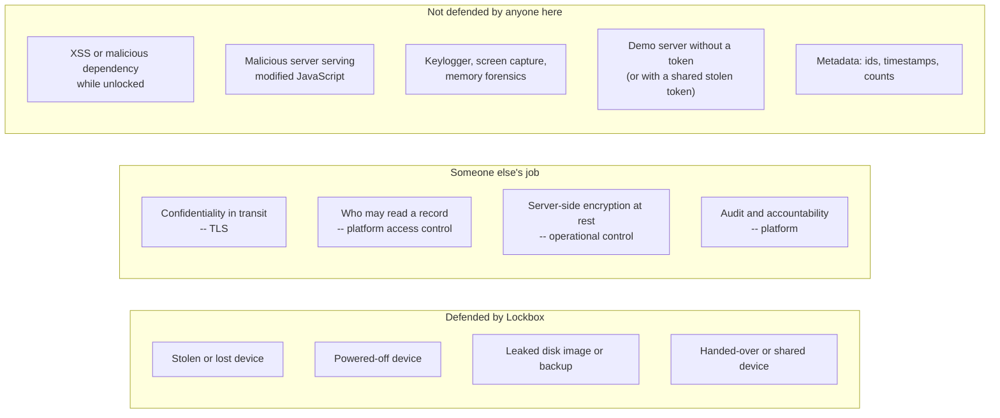

# Threat model

Being precise about what encryption buys you matters more than the encryption itself. A
vague claim ("your data is encrypted") is worse than no claim, because it leads people to
trust the system in scenarios it was never designed for.

This page states the scope exactly.

## Scope: the local device, and nothing else

!!! danger "Read this before anything else on the page"
    Lockbox's encryption protects **IndexedDB on the device**. That is the entire scope.

    In the default sync mode the server receives and stores **readable data**, on purpose.
    Server-side confidentiality is therefore **not** provided by this encryption layer and
    is **not** claimed by it. It belongs to the platform — its access control, its TLS
    termination, and whatever server-side encryption at rest it has. In the DHIS2 case,
    DHIS2's own sharing and access-control rules are the governing mechanism for this data,
    and they are the thing that must be got right.

    An earlier version of this project claimed "the server stores only ciphertext" as its
    headline property. That mode still exists as a demonstration, but it is no longer the
    design, because it is incompatible with the target. See
    [DHIS2 Context](../context/dhis2.md).

Responsibilities, split cleanly:

| Where the data is | Who protects it | How |
| --- | --- | --- |
| At rest on the device | **Lockbox** | AES-256-GCM under an Argon2id-derived envelope key |
| In transit | **TLS** | Not Lockbox's concern, and Lockbox does not attempt to duplicate it |
| At rest on the server | **The platform** | Access control, authentication, server-side encryption at rest if any |
| Governing who may read what | **The platform** | DHIS2 sharing rules, user roles, org-unit scoping |

The reason this split is the correct one, rather than a concession: a per-user passphrase
cannot govern access to shared data. If every record were encrypted under the key of
whoever typed it, no one else could read it — including the people the platform's own rules
say *should* be able to. The encryption would not be adding confidentiality, it would be
destroying the access-control model. See [DHIS2 Context](../context/dhis2.md) for the full
argument.

## The one thing it defends against

!!! success "Defended: a lost, stolen, or powered-off device"
    **Attacker capability:** physical possession of the device, or of a filesystem image
    of it. Full read access to the browser profile directory, including the IndexedDB
    files. Unlimited offline time. No passphrase.

    **Result:** they get ciphertext. The `notes` object store contains AES-256-GCM
    blobs. The `vault` store contains a salt, an IV, a KDF descriptor, and a DEK wrapped
    under a key that exists nowhere on the device. Recovering plaintext requires guessing
    the passphrase, at a cost of one full Argon2id derivation per guess — the memory and
    pass counts recorded in the vault (from 128 MiB / 3 passes on capable hardware down to
    a 19 MiB / 2 pass floor on the weakest devices), which is what makes GPU parallelism
    expensive rather than nearly free.

This is the scenario that motivated the project: a field laptop containing months of
health records is stolen from a vehicle. Without this layer, the thief opens the browser
profile and reads everything. With it, they do not.

The same protection extends to:

- A shared or handed-over device where the previous user did not wipe it.
- A device backup or disk image that leaks.
- Anyone with filesystem access who is not currently logged into a live session.

**It holds in both sync modes.** The mode governs what leaves the device, never what rests
on it. IndexedDB is ciphertext either way, which is exactly what the **At Rest** page is
there to let you check.

## What it explicitly does not defend against

!!! danger "NOT defended: a compromised running session (XSS)"
    **This is the most important caveat on the page.**

    When the vault is unlocked, the DEK is a live `CryptoKey` in the page's JavaScript
    heap. Any code that runs in that page can use it. Injected script — via XSS, a
    malicious dependency, a compromised CDN, a hostile browser extension — can call
    `decryptJson()` on every record and POST the plaintext anywhere.

    Marking the key non-extractable does **not** save you here. It prevents the raw key
    bytes from being read, but the attacker does not need the bytes; they only need to
    *use* the key, and it is right there in the same JavaScript context.

    **There is no cryptographic fix for this.** Anything reachable from JavaScript at
    runtime is reachable by injected JavaScript. The mitigations are all conventional
    web-security hygiene:

    - A strict Content-Security-Policy — no `unsafe-inline`, no `unsafe-eval`, a tight
      allowlist. (**Not yet implemented in Lockbox** — on the [Roadmap](../context/roadmap.md).)
    - Subresource Integrity on anything not served from your own origin, and ideally
      nothing served from anywhere else.
    - Ruthless dependency review; supply-chain attacks land directly in this blast radius.
    - Auto-lock on inactivity, which shrinks the window during which a DEK is live. Also
      on the roadmap.
    - Trusted Types, to make DOM-based XSS structurally difficult.

    The honest framing: **encryption at rest reduces the local attack surface from "always
    readable" to "readable only while unlocked and only by code running in the page".**
    That is a real and worthwhile reduction. It is not the same as "safe".

    Plaintext sync mode slightly enlarges the practical window, because the vault must stay
    unlocked for the queue to drain. Auto-lock on inactivity therefore matters more here,
    not less.

### NOT defended: anything about the server, in plaintext mode

!!! warning "The server holds readable records, by design"
    In the default mode the notes on the server are ordinary readable data. An attacker who
    compromises the server, or who is simply granted more access than they should have,
    reads them. Nothing in this project prevents that, and nothing in this project claims
    to.

    What has to be true instead, in a real deployment:

    - **Authentication and authorisation on the API**, with per-user and per-org-unit
      scoping. DHIS2 has this. The demo server has *none at all* — see below.
    - **TLS everywhere**, terminated somewhere you trust.
    - **Server-side encryption at rest** if the deployment's policy requires it (disk
      encryption, database-level encryption). That is an operational control, not something
      a browser can provide.
    - **Audit logging**, so inappropriate access is at least visible after the fact.

    If a deployment genuinely requires that the server operator cannot read the data, then
    a shared-data platform is the wrong architecture for that data, and the answer is not to
    bolt per-user encryption onto it. That trade is discussed in
    [Trade-offs](../context/trade-offs.md#plaintext-vs-encrypted-sync).

In **encrypted** mode the server genuinely cannot decrypt — it never receives key material,
and that is a structural property rather than a promise. That mode exists to make the
contrast concrete. It is not the default because the resulting data is unusable to the
platform.

### Not zero-knowledge, not E2EE for multiple users

Even in encrypted mode, this is a much smaller claim than "end-to-end encrypted" in the
sense people mean for messengers:

- There is one user and one key. No key exchange, no per-recipient wrapping, no identity
  verification.
- Nothing prevents a malicious server operator from serving **modified JavaScript** on the
  next page load, which then exfiltrates the passphrase as it is typed. This is the
  well-known fundamental limitation of browser-delivered cryptography: the server that
  cannot read your data is the same server that ships the code that reads your data. There
  is no meaningful defence within a web app (Subresource Integrity does not help when the
  attacker controls the HTML too).
- A native app or browser extension changes this materially, because the code is installed
  and updated through a channel independent of the data server.

### No secure OS keychain

!!! note "A web platform gap, not an implementation shortcut"
    A native app stores the DEK in the OS keychain (macOS Keychain, Android Keystore, iOS
    Secure Enclave), hardware-protected and unlocked by biometrics. The user authenticates
    once at install and effectively never again.

    Web apps have no equivalent. Persisting a key anywhere a web app *can* write —
    `localStorage`, IndexedDB, a cookie — puts it in the same place as the data it
    protects, which defeats the entire purpose. So the secret must be re-supplied every
    session.

    The closest available substitute is the **WebAuthn PRF extension**, which returns
    stable key material from a platform authenticator (Touch ID, Windows Hello, a passkey)
    and can serve as a KEK. It is real and increasingly well supported. See
    [Trade-offs: unlock UX](../context/trade-offs.md#unlock-ux).

### IndexedDB is evictable

Browsers may clear "temporary" storage under disk pressure — taking unsynced notes with
it. Lockbox asks for persistence:

```typescript
export async function requestPersistence(): Promise<boolean> {
    if (!navigator.storage?.persist) return false
    if (await navigator.storage.persisted()) return true
    return navigator.storage.persist()
}
```

but `navigator.storage.persist()` is a **request**, granted at the browser's discretion
based on heuristics (installed as a PWA, high engagement, bookmarked). It can be refused,
and it does not survive the user clearing site data. This is an availability risk, not a
confidentiality risk — but for field data collection, losing an unsynced day of work is
arguably the worse outcome. The **At Rest** page shows whether persistence was granted.

### No passphrase recovery

!!! danger "Forgotten passphrase = permanently unreadable local data"
    By design. There is no escrow, no admin override, no reset link. The passphrase is the
    only path to the DEK.

    In plaintext mode, records that already synced still exist readable on the server, so
    the loss is bounded by what had not yet uploaded. For a device that has been in the
    field all day, that can still be the whole day. In encrypted mode the loss is total.

    Any deployment with real users needs an explicit answer — printed recovery codes
    wrapping the same DEK under a second high-entropy KEK is the standard one, and is on
    the [Roadmap](../context/roadmap.md).

### Authentication is optional, shared, and not per-user

The demo server has two modes, selected at startup:

| Mode | When | What it does |
| --- | --- | --- |
| `none` (default) | Local development on `127.0.0.1` | No credentials. Anyone who can reach the process can read and write. |
| `token` | Anything reachable beyond localhost (`make serve-token`, Tailscale Funnel) | A single shared bearer token on every `/api/*` call. |

Token mode is enough to stop a public URL being an open read/write endpoint. It is **not**
per-user authentication: everyone who holds the token has the same access, the `author`
field is still self-declared, and there is no expiry or rotation. A real DHIS2 integration
would delegate identity to the platform session instead.

The app shell stays public either way — gating static JS would break service-worker install
and offline boot. See [API Reference](../reference/api.md) and
[Remote Access](../reference/remote-access.md).

### Metadata is not protected

Note ids, creation and modification timestamps, note count and sync state are all in
plaintext, in IndexedDB and on the server, in both modes. See
[Encryption: what is encrypted](encryption.md#what-is-encrypted-and-what-is-not).

An attacker with the device learns: how many records exist, when each was created and last
edited, and the editing rhythm. In some contexts that is genuinely sensitive — "a record
was created at this clinic at 02:14" can be enough on its own.

### Not protected against

For completeness, several things outside scope entirely:

| Threat | Status |
| --- | --- |
| Keylogger or screen capture on the device | Out of scope — captures the passphrase directly |
| Memory forensics against a running, unlocked browser | Out of scope — the DEK is in the heap by necessity |
| Coercion of the user to disclose the passphrase | Out of scope; no plausible deniability or duress mechanism |
| Traffic analysis (record sizes, sync timing) | Not mitigated; no padding, no cover traffic |
| Malicious browser extension | Equivalent to XSS — full access to page context |
| Server-side compromise in plaintext mode | **Out of scope by design** — the platform's responsibility, via access control and operational controls |
| A compromised server tampering with note contents | Mode-dependent. In **encrypted** mode, AES-GCM authentication makes content tampering detectable, though withholding, replaying or reordering is not, since `updatedAt` is unauthenticated metadata outside the ciphertext. In **plaintext** mode there is no client-side integrity check at all |

## Summary



Lockbox is a correct implementation of one specific defence — **confidentiality of data at
rest on a device the attacker holds but cannot unlock** — and makes no claim beyond it. The
middle column is not a gap in the design; it is the part that belongs to the platform, and
saying so plainly is the only way the first column's claim stays honest.
