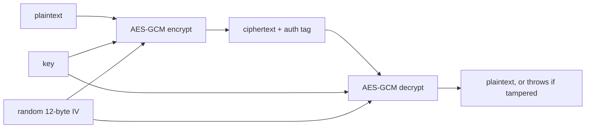
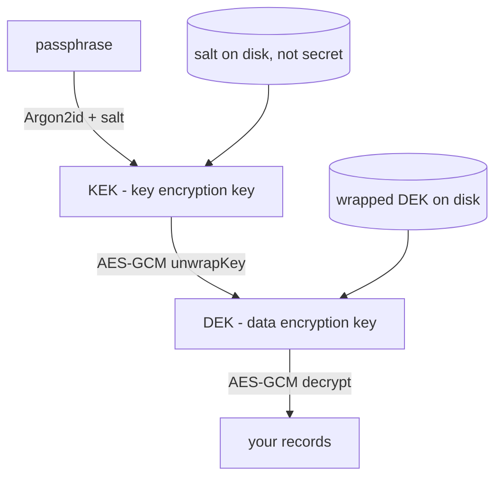

# A Beginner's Guide to the Web Crypto API

This guide assumes you are comfortable with JavaScript or TypeScript and have **never
done any cryptography**. Every term is explained the first time it appears. Every code
block is runnable — open your browser devtools on any HTTPS page and paste them in, in
order.

We build up, step by step, to the exact scheme this project uses. By the end, the code in
`frontend/src/lib/crypto.ts` should read as familiar rather than mysterious.

---

## 1. What Web Crypto is, and why you'd use it

Every modern browser ships a cryptography library built into the platform:
`window.crypto`, and specifically `window.crypto.subtle` — the *SubtleCrypto* interface.
It gives you random numbers, hashing, encryption, digital signatures, and key management,
implemented in native code by the same people who wrote the browser's TLS stack.

You want this rather than an npm package for three reasons:

- **Correctness.** Cryptographic code fails silently. A buggy sorting function gives you
  visibly wrong output. A buggy encryption function gives you output that looks
  *identical* to correct output — random-looking bytes — while being trivially breakable.
  You cannot test your way to confidence here.
- **Timing.** Many crypto operations must run in *constant time*, meaning they take the
  same duration regardless of the secret data involved. If a comparison returns early on
  the first mismatched byte, an attacker who can measure timing can recover the secret one
  byte at a time. JavaScript gives you no control over this — the JIT will optimise your
  careful constant-time loop into a variable-time one. Native code can guarantee it.
- **Supply chain.** A random npm crypto package is a dependency that can be
  compromised, unmaintained, or subtly wrong. `crypto.subtle` ships with the browser.

!!! warning "Never write your own crypto primitives"
    This is not gatekeeping folklore. Constructions that look obviously fine — XOR with a
    repeating key, "encrypt then hash", inventing your own padding scheme — have
    well-documented breaks that took experts years to find. Use the standard algorithms,
    with the standard parameters, in the standard order. Deviating from that is where
    real-world systems get broken.

### It only works in a secure context

`crypto.subtle` is `undefined` on plain `http://` pages. It requires a **secure context**:
HTTPS, or `localhost`/`127.0.0.1` for development. This trips up nearly everyone once —
you test on `localhost`, it works, you deploy to a plain-HTTP staging box, and everything
throws `TypeError: Cannot read properties of undefined`.

```js
if (!window.isSecureContext) {
  throw new Error('Web Crypto requires HTTPS or localhost')
}
console.log(typeof crypto.subtle) // "object"
```

The reason is straightforward: over plain HTTP, an attacker on the network can rewrite the
JavaScript before it reaches you. Doing crypto in code an attacker controls is
pointless, so the platform refuses to offer the API at all.

### Everything is async

Every `crypto.subtle` method returns a Promise. This is not gratuitous — the work happens
in native code, potentially on another thread, and some operations (key derivation
especially) can take hundreds of milliseconds. Blocking the main thread for that long
would freeze the UI. So: `await` everything.

```js
const digest = await crypto.subtle.digest('SHA-256', new Uint8Array([1, 2, 3]))
console.log(digest) // ArrayBuffer(32)
```

---

## 2. Random numbers

Almost everything in cryptography rests on unpredictable random numbers. Keys, salts, IVs
— all of them are just random bytes, and all of their security comes from an attacker
being unable to guess them.

```js
const bytes = crypto.getRandomValues(new Uint8Array(32))
console.log(bytes) // Uint8Array(32) [ 143, 22, 201, ... ]
```

`getRandomValues()` fills a typed array in place *and* returns it, so you can write it as
a one-liner. It draws from the operating system's cryptographically secure random source.

!!! warning "`Math.random()` is not acceptable for anything security-related"
    `Math.random()` is a fast, non-cryptographic pseudo-random number generator. It has a
    small internal state that is updated deterministically. Given a modest number of
    consecutive outputs, that state can be recovered — and once recovered, every past and
    future output is known exactly. This is a solved, published attack with working code
    on the internet, not a theoretical concern.

    If you generate a key, a salt, an IV, a session token, or a password reset code with
    `Math.random()`, an attacker can regenerate it. Use `crypto.getRandomValues()`.

For random identifiers specifically, there is a convenience method:

```js
console.log(crypto.randomUUID()) // "3f8c1b2e-..." — a v4 UUID from the CSPRNG
```

`randomUUID()` is fine for database ids and idempotency keys. It is *not* a substitute for
a key — 122 bits of randomness rendered as a string is not the same thing as a 256-bit
AES key.

---

## 3. The encoding detour

This is where everyone gets stuck first, and it has nothing to do with cryptography. Web
Crypto speaks **bytes**. Your data is strings and JSON. You need to move between them.

### `ArrayBuffer` vs `Uint8Array`

- An **`ArrayBuffer`** is a raw block of memory. You cannot read or write it directly.
- A **`Uint8Array`** is a *view* onto an `ArrayBuffer` — an array-like object that lets
  you index into those bytes.

```js
const buf = new ArrayBuffer(8)         // 8 bytes of memory
const view = new Uint8Array(buf)       // a view over all 8
view[0] = 255
console.log(view.buffer === buf)       // true — the view points at buf
```

Web Crypto methods **accept** either (any `BufferSource`), but **return** `ArrayBuffer`.
So you will constantly wrap results: `new Uint8Array(await crypto.subtle.encrypt(...))`.

!!! warning "The view-vs-buffer gotcha"
    A `Uint8Array` can be a view onto *part* of a larger buffer:

    ```js
    const big = new Uint8Array(100)
    const slice = big.subarray(10, 20)   // 10 bytes, but .buffer is all 100
    console.log(slice.length)            // 10
    console.log(slice.buffer.byteLength) // 100  ← not what you meant
    ```

    If you pass `slice.buffer` to a crypto function, you hand it all 100 bytes, not the 10
    you intended. It will not error — it will just encrypt or hash the wrong data. When
    you need a plain `ArrayBuffer` containing exactly a view's bytes, use `.slice().buffer`:

    ```js
    function bytesOf(view) {
      return view.slice().buffer   // .slice() copies exactly this view's range
    }
    ```

    This is precisely why `crypto.ts` has a `bytesOf()` helper and uses it everywhere.

### Strings ↔ bytes

`TextEncoder` turns a string into UTF-8 bytes. `TextDecoder` turns bytes back into a
string. Both are global, and `TextEncoder` is always UTF-8.

```js
const encoder = new TextEncoder()
const decoder = new TextDecoder()

const bytes = encoder.encode('héllo')     // Uint8Array(6) — note: 6, not 5
console.log(decoder.decode(bytes))        // "héllo"
```

### Bytes ↔ base64

Ciphertext is arbitrary bytes. JSON only holds text. So to store or transmit ciphertext
as JSON, you encode it as **base64** — a text representation of binary data using 64 safe
characters.

We use **base64url**, a variant that replaces `+` and `/` with `-` and `_` and drops the
`=` padding, so the result is safe in URLs and filenames without escaping.

```js
/** Encode bytes as base64url: JSON- and URL-safe, unpadded. */
function toBase64(bytes) {
  const view = new Uint8Array(bytes)
  let binary = ''
  for (let i = 0; i < view.length; i += 1) binary += String.fromCharCode(view[i])
  return btoa(binary).replace(/\+/g, '-').replace(/\//g, '_').replace(/=+$/, '')
}

/** Decode base64url back into bytes. */
function fromBase64(text) {
  const binary = atob(text.replace(/-/g, '+').replace(/_/g, '/'))
  const bytes = new Uint8Array(binary.length)
  for (let i = 0; i < binary.length; i += 1) bytes[i] = binary.charCodeAt(i)
  return bytes
}

// Round-trip check
const original = crypto.getRandomValues(new Uint8Array(16))
console.log(toBase64(original))
console.log(fromBase64(toBase64(original)).every((b, i) => b === original[i])) // true
```

`toBase64` accepts either an `ArrayBuffer` or a `Uint8Array`, because
`new Uint8Array(x)` handles both. Keep these two functions around — the rest of the guide
uses them.

---

## 4. Hashing

A **hash function** takes any amount of input and produces a fixed-size output (a
*digest*) — 32 bytes for SHA-256. It has two properties that matter:

- **Deterministic**: the same input always gives the same digest.
- **One-way**: given a digest, there is no feasible way to recover the input, and no
  feasible way to find a *different* input with the same digest.

```js
async function sha256(text) {
  const digest = await crypto.subtle.digest('SHA-256', new TextEncoder().encode(text))
  return toBase64(digest)
}

console.log(await sha256('hello'))  // LPJNul-wow4m6DsqxbninhsWHlwfp0JeacQzYpOLmCQ
console.log(await sha256('hellp'))  // completely different — one letter changed
```

Hashes are for integrity checks, deduplication, and content addressing. They are *not*
encryption — there is no "unhash", and a hash is not a secret-keeping mechanism.

!!! warning "A plain hash is the wrong tool for passwords"
    The instinct is: store `sha256(password)` instead of the password, then compare
    hashes at login. This is much better than plaintext and still badly broken.

    The problem is that SHA-256 is designed to be **fast** — that is its whole point. A
    single consumer GPU computes on the order of **billions** of SHA-256 hashes per
    second. An attacker who steals your hash database simply hashes every password in a
    leaked wordlist and matches. Human-chosen passwords fall in minutes.

    What you want for passwords is a function that is *deliberately slow*. That is a KDF,
    covered in step 6.

---

## 5. Symmetric encryption with AES-GCM

This is the core of everything else.

### Symmetric vs asymmetric

| | Symmetric | Asymmetric (public-key) |
| --- | --- | --- |
| Keys | One shared secret key | A public/private key pair |
| Same key encrypts and decrypts? | Yes | No — public encrypts, private decrypts |
| Speed | Very fast (hardware-accelerated) | Orders of magnitude slower |
| Typical size limit | Gigabytes, streaming | A few hundred bytes |
| Main use | Bulk data encryption | Key exchange, signatures, identity |
| Web Crypto names | `AES-GCM`, `AES-CBC` | `RSA-OAEP`, `ECDSA`, `ECDH` |

For encrypting your own data locally, you want **symmetric**. There is no second party to
exchange keys with — it is you now and you later. Asymmetric crypto solves a problem you
do not have here, at a large cost in speed and complexity.

### What a key is

A symmetric key is just random bytes — for AES-256, exactly 32 of them. Web Crypto wraps
those bytes in a `CryptoKey` object that records what the key is *allowed* to do
(`encrypt`, `decrypt`, `wrapKey`, …) and whether its raw bytes can be read back out.

```js
const key = await crypto.subtle.generateKey(
  { name: 'AES-GCM', length: 256 },
  false,                    // extractable — see step 7
  ['encrypt', 'decrypt'],   // allowed usages
)
console.log(key) // CryptoKey { type: "secret", extractable: false, ... }
```

### What an IV is, and why it must never repeat

AES-GCM needs a second input alongside the key: an **IV** (initialization vector), also
called a **nonce** — "number used once". It is 12 bytes (96 bits) for GCM. It is **not
secret**: you store it right next to the ciphertext and hand it back at decryption time.

Its job is to make encryption *non-deterministic*. Without it, encrypting the same
plaintext twice under the same key would give identical ciphertext, and an observer would
learn that two records are equal without decrypting either.

!!! warning "Reusing an IV under the same key is catastrophic"
    This is the single easiest way to completely destroy AES-GCM, and it is worth
    understanding the actual failure rather than treating it as a rule.

    GCM works as a stream cipher: it turns (key, IV) into a pseudorandom **keystream** and
    XORs that with your plaintext. If you encrypt two different messages with the same key
    *and* the same IV, both use the identical keystream:

    ```text
    C1 = P1 XOR KS
    C2 = P2 XOR KS
    C1 XOR C2 = P1 XOR P2      ← the keystream cancels out
    ```

    Anyone holding both ciphertexts now has the XOR of the two plaintexts, with the key
    entirely out of the picture. For structured data — JSON, English text — that is often
    enough to recover both messages outright.

    It gets worse. GCM's authentication tag is computed with a secret subkey, and a single
    IV collision leaks enough information to **recover that subkey**. Once an attacker has
    it, they can forge valid authentication tags for messages you never wrote, and your
    tamper detection is gone entirely.

    The fix is trivial: generate a fresh random 12-byte IV for **every single
    encryption**. Never cache one, never derive one from the content, never use a counter
    you might reset. With random 96-bit IVs, collisions stay negligible well past any
    volume a client-side app will produce.

### AEAD: encryption that detects tampering

The "GCM" in AES-GCM makes it an **AEAD** cipher — Authenticated Encryption with
Associated Data. Plain encryption gives you *secrecy* (an attacker cannot read the data)
but not *integrity* (an attacker can still modify it).

That distinction is not academic. With an unauthenticated stream cipher, flipping bit 3 of
the ciphertext flips bit 3 of the decrypted plaintext. An attacker who knows the format
can change `"role":"user"` to `"role":"root"` without ever decrypting anything. Decryption
succeeds and returns attacker-chosen data.

AEAD prevents this by appending an **authentication tag** — 16 bytes, computed over the
ciphertext, that only someone with the key could produce. On decryption, the tag is
verified *before* any plaintext is released. If a single bit was altered, decryption
throws. Web Crypto appends the tag to the ciphertext automatically, so you never handle it
separately.

### The full round trip



```js
const encoder = new TextEncoder()
const decoder = new TextDecoder()

async function encryptJson(key, value) {
  const iv = crypto.getRandomValues(new Uint8Array(12))   // fresh, every time
  const ciphertext = await crypto.subtle.encrypt(
    { name: 'AES-GCM', iv },
    key,
    encoder.encode(JSON.stringify(value)),
  )
  return { iv: toBase64(iv), ciphertext: toBase64(ciphertext) }
}

async function decryptJson(key, record) {
  const plaintext = await crypto.subtle.decrypt(
    { name: 'AES-GCM', iv: fromBase64(record.iv) },
    key,
    fromBase64(record.ciphertext),
  )
  return JSON.parse(decoder.decode(plaintext))
}

const key = await crypto.subtle.generateKey(
  { name: 'AES-GCM', length: 256 }, false, ['encrypt', 'decrypt'],
)

const record = await encryptJson(key, { title: 'Visit', body: 'Patient stable' })
console.log(record)                        // { iv: "...", ciphertext: "..." }
console.log(await decryptJson(key, record)) // { title: "Visit", body: "Patient stable" }
```

Note that `record` is plain JSON. You can put it straight into IndexedDB, `localStorage`,
or an HTTP body. Storing the IV in the clear alongside the ciphertext is correct and
expected.

### Proving that tampering is caught

```js
const tampered = { ...record }
const bytes = fromBase64(tampered.ciphertext)
bytes[0] ^= 1                                // flip one single bit
tampered.ciphertext = toBase64(bytes)

try {
  await decryptJson(key, tampered)
  console.log('this line never runs')
} catch (err) {
  console.log('rejected:', err.name)         // "OperationError"
}
```

One flipped bit and decryption refuses. You get an error, not silently corrupted data —
which means you never have to write code that guesses whether a decrypted result is
trustworthy.

---

## 6. Deriving a key from a password

You cannot use a passphrase as an AES key. Two reasons:

1. **Wrong shape.** AES-256 needs exactly 32 bytes. `"correct horse"` is 13.
2. **Wrong entropy.** *Entropy* is a measure of unpredictability. 32 random bytes have 256
   bits of it. A human-chosen passphrase has maybe 20–40 bits — it is drawn from a
   vastly smaller space of likely candidates. Padding it to 32 bytes changes its length,
   not its guessability.

The tool for this is a **KDF** — a Key Derivation Function. It takes a passphrase plus a
salt and produces key-shaped bytes, while being *deliberately expensive to compute*.

### Salt

A **salt** is a random value, typically 16 bytes, generated once per user (here, per
vault) and stored **in the clear** alongside the ciphertext. It is not a secret.

Its job is to make precomputation useless. Without a salt, an attacker can compute the
derived key for the ten million most common passphrases *once*, store the results in a
table (historically a "rainbow table"), and then crack any number of vaults with instant
lookups. One expensive precomputation, unlimited cheap breaks.

A per-user salt means the attacker's table would have to be rebuilt for *every* user,
because every user derives different bytes from the same passphrase. That converts a
one-time cost into a per-target cost, and it also means two users with the same passphrase
have completely unrelated keys.

Salt must be random and unique per vault. It does not need to be hidden, and hiding it
buys nothing.

### PBKDF2, the one Web Crypto gives you

`crypto.subtle` provides exactly one KDF: **PBKDF2** (Password-Based Key Derivation
Function 2). It works by running a hash function — HMAC-SHA256 here — over and over, a
configurable number of iterations, so that each guess costs the attacker that many hashes
instead of one.

Deriving takes two calls: `importKey` to turn the passphrase into a `CryptoKey` that
PBKDF2 can consume, then `deriveKey` (or `deriveBits`) to do the work.

```js
const PBKDF2_ITERATIONS = 600_000   // OWASP 2026 guidance for PBKDF2-HMAC-SHA256

async function deriveKeyPbkdf2(passphrase, salt) {
  const baseKey = await crypto.subtle.importKey(
    'raw',
    new TextEncoder().encode(passphrase),
    'PBKDF2',
    false,
    ['deriveKey'],
  )

  return crypto.subtle.deriveKey(
    { name: 'PBKDF2', salt, iterations: PBKDF2_ITERATIONS, hash: 'SHA-256' },
    baseKey,
    { name: 'AES-GCM', length: 256 },   // what kind of key to produce
    false,                              // non-extractable
    ['encrypt', 'decrypt'],
  )
}

const salt = crypto.getRandomValues(new Uint8Array(16))
console.time('pbkdf2')
const passKey = await deriveKeyPbkdf2('correct horse battery staple', salt)
console.timeEnd('pbkdf2')   // expect a few hundred ms
```

If you need raw bytes rather than a `CryptoKey` — for instance to import them with
different usages — use `deriveBits` instead, which takes a bit length and returns an
`ArrayBuffer`:

```js
const bits = await crypto.subtle.deriveBits(
  { name: 'PBKDF2', salt, iterations: PBKDF2_ITERATIONS, hash: 'SHA-256' },
  baseKey,
  256,
)
```

!!! note "Why 600,000 iterations"
    The iteration count is a dial trading your users' unlock latency against an attacker's
    cracking rate. OWASP's 2026 baseline for PBKDF2-HMAC-SHA256 is 600,000. Do not lower
    it because it feels slow — that slowness *is* the security. Do benchmark on the
    weakest device you must support, since a budget Android tablet is nothing like a
    developer laptop.

### Why PBKDF2 is no longer the best choice

PBKDF2 is **CPU-hard** but **not memory-hard**. Each iteration is a small hash needing
almost no memory, so an attacker can run enormous numbers of guesses in parallel on
hardware built for exactly that. A GPU has thousands of cores and can keep thousands of
independent PBKDF2 chains in flight simultaneously, because each one costs a few hundred
bytes of state. Your browser runs one, on one thread.

**Argon2id** — winner of the Password Hashing Competition and the current standard
recommendation — closes that gap by making each guess allocate a configurable block of
memory (say 64 MiB) and read/write it in a data-dependent pattern. Now the attacker's
parallelism is capped by memory bandwidth and capacity, not core count. A card with 24 GB
of RAM can run a few hundred concurrent guesses instead of tens of thousands, and that
ratio is the entire point.

| | PBKDF2-HMAC-SHA256 | Argon2id |
| --- | --- | --- |
| Cost dimension | CPU only | CPU **and** memory |
| Memory per guess | Negligible (~hundreds of bytes) | Configurable (e.g. 64 MiB) |
| GPU/ASIC parallelism | Very high — cheap for attackers | Sharply limited by RAM |
| In Web Crypto? | Yes, native | **No** — needs WASM |
| Typical params (2026) | 600,000 iterations | 64 MiB, 3 passes, 1 lane |
| Recommendation | Legacy vaults only | Default for new vaults |

Web Crypto does **not** offer Argon2, and there is no sign it will. The practical answer
is a small WASM implementation such as [`hash-wasm`](https://github.com/Daninet/hash-wasm)
— roughly 40 KB, which precaches into a service worker alongside the rest of the app so an
offline unlock still works.

```js
import { argon2id } from 'hash-wasm'

async function deriveBytesArgon2(passphrase, salt) {
  return argon2id({
    password: passphrase,
    salt,                    // Uint8Array, 16 bytes
    memorySize: 65_536,      // KiB — 64 MiB per guess. The parameter that hurts attackers.
    iterations: 3,           // passes over memory
    parallelism: 1,          // lanes — browsers give no reliable parallelism here
    hashLength: 32,          // bytes out, for an AES-256 key
    outputType: 'binary',    // Uint8Array
  })
}

// Turn those raw bytes into a CryptoKey
const raw = await deriveBytesArgon2('correct horse battery staple', salt)
const argonKey = await crypto.subtle.importKey(
  'raw', raw.slice().buffer, { name: 'AES-GCM', length: 256 }, false, ['encrypt', 'decrypt'],
)
```

!!! tip "This only matters for weak passphrases"
    If your passphrase has 128 bits of real entropy, no KDF choice matters — nobody is
    brute-forcing it either way. Argon2id earns its place because real users pick
    passphrases from a small, guessable space, and the KDF is the only thing standing
    between that and an offline cracking rig.

---

## 7. Extractable vs non-extractable keys

Every key-creating call takes a boolean `extractable` flag. You have been passing `false`.

- `extractable: true` — `crypto.subtle.exportKey('raw', key)` returns the key's actual
  bytes to JavaScript.
- `extractable: false` — `exportKey` throws. The key exists only as an opaque handle. The
  bytes live in the browser's native crypto implementation and never enter the JS heap.

```js
const locked = await crypto.subtle.generateKey(
  { name: 'AES-GCM', length: 256 }, false, ['encrypt', 'decrypt'],
)

try {
  await crypto.subtle.exportKey('raw', locked)
} catch (err) {
  console.log('cannot export:', err.name)   // "InvalidAccessError"
}
```

Non-extractable is the default you want. It means the key cannot be accidentally logged,
serialised into an error report, written to `localStorage`, or exfiltrated by a script
that gets a reference to it. Only make a key extractable when you have a specific reason —
in step 8, we generate the data key as extractable purely so it can be wrapped once, then
immediately replace that handle with a non-extractable one.

!!! warning "Non-extractable stops reading the key, not using it"
    Be honest about what this buys. A non-extractable `CryptoKey` in your page is still a
    live, working key. Any code running in that page — including script injected via XSS —
    can call `crypto.subtle.decrypt()` with it and read every record you hold.

    Non-extractability prevents the *bytes* from being stolen and reused elsewhere,
    forever. It does not prevent an attacker who already runs code in your page from using
    the key while the page is open. That is a real limit of doing crypto in a web page, and
    no amount of clever design fixes it from inside the page.

---

## 8. Key wrapping and envelope encryption

We now have all the pieces. Here is the design problem they leave.

If you derive a key from the passphrase and encrypt your records directly with it, then
changing the passphrase means decrypting and re-encrypting **every record**. On a large
dataset that is slow, and worse, it can half-fail — leaving some records under the old key
and some under the new one, with no clean way to recover.

**Envelope encryption** solves this with two keys instead of one:

- **DEK** — Data Encryption Key. A randomly generated AES-GCM key that encrypts the actual
  records. It is never derived from anything, and it never changes.
- **KEK** — Key Encryption Key. Derived from the passphrase. Its *only* job is to encrypt
  the DEK.

What gets stored on disk is the **wrapped DEK** — the DEK encrypted under the KEK — plus
the salt and IV needed to unwrap it. All three are safe in the clear: without the
passphrase they are inert bytes.



`crypto.subtle` has dedicated methods for this: `wrapKey` exports a key and encrypts it in
one step, `unwrapKey` decrypts and imports it in one step. Using them rather than
export-then-encrypt means the DEK's bytes never pass through JavaScript at all.

```js
// KEK gets the narrowest possible capability: wrap/unwrap only.
// It literally cannot encrypt a record, even by mistake.
const kek = await crypto.subtle.importKey(
  'raw', raw.slice().buffer, { name: 'AES-GCM', length: 256 }, false, ['wrapKey', 'unwrapKey'],
)

// Extractable ONLY so it can be wrapped on the next line.
const dek = await crypto.subtle.generateKey(
  { name: 'AES-GCM', length: 256 }, true, ['encrypt', 'decrypt'],
)

const wrapIv = crypto.getRandomValues(new Uint8Array(12))
const wrappedDek = await crypto.subtle.wrapKey('raw', dek, kek, { name: 'AES-GCM', iv: wrapIv })

// Recover it — and note the handle we keep is non-extractable.
const sessionKey = await crypto.subtle.unwrapKey(
  'raw',
  wrappedDek,
  kek,
  { name: 'AES-GCM', iv: wrapIv },      // how the wrapping was done
  { name: 'AES-GCM', length: 256 },     // what kind of key comes out
  false,                                 // non-extractable from here on
  ['encrypt', 'decrypt'],
)
```

`unwrapKey` has the most arguments of anything in this guide. In order: the format, the
wrapped bytes, the unwrapping key, the unwrap *algorithm*, the unwrapped key's
*algorithm*, extractability, and usages. The two algorithm parameters are the confusing
part — the first describes how the envelope was sealed, the second describes what is
inside it.

### The two payoffs

1. **Changing the passphrase is O(1).** Unwrap the DEK with the old KEK, re-wrap it with
   a new one derived from the new passphrase. You rewrite 32 bytes. Every record stays
   exactly as it was, because the DEK never changed. There is no partial-failure state to
   worry about.
2. **Multiple unlock methods, one DEK.** A WebAuthn or Touch ID unlock is just a *second
   envelope* over the same DEK: wrap it a second time under a key derived from that
   method, store both wrapped copies. Either path yields the same DEK, and the records
   never know which one was used. Adding or revoking an unlock method touches only its own
   envelope.

### The free correctness check

There is a detail here that is genuinely elegant. Notice there is **no stored password
hash** anywhere, and no comparison against one.

A wrong passphrase produces a wrong KEK. A wrong KEK means AES-GCM's authentication tag
fails during `unwrapKey`, so `unwrapKey` throws. Passphrase verification falls out of the
cryptography for free.

This is better than storing a hash to check against, because it means there is nothing on
disk that an attacker can test guesses against *except the wrapped key itself* — and each
guess costs a full Argon2id derivation. You have not handed them a cheaper oracle.

```js
try {
  const key = await unwrapDek(passphrase, vault)
  // correct passphrase
} catch {
  // wrong passphrase — or a tampered vault. Indistinguishable, by design.
}
```

---

## 9. Putting it together

A complete, runnable miniature of the whole scheme. Paste it into a devtools console on
any HTTPS page — it uses PBKDF2 so it needs no imports, but the structure is identical to
the real thing.

```js
// ---- helpers from step 3 ----
const enc = new TextEncoder(), dec = new TextDecoder()
const b64 = (b) => btoa(String.fromCharCode(...new Uint8Array(b)))
  .replace(/\+/g, '-').replace(/\//g, '_').replace(/=+$/, '')
const unb64 = (t) => Uint8Array.from(
  atob(t.replace(/-/g, '+').replace(/_/g, '/')), (c) => c.charCodeAt(0))
const rand = (n) => crypto.getRandomValues(new Uint8Array(n))

// ---- KDF: passphrase + salt -> KEK (wrap/unwrap only) ----
async function deriveKek(passphrase, salt) {
  const base = await crypto.subtle.importKey(
    'raw', enc.encode(passphrase), 'PBKDF2', false, ['deriveKey'])
  return crypto.subtle.deriveKey(
    { name: 'PBKDF2', salt, iterations: 600_000, hash: 'SHA-256' },
    base,
    { name: 'AES-GCM', length: 256 },
    false,
    ['wrapKey', 'unwrapKey'],
  )
}

// ---- create a vault: everything returned is safe to persist in the clear ----
async function createVault(passphrase) {
  const salt = rand(16), wrapIv = rand(12)
  const kek = await deriveKek(passphrase, salt)
  // extractable only so it can be wrapped on the next line
  const dek = await crypto.subtle.generateKey(
    { name: 'AES-GCM', length: 256 }, true, ['encrypt', 'decrypt'])
  const wrappedDek = await crypto.subtle.wrapKey(
    'raw', dek, kek, { name: 'AES-GCM', iv: wrapIv })
  return { salt: b64(salt), wrapIv: b64(wrapIv), wrappedDek: b64(wrappedDek) }
}

// ---- unlock: returns the DEK, or null if the passphrase was wrong ----
async function unlockVault(passphrase, vault) {
  const kek = await deriveKek(passphrase, unb64(vault.salt))
  try {
    return await crypto.subtle.unwrapKey(
      'raw',
      unb64(vault.wrappedDek),
      kek,
      { name: 'AES-GCM', iv: unb64(vault.wrapIv) },
      { name: 'AES-GCM', length: 256 },
      false,                       // non-extractable session key
      ['encrypt', 'decrypt'],
    )
  } catch {
    return null                    // GCM auth tag failed -> wrong passphrase
  }
}

// ---- record encryption with the DEK ----
async function encryptJson(dek, value) {
  const iv = rand(12)              // fresh IV every single time
  const ct = await crypto.subtle.encrypt(
    { name: 'AES-GCM', iv }, dek, enc.encode(JSON.stringify(value)))
  return { iv: b64(iv), ciphertext: b64(ct) }
}

async function decryptJson(dek, rec) {
  const pt = await crypto.subtle.decrypt(
    { name: 'AES-GCM', iv: unb64(rec.iv) }, dek, unb64(rec.ciphertext))
  return JSON.parse(dec.decode(pt))
}

// ---- the whole lifecycle ----
const vault = await createVault('correct horse battery staple')
console.log('persisted vault:', vault)   // salt + wrapIv + wrappedDek, all inert

let dek = await unlockVault('correct horse battery staple', vault)
const note = await encryptJson(dek, { title: 'Visit', body: 'Patient stable' })
console.log('stored record:', note)      // just JSON, safe in IndexedDB

dek = null                                // "lock" — drop the key from memory
console.log('locked. records are now unreadable.')

// unlock with the RIGHT passphrase
dek = await unlockVault('correct horse battery staple', vault)
console.log('unlocked:', dek !== null)                  // true
console.log('decrypted:', await decryptJson(dek, note)) // the original object

// unlock with the WRONG passphrase
const bad = await unlockVault('correct horse battery stapler', vault)
console.log('wrong passphrase:', bad)                   // null — fails cleanly
```

The real implementation lives in `frontend/src/lib/crypto.ts`. It is the same scheme, with
Argon2id in place of PBKDF2, the KDF parameters stored alongside the vault so old vaults
stay openable, and a `changePassphrase` that re-wraps the DEK instead of touching records.
See [Encryption](../design/encryption.md) for how it fits into the app.

---

## 10. What Web Crypto does *not* solve

Being clear about the boundary is more useful than a longer feature list.

- **It protects data at rest on a lost device.** This is the actual win, and it is a real
  one. Someone who steals the laptop and copies the browser profile finds ciphertext, a
  salt, and a wrapped key. Without the passphrase, that is all they will ever have.
- **It does not protect a compromised page.** Once unlocked, the DEK is a live object in
  the tab. Injected script (XSS, a malicious extension, a compromised dependency) can call
  `decrypt()` with it. Non-extractable keys stop the bytes leaving — not the key being
  used. Your CSP and dependency hygiene are doing as much work here as the crypto is.
- **There is no OS keychain for web apps.** Native apps store a key in the Keychain or
  Keystore, protected by the OS and biometrics. The web platform exposes no equivalent. So
  the secret has to be re-supplied every session — meaning the user types the passphrase
  again, which is a usability cost with no way around it today.
- **You trust the server that delivers the JavaScript.** Every page load fetches fresh
  code. A compromised or coerced server can serve a build that exfiltrates the passphrase,
  and the user has no practical way to detect it. This is the structural difference between
  browser-delivered crypto and an installed, signed application, and it is why
  "end-to-end encrypted web app" always deserves a footnote.

None of this makes client-side encryption pointless. It makes it *scoped*: it defends
against device loss, not against a compromised origin. Say which one you are solving.

---

## 11. Common mistakes

A checklist worth re-reading before shipping anything.

- [ ] **Using `Math.random()`** for a key, salt, IV, or token. Always
      `crypto.getRandomValues()`.
- [ ] **Reusing an IV** under the same key. Catastrophic, not merely untidy — generate a
      fresh one per encryption.
- [ ] **Hashing passwords with SHA-256.** Far too fast. Use a KDF: Argon2id, or PBKDF2 at
      600,000 iterations.
- [ ] **Forgetting the salt**, or using a fixed one shared across users. It must be random
      and per-vault. It does not need to be secret.
- [ ] **Storing the key in `localStorage` or `sessionStorage`.** They are plaintext on
      disk and readable by any script on the origin — which defeats the entire exercise.
      Keep the key in memory only, non-extractable.
- [ ] **Using AES-CBC or ECB.** ECB leaks structure so visibly it produces recognisable
      images from encrypted bitmaps. CBC gives no integrity, so tampering goes undetected.
      Use AES-GCM.
- [ ] **Inventing your own scheme** — your own padding, your own MAC construction, your own
      "encrypt twice for extra safety". Use the standard construction in the standard
      order.
- [ ] **Forgetting the secure-context requirement.** `crypto.subtle` is `undefined` over
      plain HTTP. Check `window.isSecureContext` and fail loudly rather than throwing a
      confusing `TypeError`.
- [ ] **Treating a decryption failure as a bug.** It usually means the wrong key or
      tampered data — both of which you want to surface as an error, not paper over.

---

## Further reading

- [MDN: Web Crypto API](https://developer.mozilla.org/en-US/docs/Web/API/Web_Crypto_API)
- [MDN: SubtleCrypto](https://developer.mozilla.org/en-US/docs/Web/API/SubtleCrypto)
- [OWASP Password Storage Cheat Sheet](https://cheatsheetseries.owasp.org/cheatsheets/Password_Storage_Cheat_Sheet.html)
- [Encryption design in this project](../design/encryption.md)
- [Threat model](../design/threat-model.md)
