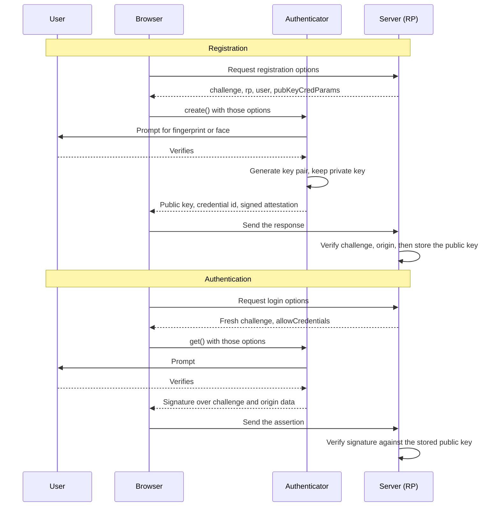
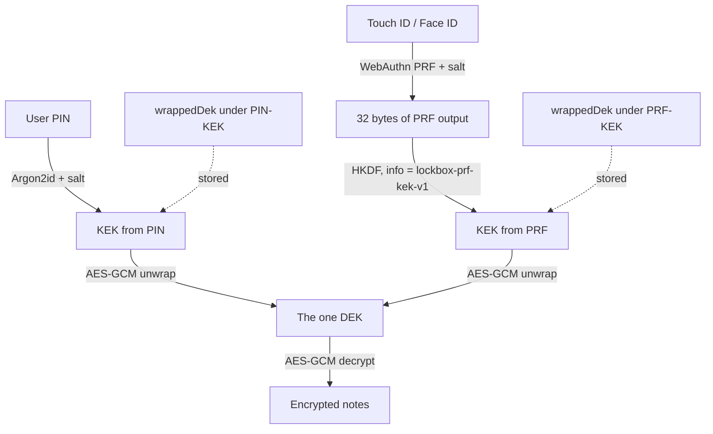

# A Beginner's Guide to WebAuthn and Passkeys

This guide assumes you write JavaScript or TypeScript comfortably and have **never
implemented authentication**. No prior knowledge of WebAuthn, FIDO2, or public-key
cryptography is assumed beyond what the companion
[Web Crypto API guide](web-crypto.md) covers — reading that one first will help, but is
not required.

We build up to what this project actually does: using a fingerprint or face to unlock
locally encrypted data, via the **PRF extension**. By the end, the code in
`frontend/src/lib/webauthn.ts` should read as familiar rather than mysterious.

---

## 1. What WebAuthn is, and why it exists

Passwords fail in four distinct ways, and each failure is structural rather than a
matter of user education:

- **Phishing.** A password is a string the user can be tricked into typing somewhere
  else. No amount of complexity helps — a 40-character passphrase typed into
  `paypa1.com` is just as compromised as `hunter2`.
- **Reuse.** People reuse passwords across sites. One breach becomes many.
- **Server-side storage.** Your server must store *something* derived from the password
  in order to check it. However carefully you hash it, that store is a target, and a
  leak of it is a leak of guessable material.
- **Transmission.** The secret leaves the user's device on every single login. Anything
  in the path — a proxy, a logging middleware, a browser extension — can see it.

**WebAuthn** (Web Authentication) is a browser API that replaces the shared secret with
a key pair. Here is the whole idea in one paragraph:

> Instead of a password, the user's device generates a **key pair** — a *private key*
> and a matching *public key*. The private key never leaves the device. The public key
> is sent to your server and stored there in plain sight. To log in, the server sends a
> random number (a **challenge**), the device signs it with the private key, and the
> server verifies that signature against the stored public key. Only the holder of the
> private key could have produced that signature. A breach of your server leaks a pile
> of public keys, which are useless to an attacker — they verify signatures, they cannot
> create them.

Phishing is solved too, and not by user vigilance: the browser refuses to use a
credential on any origin other than the one it was created for. The user *cannot* hand
their credential to `paypa1.com`, because the browser will not offer it there.

### The vocabulary

Four terms get used interchangeably and confusingly. They are not the same thing:

| Term | What it actually is |
| --- | --- |
| **WebAuthn** | The JavaScript API you call, standardised by W3C. This is what you write code against. |
| **CTAP** | Client to Authenticator Protocol. How the browser talks to an external device such as a USB security key. You never touch this. |
| **FIDO2** | The umbrella name for WebAuthn + CTAP together, from the FIDO Alliance. Marketing-adjacent. |
| **Passkey** | A *discoverable* WebAuthn credential, usually one that syncs between a user's devices via iCloud Keychain, Google Password Manager, or a password manager. A consumer-facing brand name for a specific way of using WebAuthn. |

So: passkeys are built on WebAuthn. Every passkey is a WebAuthn credential, but not
every WebAuthn credential is a passkey.

| | Password | WebAuthn |
| --- | --- | --- |
| Secret leaves device | Yes, every login | Never |
| Server stores | A hash of the secret | A public key (not secret) |
| Phishable | Yes | No — origin-bound by the browser |
| Reusable across sites | Yes, and users do | No — one credential per site |
| Breach impact | Offline cracking of every hash | Nothing usable |
| Requires user to remember | Yes | No |
| Recovery when device lost | Email reset | **Your problem** (see §9) |

---

## 2. The mental model: four parties

Every WebAuthn interaction involves exactly four participants.

| Party | Who it is |
| --- | --- |
| **User** | The human, who proves presence (a tap) and possibly identity (a fingerprint). |
| **Authenticator** | The thing holding the private key: a fingerprint sensor, a secure enclave, a USB key. |
| **Relying party (RP)** | Your site. The party *relying* on the authentication. |
| **Browser (client)** | The intermediary. Enforces origin binding, shows the UI, and is the only party you write code against. |

Note what you do **not** control: the prompt. You cannot style it, position it, or read
it. The browser and OS own that UI deliberately — if a page could draw a convincing fake
biometric prompt, the whole model collapses.

### Two kinds of authenticator

| | Platform authenticator | Roaming / cross-platform authenticator |
| --- | --- | --- |
| Examples | Touch ID, Face ID, Windows Hello, Android screen lock | YubiKey, phone used via QR + Bluetooth |
| Built into | The device itself | A separate physical object |
| Portable across devices | No (unless it syncs as a passkey) | Yes |
| Typical UX | Fingerprint, face, or device PIN | Insert, tap, maybe enter a PIN |
| Good for | Fast unlock on a device the user owns | Recovery, high assurance, shared machines |

You request one or the other with `authenticatorSelection.authenticatorAttachment`
(`'platform'` or `'cross-platform'`). This project uses `'platform'`, because the goal is
a fast biometric unlock on the device already holding the encrypted data.

### RP ID: the single most surprising rule

The **RP ID** is a domain name — `example.com`, or `localhost` in development. Every
credential is permanently **bound** to the RP ID it was created under.

A credential created on `localhost` **cannot be used on `example.com`**. Not "should
not" — the browser will not even offer it, and the ceremony fails as if the credential
did not exist. This catches everyone at least once.

The RP ID must be either the current origin's hostname or a *registrable suffix* of it.
From `app.example.com` you may use `app.example.com` or `example.com`, but never
`example.org` or a bare TLD. Choosing the broader `example.com` lets one credential work
across all your subdomains; choosing `app.example.com` deliberately confines it.

!!! warning "Changing hostname means re-enrolling"
    Move from `localhost` to a LAN IP, from an IP to a hostname, or from a staging
    domain to production, and every existing credential becomes unusable. In a normal
    login system this is an annoyance. In *this* project, where the credential unwraps an
    encryption key, it means the biometric unlock path silently disappears and users fall
    back to their PIN. Plan hostnames before you ship.

This project derives the RP ID from the live page rather than hardcoding it:

```ts
rp: { name: 'Lockbox', id: window.location.hostname }
```

Convenient for a self-hosted app that might live at any address, and honest about the
consequence: change the address, re-enrol.

---

## 3. The two ceremonies

WebAuthn has exactly two operations, called **ceremonies** (a term of art for a protocol
that includes human actions, not just message exchanges).

- **Registration** — `navigator.credentials.create()` — makes a new key pair.
- **Authentication** — `navigator.credentials.get()` — signs a challenge with an
  existing key pair.



### Registration, field by field

```js
const credential = await navigator.credentials.create({
  publicKey: {
    // 1. Random bytes from the SERVER. Prevents replay.
    challenge: challengeBytesFromServer,

    // 2. Who you are.
    rp: { name: 'Lockbox', id: 'example.com' },

    // 3. Who the user is, to this site.
    user: {
      id: opaqueUserIdBytes,      // Uint8Array, NOT an email
      name: 'ada@example.com',    // shown in the account picker
      displayName: 'Ada Lovelace' // shown in the account picker
    },

    // 4. Which signature algorithms you accept, most preferred first.
    pubKeyCredParams: [
      { type: 'public-key', alg: -7 },   // ES256  (ECDSA P-256 + SHA-256)
      { type: 'public-key', alg: -257 }, // RS256  (RSA PKCS#1 v1.5 + SHA-256)
    ],

    // 5. What kind of authenticator, and how strictly to verify the user.
    authenticatorSelection: {
      authenticatorAttachment: 'platform',
      residentKey: 'preferred',
      userVerification: 'required',
    },

    // 6. How long the prompt stays up, in milliseconds.
    timeout: 60_000,
  },
})
```

**`challenge`** must be random, unpredictable, single-use, and **generated by the
server**. It is what makes the resulting signature fresh. If the client picked it, an
attacker who once captured a valid signature could replay it forever. 32 random bytes is
the norm. (This project generates it client-side — see the note at the end of §7 for why
that is defensible *only* here.)

**`user.id`** must be an **opaque byte array**, up to 64 bytes, and must **not** be an
email address, username, or anything else meaningful. It is stored on the authenticator
and, for a synced passkey, may travel to the user's other devices and into a password
manager's UI. Use a random UUID or an internal database id. Reusing a `user.id` for a
second registration on the same authenticator *overwrites* the first credential.

**`pubKeyCredParams`** lists COSE algorithm identifiers — small negative integers from an
IANA registry. In practice you need exactly two: `-7` (ES256, elliptic-curve, what almost
every modern authenticator uses) and `-257` (RS256, RSA, for older Windows Hello and TPMs).
Order expresses preference. Offering only `-7` will lock out some real hardware.

**`authenticatorSelection`**:

- `authenticatorAttachment`: `'platform'` (built in) or `'cross-platform'` (removable).
  Omit it to allow both.
- `residentKey`: `'discouraged' | 'preferred' | 'required'`. A *discoverable* (formerly
  "resident") credential stores the user handle on the authenticator itself, so the user
  can log in without typing a username. See §4 and §5.
- `userVerification`: `'discouraged' | 'preferred' | 'required'`. `'required'` means the
  authenticator must verify the *human* — biometric or device PIN — not merely that
  someone tapped it. For anything guarding data, use `'required'`.

**`timeout`** is a hint, not a guarantee. Browsers clamp it, typically to a range around
15 seconds to 10 minutes. When it expires you get `NotAllowedError` — the same error as a
user cancellation, which is annoying and unavoidable.

### What comes back

```js
credential.id        // base64url string, safe to store
credential.rawId     // ArrayBuffer, the same value as bytes
credential.type      // "public-key"
credential.response  // AuthenticatorAttestationResponse
credential.response.clientDataJSON     // ArrayBuffer: challenge, origin, type
credential.response.attestationObject  // ArrayBuffer: public key + metadata
credential.getClientExtensionResults() // extension outputs (see §6)
```

Everything binary is an `ArrayBuffer`, and JSON cannot carry those. Convert with
base64url before sending or storing — see `toBase64` / `fromBase64` in
`frontend/src/lib/encoding.ts`.

### Authentication

```js
const assertion = await navigator.credentials.get({
  publicKey: {
    challenge: freshChallengeFromServer,
    rpId: 'example.com',
    allowCredentials: [
      { type: 'public-key', id: storedCredentialIdBytes },
    ],
    userVerification: 'required',
    timeout: 60_000,
  },
})
```

`allowCredentials` restricts which credentials may answer. Supply it when you know who
the user is; **omit** it for usernameless login, which requires discoverable credentials
(§5). The response carries `authenticatorData`, `clientDataJSON`, `signature`, and
`userHandle`.

### What a server must verify

This is not optional and it is not a formality. At minimum, on every ceremony the server
checks that:

1. The `challenge` in `clientDataJSON` matches the one it issued, and has not been used.
2. The `origin` matches your expected origin exactly.
3. The `type` is `webauthn.create` or `webauthn.get` as appropriate.
4. The RP ID hash in `authenticatorData` matches your RP ID.
5. The user-present flag is set, and the user-verified flag too if you required it.
6. On authentication: the `signature` verifies against the **stored public key**.
7. The signature counter has not gone backwards (a weak clone signal, and unreliable for
   synced passkeys, which often report `0` always).

Do not implement this from the spec by hand. Use a maintained library —
`@simplewebauthn/server`, `webauthn4j`, `py_webauthn`. The client side is small enough to
write yourself; the verification side is not.

---

## 4. Critical gotchas

These are the ones that cost real days.

!!! warning "Secure context required"
    WebAuthn is unavailable on plain `http://`. You need HTTPS, or `localhost` /
    `127.0.0.1` for development. Otherwise the call throws `SecurityError` — or
    `navigator.credentials` is missing entirely. The same rule applies to
    `crypto.subtle`, as the [Web Crypto guide](web-crypto.md) explains. Testing on a LAN
    IP over HTTP is the classic way to hit this: `192.168.1.5` is not a secure context,
    even though `localhost` on the same machine is.

!!! warning "Each ceremony consumes the page's user activation"
    A WebAuthn call requires **user activation** — a recent click, tap, or key press —
    and *spends* it. Calling `create()` and then `get()` inside a single click handler
    fails on most browsers with `NotAllowedError`, because by the time `get()` runs the
    gesture is already gone.

    **This project hit exactly this bug.** The first version of `webauthn.ts` created the
    credential and then immediately called `get()` to obtain PRF output, in one handler.
    Biometric enrolment simply refused to work, with an error message
    (`NotAllowedError`) that reads like a user cancellation. It looked like the user was
    dismissing a prompt they never saw.

    The fix has two parts, both visible in the current code:

    1. Request the PRF `eval` **at creation time**, so a browser that supports it returns
       the derived bytes straight from `create()` and one gesture is enough.
    2. When the authenticator withholds PRF output at creation, hand control back to the
       UI (`status: 'needs-assertion'`) and require a **second, separately clicked
       button** to run `get()`. A fresh gesture, a fresh activation.

**`residentKey: 'required'` can just fail.** Discoverable credentials occupy one of a
small number of slots on a hardware authenticator — some YubiKeys hold only 25 — and
demanding one when the slots are full throws. Use `'preferred'` unless you genuinely need
usernameless login. This project uses `'preferred'`, because it stores the credential id
in the vault anyway and passes it via `allowCredentials`.

**Error names carry the entire diagnosis.** WebAuthn rejects with a `DOMException`, and
its `name` is the only machine-readable signal you get. A `catch (e) { showToast('Something
went wrong') }` throws away everything useful.

| Error name | What it usually means |
| --- | --- |
| `NotAllowedError` | Prompt dismissed, timed out, **or the user gesture was already spent**. Overloaded on purpose — the spec avoids leaking which. |
| `InvalidStateError` | This authenticator already holds a credential for this user. Usually means "already registered", which is often not an error at all. |
| `NotSupportedError` | No authenticator matches your requested parameters — e.g. you asked for `platform` on a machine with none. |
| `SecurityError` | Bad RP ID for this origin, or not a secure context. |
| `AbortError` | You aborted it yourself via `AbortSignal`. |
| `ConstraintError` | Your `authenticatorSelection` constraints cannot be met (often `residentKey: 'required'`). |

This project maps them to sentences a user can act on, in `describeWebAuthnError`:

```ts
switch (error.name) {
  case 'NotAllowedError':
    return 'The prompt was dismissed, timed out, or the page had already used its user gesture.'
  case 'InvalidStateError':
    return 'This authenticator is already enrolled for this user.'
  case 'NotSupportedError':
    return 'This device does not offer a suitable authenticator.'
  case 'SecurityError':
    return 'Blocked for security reasons - the page must be served over HTTPS or localhost.'
  default:
    return `${error.name}: ${error.message}`
}
```

!!! tip "Feature-detect what you can, attempt the rest"
    `PublicKeyCredential.isUserVerifyingPlatformAuthenticatorAvailable()` tells you a
    platform authenticator exists. It does **not** tell you whether extensions like PRF
    work. There is no reliable up-front probe for those — you attempt enrolment, inspect
    the result, and degrade gracefully.

---

## 5. Discoverable credentials and conditional UI

A **discoverable credential** stores the user handle on the authenticator, so the
authenticator can answer "who could sign in here?" without being told. That enables
**usernameless** login: no username field at all, just a prompt.

**Conditional UI** (autofill sign-in) is the polished version. Instead of a modal, the
browser offers passkeys inline in the username field's autofill dropdown. If the user
ignores it and types a password, nothing was interrupted.

```html
<input type="text" name="username" autocomplete="username webauthn">
```

```js
if (await PublicKeyCredential.isConditionalMediationAvailable?.()) {
  // Resolves only when the user picks a passkey from autofill. Do not await
  // this in a blocking path - let it sit alongside the normal form.
  navigator.credentials.get({
    mediation: 'conditional',
    publicKey: { challenge, rpId: 'example.com' }, // no allowCredentials
  }).then(handleAssertion)
}
```

Three requirements: `mediation: 'conditional'`, the `webauthn` token in `autocomplete`,
and discoverable credentials at registration (`residentKey: 'required'` or `'preferred'`
where the authenticator obliged). Conditional UI needs no user gesture, because the
user's choice in the autofill menu *is* the gesture.

This project does none of this — it has no login, only a local vault — but if you are
building a normal authenticated app, this is the UX you want.

---

## 6. The PRF extension: deriving encryption keys

Everything so far was about *proving identity*. The **PRF extension** does something
different and, for a client-side-encrypted app, far more interesting: it turns an
authenticator into a source of **secret key material**.

A **PRF** — pseudo-random function — is a keyed function with two properties:

- **Deterministic**: the same key and the same input always produce the same output.
- **Unpredictable**: without the key, the output is indistinguishable from random, even
  if you can see outputs for other inputs.

The WebAuthn PRF extension gives you one, keyed by a secret held inside the
authenticator. You pass a **salt**, and get back 32 stable bytes:

```js
const assertion = await navigator.credentials.get({
  publicKey: {
    challenge: crypto.getRandomValues(new Uint8Array(32)),
    rpId: window.location.hostname,
    allowCredentials: [{ type: 'public-key', id: credentialIdBytes }],
    userVerification: 'required',
    extensions: {
      prf: { eval: { first: saltBytes.buffer } },
    },
  },
})

const results = assertion.getClientExtensionResults()
const output = results.prf?.results?.first // ArrayBuffer, 32 bytes
```

Same credential + same salt → same 32 bytes, every time, on that device, only after the
user verifies. Different salt → different bytes, with no way to relate them.

### Why this is transformative

The problem with encrypting data in a browser under a PIN is stated bluntly at the top of
`frontend/src/lib/webauthn.ts`:

> A 4-digit PIN has 10,000 possibilities. Argon2id makes each guess cost ~130 ms, so an
> attacker holding the device grinds the whole space in under half an hour. No amount of
> KDF tuning fixes that — the entropy simply is not there.

Phone PINs are not weak in the same way, because the secure enclave **rate-limits guesses
in hardware**. Five wrong tries and it makes you wait; too many and it wipes. The web has
no equivalent: any attempt counter you write to IndexedDB is defeated by editing
IndexedDB.

The PRF extension borrows precisely that hardware property. The authenticator verifies
the user itself, enforces its own retry limits, and returns high-entropy bytes derived
from a secret that never leaves it. So the derived key is:

- **stable** — usable to key an envelope,
- **unguessable** — not derived from anything the user typed,
- **unextractable** — the underlying secret cannot be copied off the device.

That makes biometric unlock here not merely nicer than a PIN but *cryptographically
stronger than a passphrase most users would actually choose*.

### Don't use the raw bytes directly

The 32 bytes are already high-entropy, so there is nothing to stretch. But you should
still run them through **HKDF** (a key-derivation function) for **domain separation** — so
that this key cannot collide with any other use of the same PRF output, now or later:

```ts
const material = await crypto.subtle.importKey('raw', output, 'HKDF', false, ['deriveKey'])

const kek = await crypto.subtle.deriveKey(
  {
    name: 'HKDF',
    hash: 'SHA-256',
    salt: new Uint8Array(0),
    info: new TextEncoder().encode('lockbox-prf-kek-v1'), // the domain separator
  },
  material,
  { name: 'AES-GCM', length: 256 },
  false,
  ['wrapKey', 'unwrapKey'],
)
```

The `info` string is the whole point: change it and you get a completely unrelated key
from identical PRF output. Version it, as above, so a future scheme change is a one-line
migration rather than a collision.

### Support, honestly

| Platform | PRF status in 2026 |
| --- | --- |
| macOS / iOS (Touch ID, Face ID) | Good, Safari and Chrome |
| Android platform authenticator | Good, Chrome |
| Chrome / Firefox on supported OSes | Good |
| **Windows Hello** | **Patchy** — depends on Windows build, browser, and TPM. Frequently unavailable. |
| Hardware keys (YubiKey 5, newer) | Good, via the `hmac-secret` CTAP extension |

!!! warning "You cannot feature-detect PRF in advance"
    There is no `isPrfAvailable()`. You request `prf` in the extensions, run the ceremony,
    then inspect `getClientExtensionResults().prf`. If `enabled` is falsy and there are no
    `results`, this authenticator will not do it — and you must have a fallback ready.
    Given the Windows situation, a fallback is **mandatory**, not a nicety.

---

## 7. Putting it together: biometric unlock for encrypted data

Now the actual design. The [encryption design doc](../design/encryption.md) covers
**envelope encryption**: a random 256-bit AES-GCM **DEK** (data encryption key) encrypts
the notes, and the DEK itself is encrypted ("wrapped") under a **KEK** (key encryption
key) derived from the user's PIN with Argon2id. Only the wrapped DEK is persisted.

The payoff arrives here. Because the notes are encrypted under the DEK and *nothing
else*, you can wrap that same DEK as many times as you like, under as many different
KEKs as you like. Each wrapper is an independent unlock path to the identical key.



!!! note "Enrolling biometrics re-encrypts nothing"
    Not one note is touched. Enrolment unwraps the DEK with the PIN, wraps that same DEK
    a second time under the PRF-derived KEK, and stores the second wrapper — a few dozen
    bytes. With a vault of ten thousand notes this is still instant. That is the entire
    argument for envelope encryption, and it is why the scheme was chosen before
    biometrics existed in this codebase.

The stored second envelope is small and contains nothing secret except the wrapped key:

```ts
export interface PrfEnvelope {
  credentialId: string  // base64url, to pass as an allowed credential
  prfSalt: string       // base64url, per-vault, not secret
  wrapIv: string        // AES-GCM IV used for the wrap
  wrappedDek: string    // the DEK, encrypted under the PRF-derived KEK
  label: string         // "Touch ID / Face ID", for the UI
}
```

Unlocking is then: run the PRF, HKDF it into a KEK, unwrap.

```ts
const output = await evaluatePrf(envelope.credentialId, fromBase64(envelope.prfSalt))
const kek = await kekFromPrf(output)

const dek = await crypto.subtle.unwrapKey(
  'raw',
  fromBase64(envelope.wrappedDek).slice().buffer,
  kek,
  { name: 'AES-GCM', iv: fromBase64(envelope.wrapIv).slice().buffer },
  { name: 'AES-GCM', length: 256 },
  false,                    // non-extractable
  ['encrypt', 'decrypt'],
)
```

The DEK comes back **non-extractable**, so even a script running on the page cannot read
its bytes out — it can only ask the browser to use it. See the
[Web Crypto guide](web-crypto.md) for why that matters.

### Enrolment must prove knowledge of the existing secret

`SecurityPage.tsx` makes the user re-enter their PIN before enrolling a biometric, and
this is not friction for its own sake. Consider the alternative: someone finds an
unlocked device and silently binds *their own* fingerprint as a second unlock path. They
now have permanent access, and the legitimate user has no signal that anything happened.

Requiring the PIN means enrolment can only be performed by someone who already holds the
secret. Mechanically it is also *necessary* — you cannot wrap the DEK a second time
without first obtaining the DEK, and the only way to obtain it is to unwrap it with the
PIN.

!!! danger "Never make the authenticator the only unlock path"
    A platform authenticator is bound to one device and one OS keychain. Lose the phone,
    replace the laptop, reinstall the OS, or reset the biometric enrolment, and the
    credential is **gone** — and with it, if it were the only wrapper, every byte of
    encrypted data. Add patchy Windows Hello PRF support and the risk stops being
    theoretical.

    The PIN wrapper must always remain. Biometric unlock is a *convenience layer over* the
    real secret, never a replacement for it. Removing biometric enrolment in this project
    deletes the PRF envelope and nothing else — the PIN still opens the vault.

!!! note "Why the challenge is generated client-side here"
    §3 insists the challenge must come from the server. In this project it does not, and
    that is deliberate: there is no server in the ceremony. The challenge exists to stop
    an attacker replaying a captured signature to a *remote verifier*, and here nothing
    is verified remotely — the only thing that matters is the PRF output, which depends
    on the credential and salt, not the challenge. If you ever use WebAuthn for actual
    login, the challenge must come from your server. Do not copy this shortcut into a
    system that has one.

---

## 8. Testing WebAuthn

You cannot script a fingerprint, which makes automated testing awkward. Chrome provides
a **virtual authenticator** that helps a great deal — and has one limitation that matters
enormously here.

### Chrome DevTools

1. Open DevTools → ⋮ (three dots) → **More tools** → **WebAuthn**.
2. Tick **Enable virtual authenticator environment**.
3. **Add** an authenticator, choosing:
    - **Protocol**: `ctap2` (modern) or `u2f` (legacy).
    - **Transport**: `internal` to emulate a platform authenticator, `usb` for a roaming one.
    - **Supports resident keys** (`hasResidentKey`) — for testing discoverable credentials.
    - **Supports user verification** (`hasUserVerification`) — so `userVerification: 'required'` succeeds.

Ceremonies then complete instantly with no prompt, and the panel lists every credential
created, with its id and sign count. You can delete credentials to simulate a lost device.

!!! warning "The virtual authenticator does not implement PRF"
    This is the crucial limitation. The virtual authenticator handles `create()` and
    `get()` faithfully, but returns no PRF results. Every PRF-dependent code path — the
    entire biometric-unlock feature — is untestable this way. Your test will see the
    "authenticator does not support the PRF extension" branch, which is *correct
    behaviour* for that authenticator and tells you nothing about the real path.

### Playwright, via CDP

Playwright can drive the same virtual authenticator through the Chrome DevTools Protocol:

```ts
const client = await page.context().newCDPSession(page)
await client.send('WebAuthn.enable')

const { authenticatorId } = await client.send('WebAuthn.addVirtualAuthenticator', {
  options: {
    protocol: 'ctap2',
    transport: 'internal',
    hasResidentKey: true,
    hasUserVerification: true,
    isUserVerified: true,       // auto-approve, no prompt
    automaticPresenceSimulation: true,
  },
})

// ... drive the UI ...

await client.send('WebAuthn.removeVirtualAuthenticator', { authenticatorId })
```

`isUserVerified: true` plus `automaticPresenceSimulation: true` is what makes it run
unattended. Flip `isUserVerified` to `false` to test your failure handling.

This is genuinely useful for registration flows, error handling, the "already enrolled"
`InvalidStateError` path, and UI state. It still **cannot exercise PRF**.

!!! note "Honest statement of this project's test coverage"
    The PRF code in `frontend/src/lib/webauthn.ts` is verified **on real hardware**
    (Touch ID on macOS) and **not in CI**. The virtual authenticator cannot produce PRF
    output, so no automated test covers the derive-wrap-unwrap path end to end. What CI
    *does* cover is the surrounding logic: base64url round-tripping, error mapping, and
    the envelope shape. This is a known and accepted gap, and the reason the PIN path is
    the one that must never break.

---

## 9. What WebAuthn does not solve

Easy to over-read the marketing. WebAuthn answers exactly one question: *is the party at
the other end holding the private key for this credential?* Everything else remains yours.

- **Not authorisation.** Knowing *who* someone is says nothing about what they may do.
  Roles, permissions, and ownership checks are unchanged.
- **Not session management.** A ceremony is a single point-in-time proof. You still issue
  a cookie or token afterwards, and every weakness of session handling — fixation,
  theft, missing expiry, absent CSRF protection — applies exactly as before.
- **No protection against a compromised page.** If an attacker runs JavaScript on your
  origin, they can trigger ceremonies, read the results, and use the unwrapped key. In
  this project, once the vault is unlocked the DEK is live in memory; non-extractable
  keys stop exfiltration of the *key*, not misuse of it. See the
  [threat model](../design/threat-model.md).
- **Account recovery is entirely your problem.** Devices are lost. If a credential is the
  only way in, that user is locked out permanently — and if it also unwraps encryption
  keys, their data is unrecoverable *by design*. Register a second authenticator, keep a
  password or PIN, or provide recovery codes. Pick one before launch.
- **Server-side verification is mandatory.** A client-side "the ceremony succeeded, log
  them in" check is bypassed by anyone with DevTools. The signature must be verified on
  the server, against the stored public key, with the challenge you issued. There is no
  version of this that is optional.
- **Attestation is rarely what you want.** It lets you cryptographically identify the
  authenticator *model*. Enterprises use it to enforce approved hardware. For consumer
  apps it adds privacy concerns and complexity for little benefit — request
  `attestation: 'none'` unless you have a specific reason.

---

## 10. Common mistakes

- [ ] **Serving over plain HTTP.** Not a secure context — `SecurityError`, or a missing
      API. HTTPS or `localhost`, always.
- [ ] **Two ceremonies in one click handler.** The second gets `NotAllowedError` because
      the gesture is spent. Request PRF `eval` at creation, and use a second button when
      you truly need a second ceremony.
- [ ] **Putting an email in `user.id`.** It must be opaque bytes. It is stored on the
      authenticator and may sync to other devices.
- [ ] **A client-generated challenge in a system that has a server.** Defeats replay
      protection entirely. Generate it server-side, store it, use it once.
- [ ] **Skipping server-side verification.** Trusting the client's word that the ceremony
      succeeded is not authentication.
- [ ] **`residentKey: 'required'` by reflex.** It burns limited authenticator storage and
      can fail outright. Use `'preferred'` unless you need usernameless login.
- [ ] **Swallowing errors in a generic `catch`.** The `DOMException.name` is the only
      diagnosis you get. Map it, log it, show it.
- [ ] **Assuming PRF works.** It cannot be feature-detected up front and Windows Hello
      support is unreliable. Always ship a fallback.
- [ ] **Using raw PRF output as a key.** Run it through HKDF with a versioned `info`
      string for domain separation.
- [ ] **Making the authenticator the only unlock path.** Device loss becomes permanent
      data loss.
- [ ] **Enrolling a new unlock method without proving the old secret.** Anyone with an
      unlocked device silently gains permanent access.
- [ ] **Changing hostname after users enrol.** Credentials are bound to the RP ID and
      simply stop existing. Decide your domain first.
- [ ] **Forgetting the `ArrayBuffer` boundary.** `rawId`, `challenge`, and PRF output are
      all binary. Base64url them before storing or sending.

---

## Further reading

- [MDN: Web Authentication API](https://developer.mozilla.org/en-US/docs/Web/API/Web_Authentication_API)
- [W3C: Web Authentication Level 3](https://www.w3.org/TR/webauthn-3/)
- [W3C: PRF extension](https://www.w3.org/TR/webauthn-3/#prf-extension)
- [passkeys.dev](https://passkeys.dev/) — practical implementation guidance
- [SimpleWebAuthn](https://simplewebauthn.dev/) — the library to reach for on the server
- [Web Crypto API guide](web-crypto.md) — the companion to this page
- [Encryption design in this project](../design/encryption.md)
- [Threat model](../design/threat-model.md)
